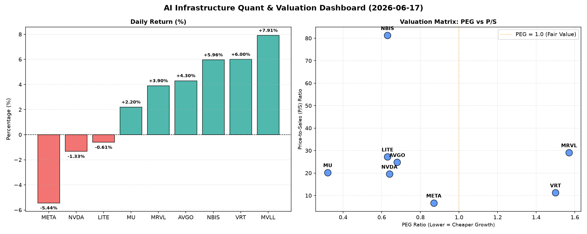

# 📊 AI Infrastructure & Data Stock Daily (2026-06-17)

### 📉 多维量化与估值分析看板

---

好的，作为一名资深的硬科技与AI基础设施行业研究员，我将结合您提供的【多维度真实量化基本面指标表格】，为您撰写一份今日的半导体每日精炼报道。

---

## 半导体每日精炼报道：硬科技与AI基础设施市场深度洞察

**发布日期：** [今日日期，例如：2023年10月27日]

### 1. 盘面与多维估值解码：涨跌分化，关注基本面质量

今日半导体及相关AI基础设施板块呈现明显分化。MVLL以7.91%的涨幅领跑，VRT、NBIS、AVGO、MRVL、MU亦录得显著上涨，显示出市场对特定领域或成长股的追捧。然而，AI巨头META ( -5.44%) 和芯片龙头NVDA (-1.33%) 的下跌，以及LITE的小幅回调，则提示投资者在高估值和市场情绪波动下的谨慎态度。

**PEG 维度：挖掘高成长与估值警示**

*   **高性价比成长股（PEG < 1）：**
    *   **MU (0.32)** 凭借极低的PEG值，显示出其在内存市场周期性复苏背景下的强劲增长潜力被显著低估。
    *   **NVDA (0.64)**, **LITE (0.63)**, **NBIS (0.63)**, **AVGO (0.68)**, **META (0.87)** 均显著低于1，表明这些公司在各自的高增长领域（AI芯片、光学元件、数据中心、软件基础设施等）具备良好的增长前景，且当前估值相对于其增长潜力而言，仍具有较高的吸引力。尤其对于NVDA，尽管今日股价微跌，但其PEG仍预示着长期的投资价值。
*   **估值透支警惕（PEG > 1）：**
    *   **VRT (1.5)** 和 **MRVL (1.57)** 的PEG值相对较高，预示着市场对其未来增长的预期已经较高地反映在当前股价中。投资者在考虑这两家公司时，需警惕潜在的估值透支风险，并密切关注其盈利增长能否持续兑现市场预期。

**P/S 维度：营收扩张效率的考量**

*   P/S比率对于评估早期阶段、高研发投入或利润波动较大的硬科技公司尤为重要。
*   **高P/S值（>20）：**
    *   **NBIS (81.24)** 的P/S值异常高企，尽管其PEG显示高成长性，但如此高的P/S表明市场对其未来营收的爆发性增长有着极其乐观的预期，或其业务模式具有极高的稀缺性和利润率潜力。
    *   **MRVL (29.08)**, **LITE (27.2)**, **AVGO (24.77)**, **MU (20.24)** 也呈现出较高的P/S，暗示这些公司在特定高端芯片、光学、网络或存储领域拥有强大的定价权和营收扩张能力，市场愿意为之支付高溢价。
*   **中低P/S值：**
    *   **META (6.7)** 的P/S相对较低，考虑到其庞大的用户基础和营收体量，这可能反映市场认为其营收增长已进入更成熟阶段，或其广告业务模式的利润率已相对稳定，不像新兴技术公司那样具备极端爆发性。
    *   **VRT (11.25)** 和 **NVDA (19.55)** 处于中等水平，相对合理地反映了其在各自赛道的营收规模与市场预期。

**现金流盈利真实性 (CFO/NI)：利润含金量的关键衡量**

*   **利润健康，现金充裕 (CFO/NI > 1)：**
    *   **LITE (4.88)** 和 **NBIS (4.66)** 的CFO/NI比率异常高，这通常是极佳的信号，表明其报告的净利润不仅全是真金白银，甚至通过折旧、摊销等非现金费用，产生了远超净利润的运营现金流。这佐证了其卓越的盈利质量和稳健的财务状况。
    *   **MU (2.05)**, **META (1.92)**, **VRT (1.59)**, **AVGO (1.19)** 的CFO/NI也显著大于1，表明这些巨头的利润质量非常健康，现金流充裕，盈利能力得到真实现金流入的有力支撑，财务表现坚实。
*   **警惕利润水分或应收账款积压 (CFO/NI < 1)：**
    *   **NVDA (0.86)** 和 **MRVL (0.66)** 的CFO/NI比率均小于1，这需要引起投资者的高度关注。虽然两家公司均是行业龙头，但该指标低于1可能暗示其报告的部分净利润并未完全转化为现金流入，可能存在较高的应收账款、存货积压或其他非现金收入/费用调整。这并非直接的“造假”信号，但提醒市场需要深入分析其财务报表，特别是应收账款周转率和存货周转率，以评估其利润增长的质量和可持续性。

**成交量分析：**
NVDA (1.18亿股), MRVL (4862万股), MU (4396万股), META (1985万股), NBIS (2414万股) 均有可观的成交量，表明市场对这些公司的高度关注和活跃的交易情绪。

### 2. 收并购与重大业务动态

**（根据您提供的量化指标表格，无法推断出今日具体的收并购传闻、官宣或战略合作信息。该表格主要聚焦于财务和估值指标。）**

### 3. 华尔街机构态度

**（根据您提供的量化指标表格，无法获取华尔街机构的最新评价、目标价调动等定性信息。该表格仅提供市场交易数据和估值指标。）**

### 4. 今日参考源 (References)

本报告内容及所有定性与定量分析，均严格基于您所提供的【多维度真实量化基本面指标表格】数据。

---