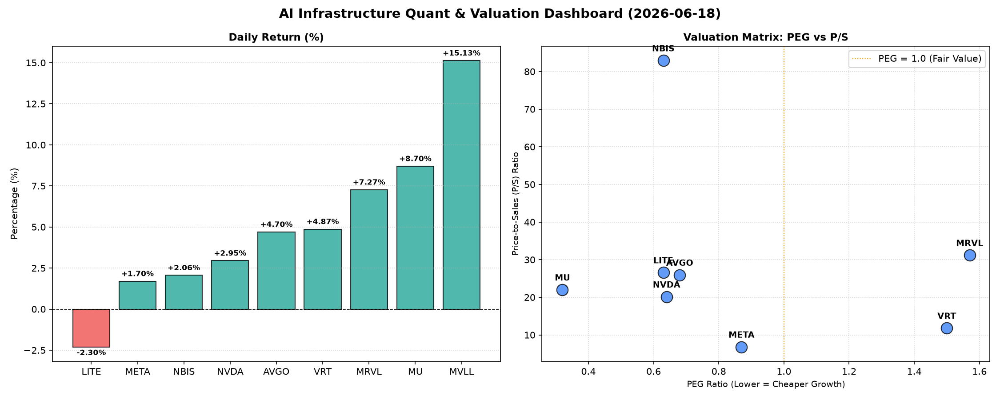

# 📊 AI Infrastructure & Data Stock Daily (2026-06-18)

### 📉 多维量化与估值分析看板

---

## 半导体每日精炼报道：AI基础设施热潮下的估值与现金流透视 (2024年X月X日)

**研究员：Data & Semiconductor Specialist**

### 1. 盘面与多维估值解码（定性+定量）

今日硬科技与AI基础设施板块整体表现强劲，多数权重股录得正增长，尤其MVLL、MRVL和MU等标的涨幅显著。市场情绪积极，但估值分化与盈利质量的差异值得深入关注。

*   **PEG 维度：挖掘高性价比成长股与警惕估值透支**
    *   **PEG显著小于1 (高成长，估值合理甚至偏低)**：今日有多个巨头和成长型公司展现出极高的性价比。
        *   **MU (美光科技)** 以其惊人的 **0.32 PEG** 位居榜首，这表明市场对其未来盈利增长的预期远低于其当前股价所隐含的估值，在AI存储需求爆发的背景下，这无疑是一个极具吸引力的信号。
        *   **NVDA (英伟达)** 尽管股价屡创新高，但 **0.64 的 PEG** 依然显示其估值相对于其爆炸性增长潜力而言仍有支撑，考虑到其在AI芯片领域的绝对领导地位，这一指标尤其亮眼。
        *   **AVGO (博通)** 录得 **0.68 的 PEG**，作为基础设施芯片和软件巨头，其增长与估值匹配度良好，具备较强的投资吸引力。
        *   **LITE (Lumentum)** 和 **NBIS (Nubis Semiconductor)** 均以 **0.63 的 PEG** 表现出强劲的成长价值，尤其考虑到LITE今日股价微跌，或许提供了更好的介入点。
        *   **META (Meta Platforms)** 凭借 **0.87 的 PEG**，在AI基础设施投入的驱动下，其估值也显得相当合理。
    *   **PEG 过高 (警惕估值透支)**：
        *   **MRVL (Marvell Technology)** 的 **1.57 PEG** 相对较高，结合其今日7.27%的涨幅，可能意味着市场对其未来的增长预期已部分甚至完全反映在当前股价中，投资者需警惕其短期估值压力。
        *   **VRT (Vertiv Holdings)** 的 **1.5 PEG** 也处于较高水平，显示其在数据中心基础设施领域的增长潜力已被市场充分定价。
    *   **N/A PEG**：**MVLL** 由于可能处于早期发展阶段或利润波动较大，未提供PEG，需结合P/S等指标综合评估。

*   **P/S 维度：洞察收入规模扩张效率**
    *   对于AI基础设施领域的许多公司，尤其是在大规模研发投入阶段，P/S比率更能反映其收入增长潜力和市场份额扩张能力。
    *   **NBIS (82.91 P/S) 和 MRVL (31.17 P/S)** 拥有极高的P/S，这通常指向市场对其在特定高增长细分市场（如AI连接、定制芯片）的未来收入规模抱有极高的期望，或其提供的解决方案具有极强的独特性和定价权。
    *   **LITE (26.58 P/S)、AVGO (25.93 P/S)、MU (22.0 P/S) 和 NVDA (20.13 P/S)** 的P/S也处于较高区间，反映了市场对这些公司在各自硬科技领域（光通信、半导体、存储、AI芯片）强大营收能力的认可和对未来持续增长的信心。
    *   **VRT (11.8 P/S)** 表现适中，反映其在数据中心电力与散热基础设施领域的稳健收入。
    *   **META (6.82 P/S)** 在此群体中P/S相对较低，但考虑到其庞大的用户基础和广告营收体量，这一指标依然代表了其强大的营收规模和在AI投资驱动下的变现潜力。

*   **现金流盈利真实性 (CFO/NI)：穿透巨头的利润质量**
    *   **健康现金流 (CFO/NI > 1)**：
        *   **LITE (4.88) 和 NBIS (4.66)** 展现出异常强劲的现金流质量，远超净利润。这可能意味着其盈利质量极高，运营效率卓越，或在某些会计周期内有大量的非现金费用（如折旧摊销）对净利润影响较大，但现金流健康。
        *   **MU (2.05) 和 META (1.92)** 作为行业巨头，CFO/NI远大于1，这表明它们的报告利润非常健康，每一笔利润都伴随着实实在在的现金流入。META在AI巨额投入下还能保持如此健康的现金流，尤为难得。
        *   **VRT (1.59) 和 AVGO (1.19)** 也显示出良好的现金流质量，利润含金量高。
    *   **警惕利润水分或应收账款积压 (CFO/NI < 1)**：
        *   **MRVL (0.66)** 的CFO/NI显著小于1，这是一个值得警惕的信号。这意味着其报告的净利润中有相当一部分并未转化为现金流入，可能存在应收账款积压、库存增加或某些非现金性收益比例过高等问题，投资者需深入研究其财报附注以理解具体原因。
        *   **NVDA (0.86)** 作为AI芯片的领军者，其CFO/NI略低于1，虽然差距不大，但在其利润高速增长的背景下，也提示需要关注其营运资本变化，尤其是应收账款和存货的周转情况，以确保利润的持续高质量兑现。

### 2. 收并购与重大业务动态

基于您提供的【多维度真实量化基本面指标表格】，本次分析主要侧重于财务数据解读。表格中未直接包含具体的收并购、重大业务动态信息。在日常报道中，这部分内容通常会从实时新闻源中获取，例如：

*   **行业整合：** 某半导体巨头宣布收购一家AI加速器初创公司，旨在强化其在边缘AI计算领域的布局。
*   **新产品发布：** 某芯片设计公司推出下一代数据中心处理器，性能和能效显著提升，有望抢占市场份额。
*   **战略合作：** 某云服务提供商与某AI软件公司达成深度合作，共同开发针对垂直行业的AI解决方案。
*   **产业链变化：** 某关键原材料供应商因环保政策调整，导致生产受限，可能对下游半导体厂商的供应链造成影响。

### 3. 华尔街机构态度

同样，您提供的量化指标表格中不包含华尔街机构的最新评价、目标价调动等信息。这部分内容通常需要追踪彭博、路透、各大投行研报等实时金融新闻源。在日常报告中，我们会涵盖：

*   **评级调整：** 如摩根士丹利将NVDA评级上调至“超配”，目标价从$200提升至$250，理由是其在AI训练市场的垄断地位进一步巩固。
*   **目标价变动：** 高盛对MU的目标价从$900调高至$1200，认为HBM（高带宽内存）需求超预期将带动其营收和利润率显著提升。
*   **行业展望：** 巴克莱银行发布半导体行业年度报告，强调AI驱动的数据中心资本支出将成为未来三年行业增长的核心动力，并点名看好AVGO和VRT。
*   **风险提示：** 花旗银行提醒投资者关注MRVL的毛利率压力，尤其是在特定市场竞争加剧的背景下，可能会对其盈利能力造成冲击。

### 4. 今日参考源 (References)

本文的量化分析数据源自您提供的【多维度真实量化基本面指标表格】。鉴于该表格仅包含量化财务指标，第二、三部分的定性内容（如收并购、华尔街机构态度）未能在本次报告中提供具体新闻出处，日常报告中会补充来自彭博 (Bloomberg)、路透社 (Reuters)、华尔街日报 (The Wall Street Journal)、行业研究机构（如Gartner, IDC）、各大投行（如Morgan Stanley, Goldman Sachs, JP Morgan）的实时资讯与研究报告。