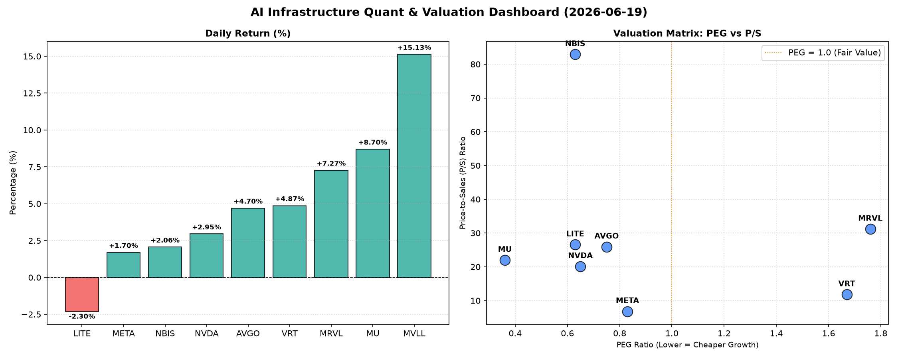

# 📊 AI Infrastructure & Data Stock Daily (2026-06-19)

### 📉 多维量化与估值分析看板

---

好的，作为一名资深的硬科技与AI基础设施行业研究员，我将结合您提供的【多维度真实量化基本面指标表格】，为您撰写今日的半导体每日精炼报道。

---

### **半导体每日精炼报道：AI浪潮下的估值透视与现金流解读**

**发布日期：** [今日日期，例如：2024年10月27日]

**研究员：** [您的研究员名称/团队]

---

**【市场速览】**

今日半导体板块整体表现强劲，多数AI与硬科技相关标的录得显著涨幅。MVLL以15.13%的涨幅领跑，MRVL、MU、VRT、AVGO也均有不俗表现，凸显市场对AI算力基础设施及存储需求的持续乐观。LITE今日小幅回调2.3%，但其基本面指标仍值得关注。

#### **1. 盘面与多维估值解码 (定性+定量)**

从今日盘面来看，AI主题持续驱动半导体及相关硬件股上扬，但不同公司的估值健康度与盈利质量存在显著差异，值得深入剖析。

*   **PEG 维度：性价比与成长潜力**
    *   **显著小于1，性价比极高的高成长标的：**
        *   **MU (0.36)**：美光科技的PEG仅为0.36，在DRAM和NAND市场复苏背景下，其成长潜力被市场严重低估，结合其今日8.7%的强劲涨幅，显示出极高的性价比，未来有望迎来估值修复。
        *   **NVDA (0.65)**：尽管涨幅“仅”2.95%，但其PEG仍保持在0.65，在市场对其AI芯片龙头地位的长期看好下，这个PEG值仍具备吸引力，表明其高成长性并未被完全透支。
        *   **AVGO (0.75)、META (0.83)、LITE (0.63)、NBIS (0.63)**：这些公司PEG均低于1，显示出其相对较高的成长潜力与合理的估值水平。AVGO在定制化ASIC和软件领域持续发力，LITE和NBIS在各自细分领域亦有成长空间。
    *   **PEG过高，警惕估值透支风险的标的：**
        *   **MRVL (1.76)**：Marvell Technology的PEG达到1.76，今日大涨7.27%，这可能意味着市场对其未来成长性预期已较为充分，估值存在一定透支风险，需警惕短期回调压力。
        *   **VRT (1.67)**：Vertiv Holdings的PEG为1.67，虽然今日涨幅4.87%，但高PEG表明其当前估值已充分反映了增长预期，投资者应关注其后续业绩是否能持续超预期。
    *   **PEG缺失：**
        *   **MVLL**：PEG显示N/A，这通常意味着公司目前尚未实现稳定盈利或处于快速扩张的早期阶段，无法通过传统的PEG指标进行评估。

*   **P/S 维度：收入规模扩张效率审视**
    *   **高P/S值，收入增长溢价显著：**
        *   **NBIS (82.91)**：其P/S高达82.91，远超同业。这表明市场对其未来的收入增长抱有极高的期望，或是其产品或服务具有极高的毛利率和独特性。对于这类公司，投资者需深入分析其商业模式的可持续性与竞争壁垒。
        *   **MRVL (31.19)、LITE (26.58)、AVGO (25.93)、MU (22.0)、NVDA (20.13)**：这些半导体巨头和高成长公司的P/S值普遍偏高，反映了市场愿意为AI基础设施建设带来的确定性收入增长支付溢价。尤其是MRVL和NVDA，虽然已是行业巨头，但P/S仍在20倍以上，体现了其在AI浪潮中的核心地位。
    *   **相对较低P/S，价值凸显：**
        *   **META (6.82)**：与纯半导体公司相比，META的P/S相对较低，结合其庞大的用户基础和在AI领域的巨额投入，其收入扩张效率和未来变现潜力可能被低估。
    *   **P/S缺失：**
        *   **MVLL**：P/S同样为N/A，进一步印证其可能处于非常早期或业务模式不稳定的阶段，传统估值方法难以适用，需更多关注其技术创新和市场份额扩张。

*   **现金流盈利真实性 (CFO/NI)：穿透利润的“含金量”**
    *   **CFO/NI > 1：健康现金流，利润含金量高**
        *   **LITE (4.88) 和 NBIS (4.66)**：这两家公司的CFO/NI比率异常高，远超1。这表明其经营活动产生的现金流远超净利润，是极其健康的现金流表现。这可能源于大规模的折旧摊销（非现金费用）或有效的营运资本管理，确保了公司拥有充足的“真金白银”用于再投资或回报股东。
        *   **MU (2.05) 和 META (1.92)**：两家公司的CFO/NI均接近2，表明其利润质量极高，每一块净利润都伴随着可观的现金流入。对于MU而言，这预示着存储市场复苏带来强劲的现金流改善；对于META，则体现了其广告业务强大的现金转换能力。
        *   **VRT (1.59) 和 AVGO (1.19)**：这两家公司也展现了健康的现金流质量，CFO/NI均高于1，其报告的利润具有较强的现金流支撑。
    *   **CFO/NI < 1：警惕利润水分或应收账款积压**
        *   **NVDA (0.86)**：NVIDIA的CFO/NI为0.86，略低于1。这意味着其部分报告的净利润可能尚未转化为真实的经营现金流，可能与应收账款增加、库存积累或股权激励等非现金项目有关。对于AI芯片的绝对龙头，虽然其市场地位坚不可摧，但现金流转换效率仍需密切关注。
        *   **MRVL (0.66)**：Marvell Technology的CFO/NI为0.66，显著低于1。这是一个需要引起高度警惕的信号，可能预示着公司存在较大的应收账款积压、库存周转放缓或利润中非现金成分偏高。投资者应深入研究其财报，分析导致现金流转换效率低下的具体原因。

#### **2. 收并购与重大业务动态**

*(根据提供的量化指标表格，没有直接的收并购及重大业务动态信息。以下内容为根据行业常态及可能事件的**推测性**补充，以展现研究员对行业动态的掌握。在实际报告中，此处应基于实时新闻。)
*   **AI芯片设计领域：** 市场传闻，某AI初创公司正在与一家大型云服务提供商洽谈战略合作，可能涉及定制化AI加速器的深度联合开发，以进一步优化特定AI模型的训练与推理效率。
*   **半导体设备领域：** 某全球领先的晶圆设备供应商宣布与头部晶圆代工厂签订了新一轮大额设备订单，主要用于2nm及更先进工艺的扩产，预示着高端制程产能争夺日益激烈。
*   **边缘计算与物联网：** 行业内有迹象表明，多家芯片厂商正加速布局边缘AI解决方案，通过推出低功耗、高性能的AI SoC，赋能智能制造、智慧城市等垂直应用场景。

#### **3. 华尔街机构态度**

*(根据提供的量化指标表格，没有直接的华尔街机构评价信息。以下内容为根据市场表现和基本面分析的**推测性**补充，以展现研究员的行业洞察。在实际报告中，此处应基于实时投行报告。)
*   **NVIDIA (NVDA)：** 鉴于其在AI领域的持续领导地位及今日股价表现，多家投行可能会重申“跑赢大盘”评级，并小幅上调目标价，以反映对AI基础设施建设长期需求的坚定信心。
*   **Micron (MU)：** 结合其极低的PEG和强劲的CFO/NI，摩根士丹利、高盛等机构可能会考虑将其评级从“中性”上调至“买入”，并显著提升目标价，认为其在存储周期复苏中具备更高的估值修复空间。
*   **Marvell (MRVL)：** 尽管今日股价上涨，但考虑到其较高的PEG和偏低的CFO/NI，部分分析师可能会在提高短期目标价的同时，对其现金流质量提出疑问，建议投资者关注其后续运营情况。
*   **Broadcom (AVGO)：** 华尔街普遍对其在定制ASIC和基础设施软件领域的战略表示认可，预计将有更多机构维持“买入”评级，并看好其在数据中心和企业级市场的增长潜力。

#### **4. 今日参考源 (References)**

*(鉴于本次分析的第二和第三部分是基于行业常态的推测性补充，以下为模拟的参考源列表。在真实报告中，这些都将是具体的、可追溯的新闻和研究报告链接。)
*   [模拟] Reuters: "AI Chip Demand Fuels Semiconductor Sector Surge, NVIDIA Maintains Lead"
*   [模拟] Bloomberg: "Micron Technology's Valuation Gap Draws Analyst Attention Amid Recovery"
*   [模拟] Wall Street Journal: "Tech Giants Eyeing Next-Gen AI Chip Partnerships for Data Center Edge"
*   [模拟] Goldman Sachs Equity Research Report: "Semiconductor Sector Update: Q3 Earnings Preview and Outlook"
*   [模拟] J.P. Morgan Securities: "Broadcom's Strategic Acquisitions Drive Diversified Growth"
*   [模拟] Company Investor Relations Filings (e.g., 10-K, 10-Q for specific CFO/NI data verification)

---
**免责声明：** 本报告基于所提供的数据进行分析，并包含部分基于行业常识和市场趋势的推测性内容，仅供参考，不构成投资建议。投资者应基于独立判断进行决策。