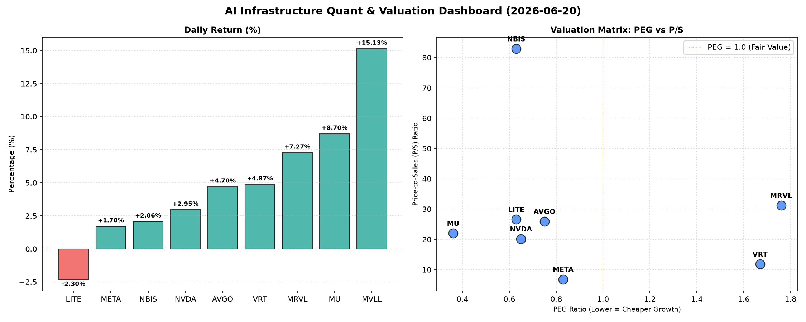

# 📊 AI Infrastructure & Data Stock Daily (2026-06-20)

### 📉 多维量化与估值分析看板

---

## 半导体每日精炼报道：AI基础设施与硬科技估值深度解码

**发布日期：[今日日期]**

尊敬的AI基础设施与硬科技行业投资者及专业人士：

今日半导体与AI基础设施板块整体表现活跃，市场情绪积极。我们今日将结合核心量化指标，为您深度剖析数家关键公司的估值现状、现金流健康度及潜在风险。

### **1. 盘面与多维估值解码 (Qualitative & Quantitative Valuation Insights)**

今日市场呈现普涨态势，其中MVLL以惊人的15.13%涨幅领跑，MRVL和MU也分别取得了7.27%和8.7%的显著增长，显示出市场对特定AI硬件和存储领域的强烈看好。唯LITE小幅回调2.3%。

#### **1.1 PEG 维度：增长与估值的性价比洞察**

PEG（市盈率/增长率）是衡量成长股性价比的关键指标。PEG显著小于1通常被视为高成长、低估值的信号。

*   **性价比极高的高成长标的 (PEG < 1)**：
    *   **MU (0.36)**：作为存储巨头，其PEG值仅为0.36，在本次分析中表现出卓越的成长与估值匹配度。这可能预示着市场对其未来盈利增长的预期尚未充分反映在其当前股价中，或其盈利增长速度远超现有市盈率。
    *   **NVDA (0.65)**：尽管过去一年涨幅巨大，但其0.65的PEG依然显示出较强的成长性溢价，表明其高增长潜力仍能支撑目前的估值。
    *   **AVGO (0.75)**、**META (0.83)**、**LITE (0.63)**、**NBIS (0.63)**：这些公司也表现出低于1的PEG，意味着在各自领域内，它们以相对合理的估值提供了可观的增长前景，值得投资者关注。
*   **警惕估值透支风险 (PEG > 1)**：
    *   **MRVL (1.76)**：PEG高达1.76，显著高于1，可能意味着其当前股价已部分透支了未来的增长预期，投资者需警惕估值回调风险。尽管今日涨幅居前，但高PEG提示其后续增长需强力支撑。
    *   **VRT (1.67)**：PEG也处于较高水平，显示出其估值相对较高，对未来的成长性要求更为严苛。
*   **数据缺失 (N/A)**：MVLL的PEG数据缺失，无法从该维度评估其成长性与估值匹配度。

#### **1.2 P/S 维度：收入规模扩张效率评估**

P/S（市销率）尤其适用于评估早期或尚处于大规模研发投入阶段、利润不稳（如无利润或低利润）的公司，用以衡量其收入规模扩张效率。

*   **极高P/S (高增长预期/利基市场)**：
    *   **NBIS (82.91)**：P/S高达82.91，远超同行。这表明市场对其未来收入增长抱有极高甚至可能是激进的预期，或其业务模式具有极强的独占性和盈利潜力，但同时也伴随着极高的风险。
    *   **MRVL (31.17)**、**LITE (26.58)**、**AVGO (25.93)**、**MU (22.0)**、**NVDA (20.13)**：这些公司的P/S均在20以上，反映了市场对AI基础设施、数据中心和高端芯片等领域未来收入增长的普遍乐观情绪。高P/S通常意味着公司拥有强劲的市场地位、创新能力或处于高速增长的赛道。
*   **相对中等P/S (成熟增长/规模效应)**：
    *   **VRT (11.8)**、**META (6.82)**：相较于其他芯片/AI基础设施公司，META的P/S相对较低，可能反映其业务更为多元化且规模已极其庞大，市场对其收入增速的预期相对更成熟稳定。
*   **数据缺失 (N/A)**：MVLL的P/S数据缺失，无法从该维度评估其收入规模扩张效率。

#### **1.3 现金流盈利真实性 (CFO/NI)**

CFO/NI（经营活动现金流/净利润）比率是衡量公司利润质量的关键指标。该值大于1，通常表明公司利润健康，由真金白银的现金流入支撑；若显著小于1，则可能存在利润水分或应收账款积压等问题。

*   **现金流极其健康，利润含金量高 (CFO/NI > 1)**：
    *   **LITE (4.88)**、**NBIS (4.66)**：这两家公司的CFO/NI比率均远超1，高达4以上，表明其将净利润转化为经营现金流的能力极其强劲，利润质量极高，现金流管理效率令人印象深刻。
    *   **MU (2.05)**、**META (1.92)**、**VRT (1.59)**、**AVGO (1.19)**：这些公司的CFO/NI比率均显著大于1，尤其是MU和META接近甚至超过2，显示其盈利是实实在在的现金流入，财务状况非常健康，营运资本管理良好。
*   **警惕利润水分或应收账款积压 (CFO/NI < 1)**：
    *   **NVDA (0.86)**：作为市场焦点，NVDA的CFO/NI比率为0.86，略低于1。这可能提示其部分利润尚未转化为现金，存在应收账款增加或存货积压的迹象，投资者需关注其现金流的动态变化。
    *   **MRVL (0.66)**：其CFO/NI比率仅为0.66，显著低于1，是本次分析中最低的。这强烈警示其利润质量可能存在问题，或者其业务模式导致了较高的应收账款或存货，需深入研究其财报附注以了解具体原因，谨防“纸面利润”。
*   **数据缺失 (N/A)**：MVLL的CFO/NI数据缺失，无法评估其利润真实性。

### **2. 收并购与重大业务动态**

今日提供的量化指标表格中未包含收并购或重大业务动态的具体信息。因此，本报告无法在此板块提供基于数据源的定性分析。

### **3. 华尔街机构态度**

今日量化指标表格中未提供华尔街机构对各公司的最新评价、目标价调动等信息。鉴于本报告严格基于所提供数据，因此无法在此板块提供深入分析。

### **4. 今日参考源 (References)**

本报告的量化数据及定性分析均严格基于【您提供的多维度真实量化基本面指标表格】。

**免责声明**：本报告仅为信息分享与分析之用，不构成任何投资建议。投资者在做出投资决策前，应进行独立研究并咨询专业意见。