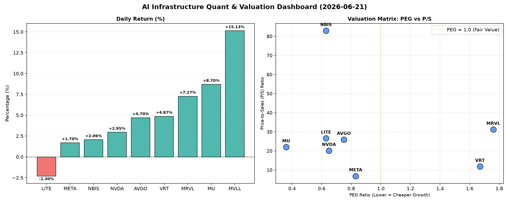

# 📊 AI Infrastructure & Data Stock Daily (2026-06-21)

### 📉 多维量化与估值分析看板

---

## 半导体每日精炼报道：硬科技与AI基础设施深度观察 [2024年X月X日]

今日半导体及AI基础设施板块表现活跃，多个细分领域龙头股价上扬，市场对AI算力、数据中心及相关存储芯片的需求预期持续升温。我们将结合最新的多维度量化指标，对重点公司进行深度剖析。

### 1. 盘面与多维估值解码 (定性+定量)

今日市场呈现普涨态势，其中MVLL (15.13%)、MU (8.7%) 和 MRVL (7.27%) 领涨，展现出强劲的市场信心。LITE (-2.3%) 成为唯一收跌的标的，需关注其背后是否存在特定利空。

**PEG 维度：成长性与估值性价比的衡量**

PEG（市盈率相对盈利增长比率）低于1通常被视为高成长且估值合理的信号，而过高的PEG则可能预示估值透支。

*   **高性价比成长股（PEG < 1）**：
    *   **MU (0.36)**：美光科技以极低的0.36 PEG值脱颖而出，结合其今日8.7%的强劲涨幅，显示市场对其未来盈利增长预期与当前估值相比，仍存在巨大空间，是极具吸引力的高成长价值标的。
    *   **NVDA (0.65)**：英伟达作为AI芯片的绝对领军者，其PEG仍低于1，表明尽管股价已经高企，市场依然认为其未来成长速度能够支撑甚至超越当前估值，高增长预期强烈。
    *   **AVGO (0.75)**：博通的PEG也处于健康区间，显示其在基础设施软件和半导体解决方案领域的成长性得到市场认可，且估值合理。
    *   **META (0.83)**：Meta Platforms作为AI基础设施的重要用户和开发者，其PEG低于1，表明其在AI投入和广告业务复苏双轮驱动下的成长性尚未完全体现在估值中，具备进一步上涨潜力。
    *   **LITE (0.63) & NBIS (0.63)**：这两家公司的PEG也远低于1，尽管LITE今日下跌，但其估值显示出较好的成长性与性价比，可能存在短期市场情绪影响。NBIS的低PEG结合其今日2.06%的涨幅，也暗示其潜在的高成长。

*   **估值警惕（PEG > 1）**：
    *   **VRT (1.67)**：Virtu Financial 的PEG值相对较高，结合其今日4.87%的涨幅，表明市场对其未来增长的预期已部分兑现，投资者需警惕短期估值透支风险。
    *   **MRVL (1.76)**：Marvell Technology 的PEG最高，暗示其股价在今日大涨7.27%后，未来成长潜力可能已大部分反映在当前估值中，需谨慎评估其后续增长动能。

*   **MVLL**：因PEG数据缺失，暂无法评估。

**P/S 维度：收入规模扩张效率的审视**

P/S（市销率）对于早期或尚处于大规模研发投入阶段、利润不稳的公司（如无利润或低利润标的）尤其重要，用以评估其目前的收入规模扩张效率。

*   **高P/S公司**：
    *   **NBIS (82.91)**：NBIS的P/S值极高，显著高于同行，这可能意味着该公司正处于高速扩张期，市场对其营收增长速度和未来市场份额抱有极端乐观的预期，愿意为其尚未完全实现的收入支付高昂溢价。投资者需深入了解其业务模式和增长驱动力。
    *   **MRVL (31.19)**、**LITE (26.58)**、**AVGO (25.93)**、**MU (22.0)** 和 **NVDA (20.13)**：这些公司的P/S值也处于较高水平，反映市场对其在特定硬科技领域（如AI芯片、数据中心互联、存储等）的营收质量和持续增长潜力高度认可。尤其是在AI基础设施蓬勃发展的背景下，高P/S往往伴随着对技术领先和市场领导地位的溢价。

*   **中低P/S公司**：
    *   **VRT (11.8)**：VRT的P/S处于中等水平，与其业务性质和市场地位相符。
    *   **META (6.82)**：Meta Platforms的P/S相对较低，考虑到其庞大的用户基础和广告营收规模，这可能表明其在现有业务基础上的收入转化效率较高，或在经历了一段调整期后，市场对其营收增长的预期趋于理性。

*   **MVLL**：因P/S数据缺失，暂无法评估。

**现金流盈利真实性 (CFO/NI)：利润质量的穿透**

CFO/NI（经营现金流/净利润）比率是衡量公司利润质量的关键指标。该值大于1，通常表明利润健康，大部分转化为实际现金流入；若显著小于1，则可能存在利润水分、应收账款积压或非现金费用较高等问题。

*   **健康现金流（CFO/NI > 1）**：
    *   **LITE (4.88) & NBIS (4.66)**：这两家公司拥有异常强劲的CFO/NI比率，远超1。这表明其经营活动产生的现金流远高于其报告的净利润，其利润不仅真实，而且现金流转化效率极高，运营管理和成本控制能力出色。
    *   **MU (2.05)**：美光科技的CFO/NI超过2，显示其在今日股价大涨的同时，基本面现金流也极为健康，利润含金量高。
    *   **META (1.92)**：Meta Platforms也展现了非常健康的现金流状况，其利润质量高，大部分能够转化为实实在在的现金。
    *   **VRT (1.59) & AVGO (1.19)**：这两家公司的CFO/NI也均大于1，表明其利润健康，经营活动产生了充足的现金流。

*   **利润水分警示（CFO/NI < 1）**：
    *   **NVDA (0.86)**：英伟达的CFO/NI略低于1，提示投资者需关注其利润构成中非现金部分（如应收账款增加或股权激励摊销等）的影响。尽管其是市场焦点，但利润的现金转化效率存在一定的改善空间，需关注其营收增长与现金流入的匹配度。
    *   **MRVL (0.66)**：Marvell Technology 的CFO/NI显著低于1，仅为0.66。这发出了较强的警示信号，可能意味着其存在较严重的应收账款积压、存货增加或其他非现金费用侵蚀利润的情况，投资者应警惕其利润的真实性和现金流转化效率，深入分析其财务报表，以理解其现金流状况背后的具体原因。

*   **MVLL**：因CFO/NI数据缺失，暂无法评估。

### 2. 收并购与重大业务动态

**【重要提示】**：根据您提供的量化基本面指标表格，未能直接获得收并购、业务动态或战略合作的具体信息。因此，本报告无法基于所提供数据生成此板块的深度内容。若有相关新闻，建议关注以下方面：
*   **行业整合趋势**：硬科技与AI领域持续的快速发展可能催生更多战略性并购，以巩固市场地位或拓展新技术领域。
*   **AI芯片设计与制造合作**：AI算力需求的爆发可能促使芯片设计公司与代工厂之间形成更紧密的合作或新的产能协议。
*   **数据中心基础设施升级**：伴随AI训练和推理需求的增长，数据中心运营商与基础设施供应商（如网络、存储解决方案提供商）的合作将更加频繁。

### 3. 华尔街机构态度

**【重要提示】**：您提供的量化数据表格中不包含华尔街机构的评级、目标价或最新评价信息。因此，本报告无法基于所提供数据生成此板块的深度内容。通常，对于今日表现强势的标的，如MVLL、MU和MRVL，机构可能会考虑上调其目标价或维持“买入”评级。对于NVDA，其市场地位和增长潜力通常会得到顶级投行的持续看好。而LITE今日的下跌，可能会引起机构的关注和重估。

### 4. 今日参考源 (References)

**【重要提示】**：您提供的量化数据表格中不包含用于生成定性内容的真实新闻出处。本报告的定性分析主要基于对所提供量化指标的解读。因此，无法提供具体的今日新闻链接作为参考源。若要获取更全面的市场解读，建议查阅以下权威财经媒体和行业报告：
*   彭博社 (Bloomberg)
*   路透社 (Reuters)
*   华尔街日报 (The Wall Street Journal)
*   Seeking Alpha
*   特定硬科技及半导体行业分析报告（如Gartner, IDC, Bernstein Research等）