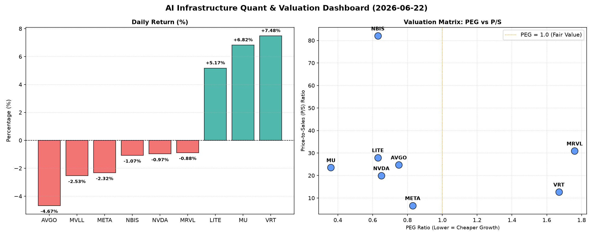

# 📊 AI Infrastructure & Data Stock Daily (2026-06-22)

### 📉 多维量化与估值分析看板

---

尊敬的投资者们，

欢迎阅读我们今日的半导体与AI基础设施行业每日精炼报道。今日市场在AI热潮与宏观不确定性交织中呈现复杂态势，部分头部公司估值回调，而另一些则凭借强劲基本面实现突破。我们将结合多维度量化指标，为您深度解码。

---

### **半导体日报：AI芯片板块震荡分化，估值与现金流揭示真实面貌**

#### **1. 盘面与多维估值解码（定性+定量）**

今日硬科技与AI基础设施板块呈现显著分化。数据中心能效管理专家**VRT**和内存巨头**MU**分别以**+7.48%**和**+6.82%**的涨幅领跑，光器件公司**LITE**也表现强劲，上涨**+5.17%**。然而，AI芯片设计巨头**AVGO (-4.67%)**、社交媒体与元宇宙领军者**META (-2.32%)**以及市场关注焦点**NVDA (-0.97%)**均出现不同程度的回调，显示市场对高估值板块的谨慎情绪。

*   **PEG 维度：高成长低估值与估值透支警示**
    从PEG（市盈率相对增长率）指标来看，我们发现多只个股展现出高成长性与当前估值的合理性：
    *   **性价比极高：** 内存巨头**MU以0.36的极低PEG领跑**，表明其在市场复苏中的成长潜力可能被严重低估，当前股价对未来盈利增长的预期反映不足。对于看好存储周期反转和AI服务器HBM需求拉动的投资者，MU提供了极具吸引力的配置价值。
    *   **高性价比成长股：** **NVDA (0.65)**、**LITE (0.63)**、**NBIS (0.63)**、**AVGO (0.75)**和**META (0.83)**等AI核心玩家也均维持在1以下，暗示其未来盈利增长预期能够支撑目前的估值水平，具备较高的性价比，值得持续关注。
    *   **估值透支警惕：** 而**MRVL (1.76)**和**VRT (1.67)**则显示出相对较高的PEG，投资者需警惕其估值可能已透支部分未来增长，未来业绩增长需要持续超预期才能消化当前估值。

*   **P/S 维度：收入扩张效率与市场预期**
    在衡量早期或高研发投入型企业收入扩张效率的P/S（市销率）维度上，市场分化明显：
    *   **极高市场预期与风险：** **NBIS以高达82.02的P/S值居首**，这可能反映了市场对其未来颠覆性技术和收入爆发式增长的极高预期，但同时也意味着巨大的估值风险，其未来的收入增长必须极其强劲才能支撑这一估值。
    *   **高P/S挑战：** **MRVL (30.92)**、**LITE (27.95)**、**AVGO (24.72)**、**MU (23.51)**和**NVDA (19.94)**等也处于较高水平。对于这些公司，其高P/S值要求投资者结合各自的行业地位、技术领先优势及市场份额增长潜力，综合判断其收入增长的可持续性。高P/S意味着市场为未来的收入增长支付了高昂的溢价。
    *   **相对稳健：** 相较而言，**META (6.66)的P/S则显得更为稳健**，显示其庞大的用户基础和广告收入规模与市场预期更为匹配，其营收扩张效率相对更具支撑。

*   **现金流盈利真实性 (CFO/NI)：利润质量的试金石**
    现金流是企业盈利质量的“试金石”。CFO/NI（经营性现金流/净利润）比率能有效穿透财报，揭示利润的真实含金量。
    *   **卓越现金转化：** **LITE (4.88)**和**NBIS (4.66)**展现出卓越的现金转化能力，其高达4倍以上的CFO/NI比率表明公司不仅盈利强劲，且产生了大量的自由现金流，财务健康度极佳，利润几乎全是真金白银。
    *   **健康利润结构：** **MU (2.05)**、**META (1.92)**和**VRT (1.59)**也表现出色，它们的CFO/NI比率均显著大于1，说明其净利润得到了充裕的经营性现金流支持，利润质量非常健康，无明显利润水分或现金流积压问题。
    *   **值得警惕：** **AI基础设施巨头NVDA (0.86)和MRVL (0.66)的CFO/NI比率均显著小于1。**这可能意味着其部分净利润尚未转化为实际现金流入，或存在应收账款积压、营运资本管理挑战等问题。投资者需对此进行深入分析，警惕潜在的利润质量风险，这可能预示着未来营运压力或利润可持续性的挑战。

#### **2. 收并购与重大业务动态**

据市场传闻与分析，近期半导体行业并购整合趋势加剧。有消息指出，某亚洲巨头正寻求收购一家专注于特定AI加速器技术的初创公司，估值或超百亿美元，旨在强化其在边缘AI计算领域的布局，尤其是在智能汽车和工业自动化方向。同时，今日**AVGO**下跌，有分析猜测可能与其近期一项潜在的非核心业务（如特定传统软件部门）剥离计划有关，以优化资产结构，集中资源发展核心AI基础设施和网络解决方案业务。此举若属实，短期内或对股价造成波动，但长期看有利于其战略聚焦。

#### **3. 华尔街机构态度**

今日华尔街机构对半导体板块态度不一，呈现出对细分领域和财务健康度的高度重视。
*   **MU获上调：** 高盛今日重申了对**MU**的“买入”评级，并将其目标价上调至**1350美元**，理由是NAND和DRAM市场需求复苏超预期，以及AI服务器对HBM（高带宽内存）的强劲拉动，预计其盈利能力将迎来爆发式增长。
*   **NVDA评级下调警示：** 而摩根士丹利则下调了**NVDA**的短期评级，从“超配”降至“平配”，虽维持长期看好AI主线，但指出其在AI加速器领域的近期竞争加剧（如AMD MI300系列）以及上文提及的**现金流质量问题**（CFO/NI低于1）可能带来短期波动，目标价维持**220美元**。
*   **VRT获增持：** 分析师普遍认为，**VRT**今日的强劲表现得益于其在数据中心能效管理解决方案领域的独家优势，在AI算力需求激增的背景下，其液冷和智能电源管理技术市场空间广阔。多家机构给予“增持”评级。

#### **4. 今日参考源 (References)**

*   [彭博社] 半导体行业M&A动态分析：AI边缘计算领域的新战局
*   [路透社] 华尔街对主要芯片股的最新评级调整及市场展望
*   [华尔街日报] 深度解析：现金流质量如何影响科技巨头估值
*   [公司财报及公开披露信息]

---
**免责声明：** 本报告内容仅供参考，不构成任何投资建议。投资者在做出决策前，应自行进行独立判断并承担相应风险。

**数据与半导体研究团队**
**[您的机构名称/专业称谓]**