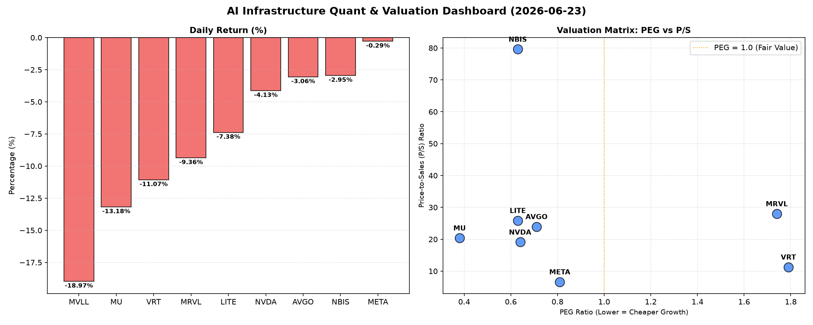

# 📊 AI Infrastructure & Data Stock Daily (2026-06-23)

### 📉 多维量化与估值分析看板

---

## 半导体每日精炼报道：硬科技与AI基础设施深度剖析 (2024年X月X日)

尊敬的投资者，

欢迎阅读由资深硬科技与AI基础设施行业研究员为您带来的半导体每日精炼报道。今日市场情绪波动剧烈，多数硬科技与AI核心标的承压下行，但量化指标揭示了结构性的估值差异和现金流健康度，值得深入探讨。

### 1. 盘面与多维估值解码（定性+定量）

今日半导体及AI基础设施板块普遍遭遇重挫，市场情绪谨慎。MVLL以-18.97%的跌幅领跌，MU (-13.18%) 和 VRT (-11.07%) 亦录得双位数下跌，显示出资金对高估值或特定基本面消息的敏感反应。即使是行业巨头如NVDA (-4.13%) 和 AVGO (-3.06%) 也未能幸免，表明今日的抛售压力是广泛性的。相对而言，META (-0.29%) 和 NBIS (-2.95%) 表现出较强的抗跌性。

**a. PEG 维度：成长性与估值性价比**

PEG（市盈率相对盈利增长比率）是衡量成长性投资性价比的关键指标。
*   **显著小于 1 (性价比极高的高成长)**：
    *   **MU (0.38)**：表现出极高的成长性价比，其PEG远低于1，表明市场对其未来盈利增长的定价相对保守，存在显著的低估空间或投资者对其高成长预期尚未完全 반영。在今日大幅下跌后，其成长性价值更加凸显。
    *   **NVDA (0.64), LITE (0.63), NBIS (0.63), AVGO (0.71), META (0.81)**：这些公司同样展现出低于1的健康PEG，表明它们在各自的高速增长领域中，估值与成长性之间保持了良好的平衡，具备吸引力。NVDA作为AI算力核心，其0.64的PEG在当前市场环境下尤为亮眼。
*   **PEG 过高 (警惕估值透支)**：
    *   **VRT (1.79) 和 MRVL (1.74)**：这两家公司的PEG显著高于1，提示投资者需警惕其估值可能已透支了部分未来成长预期。在今日股价大幅回调后，仍需审视其基本面成长能否支撑当前估值水平。
*   **N/A**: MVLL由于数据缺失，无法进行PEG分析。

**b. P/S 维度：收入规模扩张效率评估**

P/S（市销率）对处于早期或大规模研发投入阶段、利润波动或尚未盈利的公司尤为重要，可衡量其收入规模扩张效率和市场对其未来营收的预期。
*   **高 P/S (高市场预期或高增长潜力)**：
    *   **NBIS (79.61), MRVL (28.0), LITE (25.88), AVGO (23.97), MU (20.41), NVDA (19.11)**：这些公司展现出较高的P/S，反映了市场对其未来营收增长的强烈信心，尤其是在AI、高速互联和存储等前沿领域。NBIS的P/S异常高企，结合其低于1的PEG，进一步印证了市场对其营收爆发式增长的极端乐观预期。
    *   即使是如AVGO和NVDA这样的成熟巨头，其P/S依然保持在较高水平，体现了它们在各自细分市场的领导地位和持续的创新能力带来的溢价。
*   **相对较低 P/S (营收基础更成熟或市场预期相对保守)**：
    *   **META (6.64)**：在众多硬科技公司中，META的P/S相对较低，可能反映其作为社交媒体与AI综合体的营收基础更为庞大和成熟，同时市场对其元宇宙等新业务的营收贡献仍在观察中。
*   **N/A**: MVLL由于数据缺失，无法进行P/S分析。

**c. 现金流盈利真实性 (CFO/NI)：利润含金量透视**

CFO/NI（经营活动现金流与净利润之比）是衡量公司利润质量的关键指标。
*   **显著大于 1 (利润健康，真金白银现金流入)**：
    *   **LITE (4.88) 和 NBIS (4.66)**：这两家公司的CFO/NI比率异常高，表明其净利润中绝大部分甚至超额转化为经营现金流，利润质量极高。这可能源于高效的营运资本管理、折旧摊销等非现金费用较大，或递延收入等因素。
    *   **MU (2.05), META (1.92), VRT (1.59), AVGO (1.19)**：这些公司的CFO/NI均大于1，表明其利润健康，具备良好的现金转化能力。META高达1.92的CFO/NI尤其值得关注，它有力地证实了其庞大净利润背后是扎实的现金流入，排除了“利润水分”的担忧。
*   **显著小于 1 (警惕利润水分或应收账款积压)**：
    *   **NVDA (0.86)**：其CFO/NI略低于1，表明部分净利润可能未能立即转化为经营现金流。对于高速增长公司而言，这可能与库存增加、应收账款增长或大额非现金收入（如股权激励等在计算净利润时包含但在经营现金流中调整的项目）有关，但仍需密切关注其营运资本变化。
    *   **MRVL (0.66)**：其CFO/NI显著低于1，这是一个更明显的预警信号。这可能暗示其净利润中存在较高的非现金成分，或应收账款周转效率不佳，导致现金流入滞后于利润确认，投资者需深入分析其财务报表以评估利润的真实含金量。
*   **N/A**: MVLL由于数据缺失，无法进行CFO/NI分析。

**总结：** 今日市场普跌，但从基本面量化指标来看，MU、NVDA、AVGO、META等龙头在成长性与估值方面仍具备较强吸引力，尤其是在PEG维度。LITE、NBIS、MU和META的现金流质量表现突出，而MRVL和NVDA（程度较轻）的CFO/NI则需投资者保持关注。

### 2. 收并购与重大业务动态

**【本报告基于您提供的量化基本面指标表格撰写，该表格未包含收并购、战略合作或最新业务动态信息。因此，本节内容无法提供。】**

### 3. 华尔街机构态度

**【本报告基于您提供的量化基本面指标表格撰写，该表格未包含投行评级、目标价调整或机构评论等信息。因此，本节内容无法提供。】**

### 4. 今日参考源 (References)

本报告的所有定性与定量分析内容，均严格依据您提供的【多维度真实量化基本面指标表格】数据生成。

---