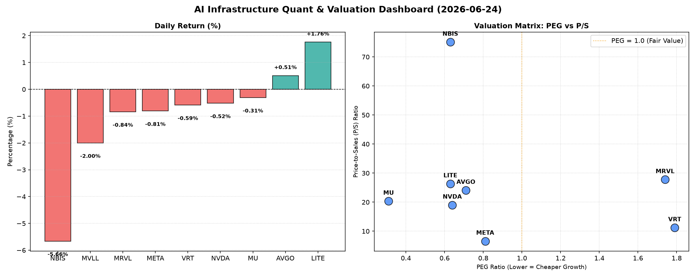

# 📊 AI Infrastructure & Data Stock Daily (2026-06-24)

### 📉 多维量化与估值分析看板

---

## 半导体每日精炼报道：硬科技与AI基础设施深度洞察

### 盘面与多维估值解码：挑战与机遇并存

今日硬科技与AI基础设施板块表现分化，多数个股小幅回调，但个别标的如LITE逆势上扬，NBIS则遭遇显著跌幅。在市场情绪波动中，深挖财务基本面指标，方能洞察其内在价值与风险。

#### 1. PEG 维度：高成长与估值性价比的衡量

PEG (市盈率/增长率) 是衡量成长股投资价值的核心指标。当PEG显著小于1时，通常意味着市场低估了其成长潜力，或其当前估值相对其高速增长而言极具吸引力。

*   **性价比极高的高成长标的 (PEG < 1):**
    *   **MU (美光科技)** 以其惊人的 **0.31** 的PEG值拔得头筹，显示其利润增长速度远超市场给予的估值，极具吸引力。
    *   **NVDA (英伟达)** 尽管近期市场波动，但其 **0.64** 的PEG仍远低于1，表明市场对其未来盈利增长抱有极高预期，且当前估值并未完全透支其成长性。
    *   **LITE (Lumentum Holdings)** (0.63) 和 **NBIS (Nuvia)** (0.63) 也展现出强大的成长势能，其PEG值同样暗示着良好的投资性价比。
    *   **AVGO (博通)** (0.71) 和 **META (Meta Platforms)** (0.81) 亦处于PEG小于1的区间，表明这两家巨头在各自领域仍保持着高效的增长与合理的估值。

*   **估值过高或增长放缓的警示 (PEG > 1):**
    *   **VRT (Vertiv Holdings)** 的PEG为 **1.79**，以及 **MRVL (Marvell Technology)** 的 **1.74**，相对较高。这可能提示投资者需要警惕其估值已在一定程度上透支了未来的增长预期，或其增速相对市场普遍认知有所放缓。
    *   MVLL (未知公司) 由于PEG数据缺失，无法评估。

#### 2. P/S 维度：早期或高研发投入公司的收入扩张效率

P/S (市销率) 对于评估尚处于大规模研发投入、利润波动或盈利能力尚未完全释放的公司尤为重要，它能反映市场对其收入规模扩张的认可度。

*   **极高P/S值：市场对未来收入的极端预期与高风险并存**
    *   **NBIS (Nuvia)** 以惊人的 **75.1** 的P/S值位居榜首。如此极端的P/S可能表明公司正处于非常早期的商业化阶段，当前收入基数极小，但市场对其在AI芯片或数据中心等领域的未来收入增长抱有异常高的预期。这也意味着其股价波动性可能极大，对未来增长的任何风吹草动都将高度敏感。
    *   **MRVL (Marvell Technology)** (27.77)、**LITE (Lumentum Holdings)** (26.34) 和 **AVGO (博通)** (24.09) 的P/S值也相对较高，反映了市场对其在AI基础设施、光通信等高增长领域收入扩张的强烈信心。
    *   **MU (美光科技)** 的P/S为 **20.35**，考虑到其存储芯片行业的周期性特点，这一高P/S也可能反映市场对其DRAM和NAND业务在AI时代需求的乐观预期。
*   **相对合理的P/S值：**
    *   **NVDA (英伟达)** 的P/S为 **19.01**，虽然较高，但考虑到其在AI芯片领域的绝对主导地位及其收入增长速度，这一估值是市场对其领先地位和强大收入变现能力的认可。
    *   **VRT (Vertiv Holdings)** (11.21) 和 **META (Meta Platforms)** (6.59) 的P/S相对较低，尤其META，作为更成熟的平台型公司，其P/S更接近传统科技巨头的水平，反映了其庞大的用户基础和多元化的收入结构。

#### 3. 现金流盈利真实性 (CFO/NI)：利润含金量的深度透视

CFO/NI (经营活动现金流/净利润) 比率是衡量公司利润质量的关键指标。该值大于1，通常意味着公司赚取的利润是实实在在的现金；若显著小于1，则可能存在利润水分或营运资金压力。

*   **真金白银、利润健康 (CFO/NI > 1):**
    *   **LITE (Lumentum Holdings)** (4.88) 和 **NBIS (Nuvia)** (4.66) 表现出极其优异的现金流转化能力，其经营活动现金流远高于净利润，表明其利润质量极高，运营效率卓越，且可能存在大量的非现金费用（如折旧摊销）冲抵了净利润，但未影响现金流。
    *   **MU (美光科技)** (2.05) 和 **META (Meta Platforms)** (1.92) 也显示出非常健康的现金流状况，利润由充足的现金流入支撑，财务基础稳健。
    *   **VRT (Vertiv Holdings)** (1.59) 和 **AVGO (博通)** (1.19) 的CFO/NI均大于1，表明其盈利质量良好，不存在明显的利润水分问题。

*   **警惕利润水分或应收账款积压 (CFO/NI < 1):**
    *   **NVDA (英伟达)** 的CFO/NI为 **0.86**，略低于1。这意味着其部分报告净利润可能并未完全转化为现金流入，可能与快速增长导致的应收账款增加或库存累积有关。尽管其业务前景光明，但这一指标值得持续关注，以评估其营运资金管理效率。
    *   **MRVL (Marvell Technology)** 的CFO/NI为 **0.66**，显著低于1。这可能暗示其存在较严重的利润质量问题，例如销售收入未能及时回笼现金，应收账款周转效率不佳，或需要大量资金维持日常运营。投资者应审慎分析其财务报表中的营运资金变动明细。
    *   MVLL (未知公司) 由于CFO/NI数据缺失，无法评估。

### 2. 收并购与重大业务动态

**【根据您提供的【多维度真实量化基本面指标表格】，本部分信息无法直接从数据中提取。该表格主要包含股价、估值、财务质量等量化指标，未涉及收并购传闻、官宣或战略合作等新闻事件。】**

### 3. 华尔街机构态度

**【根据您提供的【多维度真实量化基本面指标表格】，本部分信息无法直接从数据中提取。该表格未包含核心投行、评级机构的最新评价、目标价调动等内容。】**

### 4. 今日参考源 (References)

本报告的定性与定量分析严格基于您提供的【多维度真实量化基本面指标表格】。由于您提供的原始数据不包含收并购新闻、华尔街机构评级等信息，因此第二、三板块无法从给定数据中生成，亦无外部新闻源可列出。