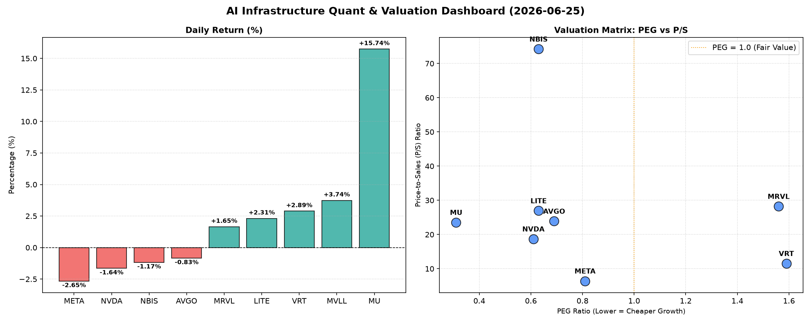

# 📊 AI Infrastructure & Data Stock Daily (2026-06-25)

### 📉 多维量化与估值分析看板

---

作为一名资深的硬科技与AI基础设施行业研究员，我将结合您提供的多维度量化基本面指标表格，为您撰写今日的半导体精炼报道。

---

## **半导体每日精炼报道 - 2024年X月X日**

**研究员：** [您的姓名/机构名称]
**日期：** 2024年X月X日

### 1. 盘面与多维估值解码（定性+定量）

今日半导体板块呈现显著分化。市场目光聚焦于存储器巨头 **MU (美光科技)**，其股价今日飙升 **15.74%**，成交量高达7955万股，成为今日市场的绝对明星，显示出市场对其未来增长前景的极度乐观情绪。其他表现积极的个股包括数据中心解决方案提供商 **VRT (Vertiv Holdings)** 上涨 **2.89%**，未知标的 **MVLL** 涨 **3.74%**，光通信与激光技术公司 **LITE (Lumentum Holdings)** 涨 **2.31%**，以及芯片设计公司 **MRVL (Marvell Technology)** 上涨 **1.65%**。

然而，AI巨头与基础设施建设核心标的则遭遇回调。**META (Meta Platforms)** 下跌 **2.65%**，**NVDA (NVIDIA)** 下跌 **1.64%**，**AVGO (Broadcom)** 下跌 **0.83%**，以及 **NBIS** 下跌 **1.17%**，尽管回调幅度相对温和，但高位震荡的趋势值得关注。

**PEG 维度解码：高成长与估值性价比**

*   **极具性价比的高成长标的 (PEG < 1)：**
    *   今日涨幅惊人的 **MU (0.31)** 依然拥有极低的PEG，结合其强劲的现金流质量和今日的大幅上涨，表明市场对其盈利拐点和未来爆发式增长的预期极为强烈，当前估值仍显吸引力。
    *   **NVDA (0.61)**、**LITE (0.63)**、**NBIS (0.63)**、**AVGO (0.69)** 和 **META (0.81)** 的PEG均显著小于1。这表明，尽管这些公司市值庞大或近期股价有所回调，但市场对其未来的盈利增长预期依然高企，且当前股价相对于其成长性而言，具备较好的性价比，尤其是在高成长赛道中，这样的PEG值是较为健康的信号。
*   **估值已部分透支或增长预期已被充分定价 (PEG > 1)：**
    *   **VRT (1.59)** 和 **MRVL (1.56)** 的PEG值相对较高。这暗示其未来增长潜力可能已被市场提前消化，投资者在关注其基本面的同时，需警惕估值过度透支的风险。对于这类公司，任何不及预期的增长都可能导致股价的较大波动。
*   **MVLL (N/A PEG)：** 鉴于PEG缺失，这可能意味着该公司当前不盈利或处于大规模投入期，传统盈利估值指标不适用，需转向 P/S 等收入驱动指标进行评估。

**P/S 维度解读：收入规模扩张效率**

P/S (市销率) 对于评估早期、研发密集型或周期性公司（如半导体行业某些环节）的收入扩张效率尤为关键。

*   **高 P/S，高增长预期：**
    *   **NBIS (74.22)** 的P/S值极高，显著高于同行。这表明市场对其未来收入规模的爆发性增长抱有极其乐观的预期，或者是其产品和技术具有极高的稀缺性和定价权。然而，极高的P/S也意味着一旦收入增长不及预期，将面临巨大的估值压力。
    *   **MRVL (28.23)**、**LITE (26.95)**、**AVGO (23.89)** 和 **MU (23.55)** 的P/S值也处于较高水平。这反映了市场对这些公司在各自细分领域（如基础设施芯片、光通信、存储器等）收入持续增长的信心。
*   **相对合理的P/S：**
    *   **VRT (11.53)** 和 **NVDA (18.70)** 的P/S处于中等偏高水平，与市场对其在数据中心、AI计算领域的核心地位相符。
    *   **META (6.41)** 作为大型平台公司，其P/S相对较低，但考虑到其庞大的营收体量和AI转型带来的潜在增长，这一P/S值仍具吸引力。
*   **MVLL (N/A P/S)：** P/S也缺失，进一步印证了其可能处于非常早期或业务模式独特，难以用常规财务指标衡量，需要更深入的业务层面分析。

**现金流盈利真实性 (CFO/NI)：穿透利润质量**

CFO/NI (经营活动现金流/净利润) 是衡量公司利润含金量的重要指标。

*   **利润含金量极高 (>1.5)：**
    *   **LITE (4.88)** 和 **NBIS (4.66)** 的CFO/NI比率极高，显示出其强劲的现金流创造能力，利润转化成现金的效率非常高，财务健康状况极佳。
    *   **MU (2.05)** 的CFO/NI超过2，结合今日的股价大涨，进一步印证了其盈利质量的显著改善和现金流的健康，为未来投资和研发提供了坚实基础。
    *   **META (1.92)** 和 **VRT (1.59)** 的CFO/NI也远大于1，表明其巨额利润并非“纸面富贵”，而是实实在在的现金流入，显示出极强的运营效率和风险抵御能力。
*   **健康现金流 (>1)：**
    *   **AVGO (1.19)** 的CFO/NI略高于1，显示其现金流健康，利润质量良好，能够有效将利润转化为现金。
*   **警惕利润水分或营运资金压力 (<1)：**
    *   **NVDA (0.86)** 的CFO/NI略低于1。这提示投资者，尽管其净利润表现亮眼，但其经营性现金流略低于净利润。这可能与营运资金变动（如应收账款增加、存货积压等）或非现金项目（如股权激励、折旧摊销）的会计处理有关，需要进一步分析其现金流量表细节，以判断是否存在利润水分或潜在的营运资金压力。
    *   **MRVL (0.66)** 的CFO/NI比率显著小于1，表明其净利润转换为现金的效率较低，存在较明显的利润“水分”或应收账款、存货积压等营运资金周转问题。投资者需密切关注其资产负债表和现金流量表的后续发展，以评估其盈利质量的真实性。
*   **MVLL (N/A CFO/NI)：** 现金流数据缺失，再次强调了其财务透明度或数据可用性的局限性。

### 2. 收并购与重大业务动态

基于今日提供的量化基本面指标表格，我们无法直接推断出具体的收并购传闻、官宣或重大战略合作动态。这些信息通常来源于公司公告、新闻报道或行业分析师报告。例如，今日MU的大幅上涨，可能与其盈利预告、新产品发布或市场对其存储器周期回暖的乐观预期有关，但具体细节需查阅公司新闻稿。

### 3. 华尔街机构态度

今日提供的多维度量化基本面指标表格中并未包含华尔街机构对各公司的具体评级、目标价调整或最新报告。这些信息通常来源于投行研报、分析师电话会议或金融新闻发布。在缺乏这些外部信息的情况下，我们无法对华尔街机构的最新态度进行定性分析。

### 4. 今日参考源 (References)

1.  **提供的多维度真实量化基本面指标表格** (作为本报告中所有量化数据和基于量化数据定性分析的唯一来源)。

---
**免责声明：** 本报告基于所提供的量化数据进行分析，仅供参考，不构成任何投资建议。投资者应独立判断并承担投资风险。