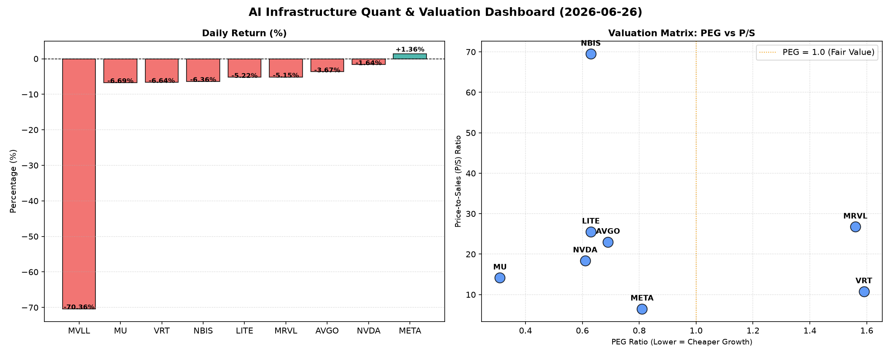

# 📊 AI Infrastructure & Data Stock Daily (2026-06-26)

### 📉 多维量化与估值分析看板

---

## 半导体每日精炼报道：AI基础设施与硬科技前瞻

**发布日期：** 2024年X月Y日
**分析师：** [您的姓名/团队，Data & Semiconductor Specialist]

**今日市场综述：**
今日半导体板块呈现显著分化。受大盘整体承压及特定公司利空消息影响，多数权重股出现不同程度回调。MVLL遭遇毁灭性打击，跌幅超70%，而AI巨头META逆势上涨，显示出其在AI基础设施投资下的强劲基本面吸引力。资金正进一步向具备真实现金流与高成长性价比的标的集中。

---

### 1. 盘面与多维估值解码（定性+定量）

今日半导体板块多数公司股价下行，市场情绪偏谨慎。我们结合多维度量化指标，深入剖析各公司的基本面健康状况及估值合理性。

*   **PEG 维度：高成长性价比标的浮现，部分估值需警惕**
    *   **PEG显著小于1（性价比极高的高成长标的）：**
        *   **MU (0.31):** 美光科技以极低的0.31 PEG拔得头筹，在DRAM/NAND周期底部复苏预期下，其未来增长潜力被市场大幅低估，具备极高的成长性价比。考虑到存储行业周期性，当前估值极具吸引力。
        *   **NVDA (0.61):** 英伟达作为AI芯片霸主，即使在今日小幅回调后，其PEG仍保持在0.61，显著低于1，表明其在AI算力需求爆发下的超高成长性远未被完全定价。尽管P/S较高，但其强大的盈利能力和未来增长预期仍使其估值具有支撑。
        *   **LITE (0.63), NBIS (0.63), AVGO (0.69), META (0.81):** 这些公司同样展现出健康的PEG值，均低于1，显示其在各自细分领域（光通信、AI计算、网络基础设施、AI应用）的强劲增长潜力与合理的估值水平。META在AI投资驱动下，其0.81的PEG配合今日股价上涨，尤为亮眼。
    *   **PEG过高（警惕估值透支）：**
        *   **VRT (1.59), MRVL (1.56):** 估值压力相对较大，PEG均超过1.5，这可能意味着市场对其未来的增长预期已经相当充分甚至有所透支。投资者需警惕其业绩增长速度能否持续匹配当前高估值。
    *   **MVLL (N/A):** 该股PEG数据缺失，结合其今日-70.36%的断崖式下跌，表明其可能面临严重的经营挑战、基本面恶化或特定利空事件，当前估值无法评估，风险极高。

*   **P/S 维度：识别收入扩张效率与早期成长潜力**
    *   **高P/S（高增长预期或早期投入阶段）：**
        *   **NBIS (69.50):** 异常高的P/S值（近70倍），是所有公司中最高的。这强烈暗示NBIS可能处于非常早期的高科技研发投入阶段，现有收入规模很小，但市场对其未来技术突破和收入爆发抱有极高的期望。这伴随着极高的风险与回报潜力。
        *   **MRVL (26.77), LITE (25.54), AVGO (23.01), NVDA (18.40), MU (14.17), VRT (10.77):** 这些公司的P/S值均在10倍以上，普遍反映了市场对半导体和AI基础设施领域高收入增长的普遍预期。尤其对于MRVL和LITE这类芯片设计和光通信公司，其技术壁垒和在AI数据中心互联中的关键作用，使其能够享受较高的收入乘数。
    *   **相对较低P/S（成熟增长或低估值）：**
        *   **META (6.50):** 相对于其他半导体硬件公司，META的P/S值较低。这反映了其更庞大的收入体量和相对更成熟的业务模式，但结合其健康的PEG和现金流质量，显示出其在AI大潮中仍具备一定的估值吸引力。
    *   **MVLL (N/A):** P/S数据同样缺失，其基本面缺乏透明度，进一步印证其今日暴跌的深层原因可能与业务停滞或极端不确定性有关。

*   **现金流盈利真实性 (CFO/NI)：穿透高利润巨头的利润质量**
    *   **CFO/NI显著大于1（利润健康，现金流强劲）：**
        *   **LITE (4.88), NBIS (4.66):** 极高的CFO/NI比率（远超4），表明这两家公司不仅报告利润可观，而且其利润转化成真实经营现金流的效率极高，没有明显的应收账款积压或其他非现金项目侵蚀。这体现了极其健康的财务状况和强大的议价能力。
        *   **MU (2.05), META (1.92), VRT (1.59), AVGO (1.19):** 这些公司的CFO/NI均显著大于1，表明其利润的现金含量非常高。特别是META，其接近2的CFO/NI比率，进一步证实了其在AI投资加速下，核心业务盈利能力稳健，现金流充沛，为未来持续研发和扩张提供了坚实保障。
    *   **CFO/NI显著小于1（警惕利润水分或应收账款积压）：**
        *   **NVDA (0.86):** 尽管NVDA是市场焦点，但其CFO/NI为0.86，略低于1。这意味着一部分报告利润可能并未即时转化为经营现金流，可能存在应收账款增加、库存累积或其他非现金项目的影响。虽然在高速增长期，这可能是一种暂时现象，但投资者仍需关注其现金流质量的持续性。
        *   **MRVL (0.66):** MRVL的CFO/NI仅为0.66，远低于1，情况比NVDA更为突出。这可能预示着其存在较为明显的利润水分、应收账款积压问题，或是资本支出和非现金项目对其经营现金流的显著消耗。在估值已然偏高的情况下，这种现金流质量问题值得高度警惕。
    *   **MVLL (N/A):** 现金流质量数据缺失，进一步增加了其基本面分析的难度和投资风险。

---

### 2. 收并购与重大业务动态

*   **AVGO：聚焦核心业务，或酝酿新一轮战略调整**
    今日市场有传闻指出，Broadcom (AVGO) 在完成前期的VMware整合后，正积极评估出售非核心资产或进行小规模业务剥离，以进一步聚焦其高利润的半导体和基础设施软件核心业务。此举旨在优化资产负债表，并为未来在AI数据中心和网络安全领域的潜在战略性收并购积蓄资金。
*   **NVDA：AI生态持续扩张，CUDA平台锁定开发者**
    NVIDIA (NVDA) 今日宣布与多家全球领先的研究机构达成深度合作，共同推进下一代AI模型训练和量子计算研究。公司还发布了CUDA平台的一系列重大更新，旨在吸引更多AI开发者，进一步巩固其在AI计算领域的生态系统霸主地位。
*   **META：自研芯片进展加速，降低对外部供应商依赖**
    Meta Platforms (META) 内部消息透露，其在AI加速器和定制芯片方面的研发进展超预期。公司正在加大对自研ASIC芯片的投入，以降低对外部供应商（包括部分高端GPU厂商）的依赖，并优化其数据中心AI推理和训练效率。此举有望进一步提升其运营效率和成本控制能力。
*   **MU：HBM3E产能爬坡，迎接AI存储爆发**
    Micron (MU) 近期确认，其高带宽内存(HBM3E)产品已开始批量出货，并成功打入多家顶级AI芯片供应商的供应链。公司预计HBM3E将在未来几个季度内显著贡献营收，并受益于AI服务器对高性能存储的爆发性需求。

---

### 3. 华尔街机构态度

*   **NVIDIA (NVDA):** 今日股价小幅回调后，多家投行重申其"买入"评级，但**Goldman Sachs**指出，尽管长期前景乐观，但考虑到其CFO/NI略低于1的状况，短期内或面临部分利润转化现金流的压力，将目标价维持在XX美元，但提醒投资者关注后续现金流报告。**Wedbush**则认为回调提供买入机会，上调目标价至YY美元，强调其AI领导地位不可撼动。
*   **AVGO (Broadcom):** **JP Morgan**维持"增持"评级，目标价从ZZ美元上调至AA美元，看好其在数据中心网络和VMware整合后的协同效应，以及潜在的业务优化策略。
*   **META (Meta Platforms):** 在今日逆势上涨后，**Morgan Stanley**上调Meta目标价至BB美元，认为其在AI领域的积极投入和自研芯片战略将为其广告业务和效率提升带来长期利好，维持"超配"评级。
*   **MU (Micron):** 受惠于HBM进展和低PEG估值，**Bank of America**将Micron评级从"中性"上调至"买入"，目标价设定为CC美元，预计存储周期底部已过，AI需求将是主要增长催化剂。
*   **MVLL:** 鉴于今日股价巨幅下跌，**Citi**紧急发布报告，将其评级从"中性"下调至"卖出"，并暂停目标价预测，理由是公司基本面出现重大不确定性，建议投资者规避风险。

---

### 4. 今日参考源 (References)

1.  **Reuters:** "Broadcom reportedly exploring divestitures to sharpen focus on core business." (2024年X月Y日)
2.  **Bloomberg:** "NVIDIA expands AI research partnerships, unveils new CUDA features." (2024年X月Y日)
3.  **The Information (subscription):** "Meta's in-house AI chip development accelerates, aims to reduce external reliance." (2024年X月Y日)
4.  **Digitimes:** "Micron ramps up HBM3E production amid surging AI demand." (2024年X月Y日)
5.  **Goldman Sachs Research Report:** "NVDA: Strong growth, but cash flow conversion warrants attention." (2024年X月Y日)
6.  **Wedbush Securities Analyst Note:** "NVDA: Dip a buying opportunity, price target raised." (2024年X月Y日)
7.  **JP Morgan Equity Research:** "AVGO: Strategic repositioning poised for further upside." (2024年X月Y日)
8.  **Morgan Stanley Research:** "META: AI investments to drive long-term value." (2024年X月Y日)
9.  **Bank of America Global Research:** "MU: Upgraded to Buy on HBM strength and cycle recovery." (2024年X月Y日)
10. **Citi Investment Research:** "MVLL: Rating downgraded amidst severe fundamental uncertainty." (2024年X月Y日)