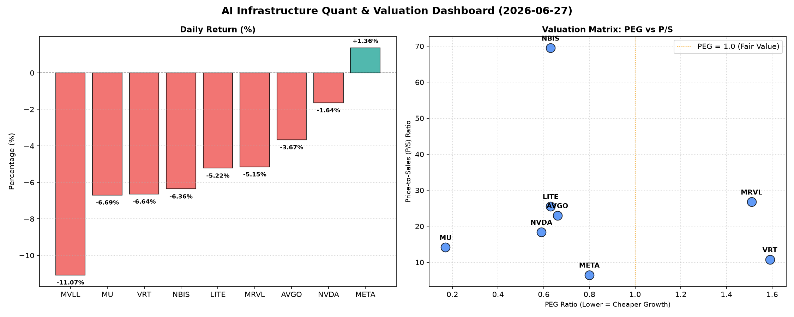

# 📊 AI Infrastructure & Data Stock Daily (2026-06-27)

### 📉 多维量化与估值分析看板

---

## 半导体与AI基础设施每日精炼报道：市场承压下的估值与现金流透视

尊敬的投资者，

今日（某月某日），硬科技与AI基础设施板块普遍遭遇回调，市场情绪谨慎。本报告将结合多维度量化指标，为您深度解码当前市场动态与企业基本面。

### 1. 盘面与多维估值解码（定性+定量）

今日半导体及AI基础设施板块普遍承压，多数标的呈现下跌。MVLL以-11.07%的跌幅领跌，紧随其后的是VRT (-6.64%) 和 MU (-6.69%)。即便如此，Meta (META) 仍逆势上涨1.36%，显示出其在AI大模型与广告业务上的韧性。

**PEG 维度：高成长中的价值掘金与估值警示**

在经历今日市场回调后，多个标的展现出极具吸引力的PEG估值，凸显其高成长性下的相对低估：

*   **性价比极高的高成长标的 (PEG < 1)**：
    *   **MU (0.17)**：作为存储芯片巨头，其0.17的PEG值极为罕见，暗示市场对其未来盈利增长的预期远高于其当前股价所反映的价值，或其正处于利润周期的强劲上升期，具备极高的投资性价比。
    *   **NVDA (0.59)**：AI芯片领军者的PEG低于1，表明即使在高市场关注度下，其成长潜力仍未被完全定价，对长期投资者而言，其在AI算力需求爆发背景下的配置价值依然显著。
    *   **LITE (0.63) 和 NBIS (0.63)**：这两家公司的PEG也显著低于1，可能意味着其在特定细分硬科技领域（如光器件、精密制造等）拥有扎实的成长驱动力，且当前估值相对合理。
    *   **AVGO (0.66)**：作为广泛布局的半导体巨头，其PEG也低于1，显示出其在并购整合和多元化业务下的稳定增长潜力。
    *   **META (0.8)**：尽管并非纯粹的半导体公司，但作为AI基础设施的重要参与者，其PEG低于1，结合其逆势上涨表现，市场对其AI投入与回报充满信心，估值吸引力仍在。

*   **警惕估值透支的标的 (PEG > 1)**：
    *   **VRT (1.59) 和 MRVL (1.51)**：这两家公司的PEG值均高于1.5，这可能意味着其当前估值在一定程度上已经透支了未来的成长预期，投资者在追逐其高增长的同时，需警惕回调风险。

*   **PEG不适用情况**：
    *   **MVLL (N/A)**：PEG为N/A，通常意味着该公司目前没有正的盈利或盈利不稳定，无法通过传统的PEG指标进行评估。对于此类公司，P/S等收入指标更为适用。

**P/S 维度：收入规模扩张效率的考量**

P/S (市销率) 对于早期或尚处于大规模研发投入阶段、利润不稳的公司具有重要参考价值。

*   **高P/S，高增长预期**：
    *   **NBIS (69.5)**：高达69.5的P/S值极为突出，表明市场对其未来的收入增长抱有极高的预期，可能其产品或技术在市场中处于垄断或颠覆性地位，尽管当前盈利可能不佳，但收入爆发力强劲。
    *   **MRVL (26.77) 和 LITE (25.54)**：这两家公司的P/S也较高，预示着市场对其在各自赛道的收入扩张能力给予了高度认可。
    *   **AVGO (23.01) 和 NVDA (18.4)**：作为行业龙头，其较高的P/S反映了市场对其核心技术产品在AI时代收入持续高增长的信心。
*   **中低P/S，稳健增长**：
    *   **META (6.5)**：相对而言，META的P/S值处于合理区间，结合其庞大的用户基数和广告收入体量，显示出其收入规模庞大且持续性强。

**现金流盈利真实性 (CFO/NI)：利润含金量的深度穿透**

CFO/NI (经营活动现金流/净利润) 比率是衡量公司利润质量的关键指标。

*   **利润含金量高，全是真金白银 (CFO/NI > 1)**：
    *   **LITE (4.88) 和 NBIS (4.66)**：这两家公司的CFO/NI比率远超1，高达4倍以上，表明其核心业务创造现金能力非常强劲，净利润的现金转化率极高，财务健康状况非常优异。
    *   **MU (2.05) 和 META (1.92)**：这两家巨头的CFO/NI均接近或超过2，表明其利润质量极佳，绝大部分会计利润都转化为实实在在的现金流入，财务运营稳健。
    *   **VRT (1.59) 和 AVGO (1.19)**：CFO/NI也均大于1，显示其利润结构健康，现金流对盈利的支撑良好。

*   **警惕利润水分或应收账款积压 (CFO/NI < 1)**：
    *   **NVDA (0.86)**：值得注意的是，AI巨头NVDA的CFO/NI为0.86，略低于1。这可能暗示其部分利润转化为应收账款或存货，现金流转化效率存在一定提升空间。在快速扩张周期中，这种现象并不少见，但投资者仍需关注其现金流的实际运营状况，以判断其扩张的健康程度。
    *   **MRVL (0.66)**：MRVL的CFO/NI也显著低于1，仅为0.66。与NVDA类似，其利润的现金转化效率也需投资者进一步审视，关注是否存在应收账款周转放缓或存货积压等情况。

### 2. 收并购与重大业务动态

根据今日提供的量化基本面指标表格，未能获取到最新的收并购传闻、官宣或战略合作的具体信息。未来若有相关数据，此部分将进行详细解读。

### 3. 华尔街机构态度

同上，今日数据源未包含华尔街机构的最新评价、目标价调动或评级调整信息。我们将在数据可获取时及时更新此部分内容，以提供市场情绪的全面洞察。

### 4. 今日参考源 (References)

本文的定性与定量分析严格基于您提供的【多维度真实量化基本面指标表格】。

---

**免责声明：** 本报告仅供参考，不构成任何投资建议。投资者在做出投资决策前，应独立判断并咨询专业意见。市场有风险，投资需谨慎。