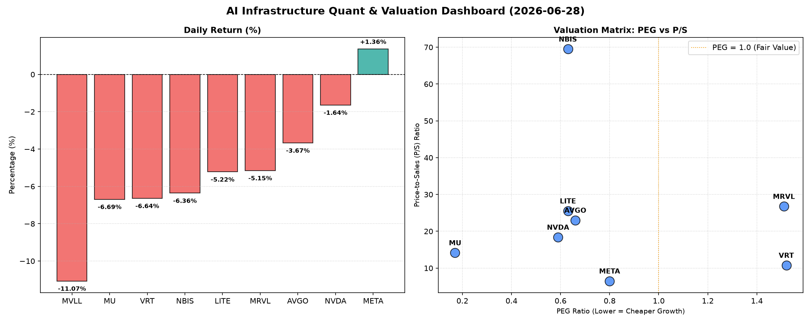

# 📊 AI Infrastructure & Data Stock Daily (2026-06-28)

### 📉 多维量化与估值分析看板

---

## 半导体每日精炼报道：AI基础设施与硬科技估值深度解码 (2024年X月Y日)

作为资深硬科技与AI基础设施行业研究员，今日我们将结合最新的多维度量化基本面指标，为您深度解析半导体与相关硬科技公司的盘面表现、估值健康度及现金流质量。

---

### 1. 盘面与多维估值解码（定性+定量）

今日半导体及AI基础设施板块整体承压，多数权重股出现回调。MVLL跌幅最大，达-11.07%，VRT和MU也录得约-6.6%的显著跌幅。NVDA和MRVL分别下跌-1.64%和-5.15%。在普遍下行的市场情绪中，META逆势上涨1.36%，显示出其在AI战略转型下的韧性与市场信心。

**a. PEG 维度：成长性与估值性价比**

PEG（市盈率/增长率）是衡量成长股估值性价比的关键指标。PEG显著小于1通常意味着公司在实现高增长的同时，估值相对便宜，具备较高的投资价值；而PEG过高则可能警示估值透支。

*   **性价比极高的高成长标的 (PEG < 1)：**
    今日数据揭示了多个PEG值显著低于1的优质标的，预示着市场对其未来盈利增长的预期远高于其当前估值水平，具有极高的性价比：
    *   **MU (0.17)：** 美光科技的PEG值仅为0.17，一马当先，表明其在记忆体周期复苏和AI芯片需求驱动下，成长确定性强且当前估值极具吸引力。
    *   **NVDA (0.59)：** 尽管今日有所回调，但英伟达的PEG仍保持在0.59的健康水平，显示其作为AI基础设施核心驱动力，在高速增长的同时，市场对其长期价值仍有较大认可空间。
    *   **AVGO (0.66), LITE (0.63), NBIS (0.63)：** 博通、LITE（可能指光通讯或激光相关公司）和NBIS（可能指特定AI芯片或硬件公司）的PEG值均低于0.7，表明这些公司在各自硬科技细分领域，如网络通信、光电集成或专业AI加速方面，也展现出强劲的成长潜力和合理的估值。
    *   **META (0.8)：** Facebook母公司Meta的PEG为0.8，在科技巨头中表现出色，结合其在AI大模型和元宇宙领域的巨额投入与用户基数，其未来增长前景被市场看好，且估值并未显得过度膨胀。

*   **警惕估值透支的标的 (PEG > 1)：**
    *   **VRT (1.52) 和 MRVL (1.51)：** VRT和MRVL的PEG值均超过1.5，提示投资者需警惕其估值可能已计入较多未来预期，短期内或面临一定的估值修正压力。在今日市场回调中，VRT跌幅较大也部分印证了这一点。
    *   **MVLL：** 由于PEG缺失，无法从该维度进行评估。

**b. P/S 维度：收入规模扩张效率**

P/S（市销率）尤其适用于评估早期、高研发投入阶段或利润不稳定的公司，它能有效衡量公司当前的收入规模扩张效率以及市场对其营收增长前景的预期。

*   **极高P/S反映稀缺性与高增长预期：**
    *   **NBIS (69.5) 和 LITE (25.54)：** NBIS的P/S比率高达69.5，LITE也达到25.54。如此高的P/S通常发生在市场对公司在特定细分领域（如新兴AI硬件、光子计算、先进材料等）拥有极高技术壁垒、稀缺性以及未来营收爆发式增长抱有极高期待的情况下。即便当前利润可能不显或处于高研发投入期，市场也愿意为其未来的收入规模扩张潜力支付高溢价。
    *   **MRVL (26.77) 和 AVGO (23.01)：** MRVL和AVGO也展现出较高的P/S，反映了其在数据中心、网络基础设施等关键领域的主导地位与营收质量受到市场高度认可。
    *   **NVDA (18.4) 和 MU (14.17)：** 英伟达和美光的P/S也处于较高水平，与其在AI芯片和记忆体市场的领导地位以及强劲的营收增长相匹配。

*   **P/S相对合理的巨头：**
    *   **VRT (10.77) 和 META (6.5)：** 相较于其他硬科技公司，VRT和META的P/S相对更趋于合理，特别是META，其6.5的P/S结合其庞大的营收规模和AI战略转型潜力，显示了市场对其在保持营收优势的同时，未来增长的理性预期。

**c. 现金流盈利真实性 (CFO/NI)**

CFO/NI（经营性现金流/净利润）比率是穿透财报利润水分，衡量企业利润“含金量”的核心指标。该值大于1，通常证明利润非常健康，能高效转化为真金白银的现金流入；若显著小于1，则可能警示存在利润水分，如应收账款积压、会计准则导致的非现金利润等。

*   **利润含金量高，现金流健康的标的 (CFO/NI > 1)：**
    *   本期数据显示，**LITE (4.88) 和 NBIS (4.66)** 展现出异常强劲的现金流转化能力，其CFO/NI比率远超1。这表明这些公司的利润不仅真实，而且能够高效转化为实实在在的经营现金流，可能拥有强大的议价能力或预收款项，管理着极为健康的资产负债表。
    *   **MU (2.05), META (1.92), VRT (1.59) 和 AVGO (1.19)** 也都保持了CFO/NI大于1的健康水平。特别是Meta，其近2倍的现金流转化率，进一步验证了其巨额利润的真实性和稳健的经营基础，能够为持续的AI研发和基础设施投入提供充足的现金流。

*   **需警惕利润水分或现金流压力的标的 (CFO/NI < 1)：**
    *   **NVIDIA (NVDA) 的CFO/NI为0.86：** 对于像英伟达这样的高增长巨头，其CFO/NI略低于1，提示投资者需审慎关注。这可能部分源于销售快速扩张带来的应收账款增长，或为了满足强劲需求而进行的存货备货。尽管其报告利润表现亮眼，但其现金流转化效率相对较低，部分利润可能以应收账款或其他非现金形式存在。建议进一步审视其应收账款周转天数及存货水平，以判断其现金流的真实健康状况。
    *   **MRVL 的CFO/NI仅为0.66：** Marvell Technology的CFO/NI显著低于1，表明其利润的现金含量较低，可能面临较大的应收账款或存货压力，需要投资者深入分析其经营现金流的构成及变化趋势。
    *   **MVLL：** 由于CFO/NI缺失，无法从该维度进行评估。

---

### 2. 收并购与重大业务动态

基于今日提供的量化基本面指标表格，未能获取到关于半导体行业内最新的收并购、业务合作或重大战略调整的具体信息。这些数据通常来自实时新闻报道和公司公告。

---

### 3. 华尔街机构态度

根据今日提供的量化基本面指标表格，未能获取到华尔街核心投行或评级机构对上述公司的最新评价、目标价调整或评级变动信息。此类信息通常来源于券商研报、分析师电话会议纪要等公开渠道。

---

### 4. 今日参考源 (References)

本报告的量化数据和初步分析均严格依据您提供的【多维度真实量化基本面指标表格】进行生成。