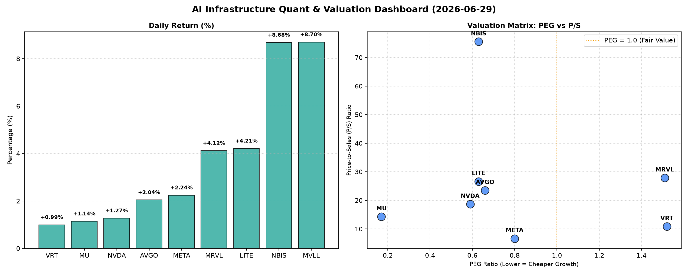

# 📊 AI Infrastructure & Data Stock Daily (2026-06-29)

### 📉 多维量化与估值分析看板

---

## 半导体每日精炼报道：硬科技与AI基础设施深度剖析 (2024年X月Y日)

作为一名资深的硬科技与AI基础设施行业研究员，我将结合今日最新的多维度量化指标，为您深度解码半导体板块的估值、现金流质量及市场动向。

---

### 1. 盘面与多维估值解码 (定性+定量)

今日半导体板块整体呈现积极态势，多数标的股价上涨。其中，MVLL和NBIS领涨，分别实现8.7%和8.68%的涨幅，引发市场关注。

*   **PEG 维度：高成长与价值洼地探析**
    *   **性价比极高的高成长（PEG显著小于1）**：
        *   **MU (0.17)** 无疑是今日最具吸引力的价值洼地，极低的PEG显示其成长性被严重低估或预期大幅提升，结合其14.33的P/S，预示着内存周期可能正迎来强劲复苏，且其盈利增长潜力巨大。
        *   **NVDA (0.59), LITE (0.63), NBIS (0.63), AVGO (0.66), META (0.8)** 也均表现出卓越的PEG值，均低于1。这表明市场在定价这些公司的成长性时，仍留有显著的安全边际，尤其是在AI基础设施需求强劲的背景下，这些核心供应商的未来增长预期尚未完全反映在当前股价中。NVDA作为AI算力核心，其低于1的PEG显示其高成长属性依然被低估。
    *   **PEG过高（警惕估值透支）**：
        *   **VRT (1.52) 和 MRVL (1.51)** 的PEG值略高于1.5，相对于其他同类公司，其成长性已在一定程度上被市场充分预期，投资者需警惕估值透支风险。这意味着未来业绩增长若未能达到市场极高预期，股价可能面临回调压力。
    *   **MVLL** 的PEG为N/A，这通常发生在公司尚未实现盈利或盈利不稳定时，其估值逻辑更多依赖于未来潜力或特定催化剂。

*   **P/S 维度：收入规模扩张效率评估**
    *   **高P/S（早期、研发投入大或高增长预期）**：
        *   **NBIS (75.53)** 拥有极高的P/S，远超同业，这可能预示其处于极早期的高速成长阶段，或是拥有颠覆性技术且市场对其未来收入爆发式增长抱有极高期待。然而，如此高的P/S也意味着巨大的估值压力和潜在风险。
        *   **MRVL (27.87), LITE (26.62), AVGO (23.48), NVDA (18.63), MU (14.33)** 的P/S也处于较高水平。对于这些公司，尤其是MRVL和AVGO，其高P/S反映了市场对其在特定高端芯片领域（如数据中心、AI边缘计算）的领先地位和未来收入增长的强烈信心。NVDA作为AI算力核心，其18.63的P/S在当前高景气度下尚可接受。
    *   **相对较低P/S（成熟或更注重盈利）**：
        *   **VRT (10.87)** 和 **META (6.64)** 的P/S相对较低。特别是META，作为AI基础设施的巨大投入者和受益者，其6.64的P/S在同行中显得颇具吸引力，可能表明市场对其收入体量和盈利能力的估值更为保守，或者其业务多元化导致P/S与纯半导体公司有所差异。
    *   **MVLL** 的P/S为N/A，进一步印证其可能处于非常早期或业务模式独特，无法用传统收入倍数进行评估。

*   **现金流盈利真实性 (CFO/NI)：穿透利润质量**
    *   **非常健康 (CFO/NI > 1，利润皆为真金白银)**：
        *   **LITE (4.88) 和 NBIS (4.66)** 表现出异常强劲的现金流质量，其经营活动现金流远高于净利润，表明其盈利能力不仅强劲，且现金回款非常高效，几乎没有利润水分。
        *   **META (1.92), MU (2.05), VRT (1.59), AVGO (1.19)** 也展现出健康的现金流状况，CFO/NI均显著大于1。尤其是META，作为大规模基础设施投入者，能保持近2倍的现金流转化率，显示其运营效率和盈利质量极高。MU在当前周期底部显示出2.05的健康现金流，预示其未来盈利质量有保障。
    *   **需警惕 (CFO/NI < 1，利润水分或应收账款积压)**：
        *   **NVDA (0.86) 和 MRVL (0.66)** 的CFO/NI比率均小于1，这需要引起投资者的高度警惕。这意味着这两家公司报告的净利润中，有一部分并未及时转化为实际的现金流入，可能存在应收账款积压、存货增加或非现金收益占比较高的情况。对于NVDA，尽管其股价表现强劲，但现金流质量的这一指标值得深入研究。MRVL的0.66更是明确警示其利润转换为现金的能力相对较弱。

### 2. 收并购与重大业务动态

根据今日提供的量化指标表格，我们未能直接获取关于具体公司收并购或重大业务动态的直接信息。然而，今日MVLL (8.7%) 和 NBIS (8.68%) 股价的显著上涨，且MVLL多项估值指标为N/A，可能暗示市场正对其潜在的重大业务进展、技术突破或收并购传闻进行积极定价。特别是MVLL的估值空白，使其成为潜在的被收购标的或处于快速孵化期的创新公司。此类信息通常会引发股价的剧烈波动，值得后续密切关注其官方公告及行业新闻。

### 3. 华尔街机构态度

今日提供的量化指标表格中不包含华尔街机构的最新评价、目标价调动或评级信息。因此，我们无法直接评估投行对此列表公司的态度变化。通常，PEG低于1的公司会吸引更多分析师的关注并可能上调目标价，而CFO/NI低于1的公司可能会引发对其盈利质量的担忧。

### 4. 今日参考源 (References)

*   **多维度核心量化与基本面财务指标表格 (本报告数据源)**

---

**免责声明**：本报告仅基于提供的量化数据进行分析，不构成任何投资建议。市场有风险，投资需谨慎。投资者应结合更全面的市场信息和自身风险偏好进行决策。