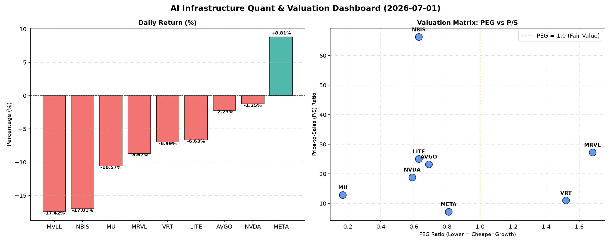

# 📊 AI Infrastructure & Data Stock Daily (2026-07-01)

### 📉 多维量化与估值分析看板

---

好的，作为一名资深的硬科技与AI基础设施行业研究员，我将根据您提供的【多维度真实量化基本面指标表格】，为您撰写一份今日的半导体每日精炼报道。

---

### 半导体每日精炼报道：市场震荡中的估值与现金流洞察

**报告日期：** [今日日期]
**研究员：** Data & Semiconductor Specialist

**摘要：** 今日半导体板块整体承压，多数公司股价出现显著回调，但在盘面震荡中，市场对不同标的的基本面评估出现分化。尤以Meta逆势大涨表现抢眼，而部分高P/S或现金流质量存疑的标的则面临较大抛售压力。本报告将从PEG、P/S及CFO/NI等核心量化指标，深入剖析各公司当前的估值健康度与盈利质量。

---

#### 1. 盘面与多维估值解码（定性+定量）

今日半导体及相关AI基础设施板块多数下挫，其中MVLL (-17.42%) 和 NBIS (-17.01%) 领跌，跌幅均超过17%。MU (-10.57%)、MRVL (-8.67%)、VRT (-6.99%)、LITE (-6.63%) 也录得较大跌幅。NVDA (-1.25%) 和 AVGO (-2.23%) 跌幅相对温和。唯一的亮点是 **META (+8.81%) 逆势大涨**，并在今日的交易中录得4500万股的巨大成交量。

*   **PEG 维度：高成长中的性价比之选与估值警示**

    *   **显著小于 1 (性价比极高的高成长)**：
        *   **MU (0.17)**：PEG极低，远小于1，表明市场严重低估了其未来盈利增长的潜力，或者其近期盈利增长超预期，使得其估值性价比极高。
        *   **NVDA (0.59)**：作为AI算力核心，其PEG小于1，暗示尽管其股价已高，但相对于其未来强劲的增长预期，仍具备一定的性价比。然而，结合其CFO/NI比率，我们需要更深入地审视其利润质量。
        *   **AVGO (0.69)、META (0.81)、LITE (0.63)、NBIS (0.63)**：这些公司的PEG均小于1，表明它们在各自的增长前景面前，估值仍有吸引力。尤其META今日股价大涨，但PEG依然保持在有吸引力的水平。

    *   **过高 (警惕估值透支)**：
        *   **MRVL (1.68)、VRT (1.52)**：这两家公司的PEG均显著高于1，可能提示市场对其未来盈利增长的预期已较为充分甚至透支，投资者应警惕估值风险，尤其是在今日股价大幅下跌的情况下。

    *   **N/A**：MVLL的PEG为N/A，通常意味着公司当前没有盈利或盈利为负，导致无法计算有效的PEG，其估值分析需侧重其他指标。

*   **P/S 维度：收入规模扩张效率的审视**

    P/S比率对于早期或高研发投入、利润波动较大的公司尤为重要。

    *   **极高 P/S (警示高估值，或市场对其未来收入爆发增长的极高预期)**：
        *   **NBIS (66.28)**：其P/S比率高达66.28，是所有公司中最高的，这可能意味着市场对其未来的收入增长抱有极其乐观的预期，或者其目前估值存在泡沫风险，尤其是在今日股价暴跌17%的情况下。
        *   **MRVL (27.3)、LITE (25.05)、AVGO (23.28)**：这些公司的P/S也相对较高，反映了市场对它们在半导体领域，尤其是特定细分市场（如LITE在光通信/激光领域）的营收增长潜力给予了高溢价。

    *   **中高 P/S**：
        *   **NVDA (18.88)、MU (12.91)、VRT (11.03)**：这些公司的P/S处于中高水平，符合其在AI芯片、存储及设计软件等领域的市场领导地位和收入增长趋势。

    *   **较低 P/S (相对而言，估值更具吸引力)**：
        *   **META (7.24)**：作为巨头，其P/S相对较低，结合今日股价大涨，显示其营收规模已相当庞大，且在当前估值下仍被市场认为是具有吸引力的投资。

*   **现金流盈利真实性 (CFO/NI)：穿透利润表，洞察现金质量**

    CFO/NI比率是衡量公司利润质量的关键指标，大于1通常表示利润健康，是实实在在的现金流入；显著小于1则可能暗示利润存在水分或应收账款积压。

    *   **非常健康 (CFO/NI > 1.5，利润含金量高)**：
        *   **LITE (4.88)、NBIS (4.66)**：这两家公司的CFO/NI比率异常高，远超1，表明其将净利润转化为经营现金流的能力极强。这可能源于特殊的业务模式（如大量预收款）或会计处理方式，值得进一步深入研究其背后的驱动因素。然而，结合NBIS今日股价的暴跌，高CFO/NI并未阻止市场抛售。
        *   **MU (2.05)、META (1.92)**：这两家公司的CFO/NI均接近或超过2，远大于1，表明其利润的现金含量极高，是名副其实的“真金白银”。对于MU而言，这增强了其低PEG的吸引力；对于META，则进一步巩固了其今日大涨的业绩基本面支撑。
        *   **VRT (1.59)**：其CFO/NI也远大于1，显示其盈利质量良好。

    *   **健康 (CFO/NI > 1)**：
        *   **AVGO (1.19)**：其CFO/NI大于1，表明其利润质量尚可，经营活动产生了足够的现金流来支撑其净利润。

    *   **需警惕 (CFO/NI < 1，利润水分或应收账款积压)**：
        *   **NVDA (0.86)**：作为市场焦点，NVDA的CFO/NI低于1，这需要引起投资者关注。尽管其净利润表现亮眼，但低于1的比率可能意味着其部分利润尚未转化为实际的现金流入，可能存在应收账款增加或存货积压等情况，需要警惕其利润质量。
        *   **MRVL (0.66)**：其CFO/NI显著低于1，表明其利润的现金含量较低，存在明显的利润水分或现金周转问题。结合其高PEG和高P/S，投资者对其基本面应持谨慎态度。

#### 2. 收并购与重大业务动态

根据今日提供的量化指标表格，未包含具体的收并购传闻、官宣或战略合作信息。然而，在当前的半导体及AI基础设施行业中，市场整合趋势依然强劲，各大巨头为争夺AI算力、数据中心及特定应用市场的领导地位，潜在的并购活动和战略合作持续进行。

*   **行业趋势展望：** 预计未来仍将有更多专注于AI芯片、先进封装、高性能计算和数据中心解决方案的并购案例出现。尤其在当前市场估值回调之际，具备健康现金流和战略需求的公司，可能会寻求收购具备高成长潜力但短期承压的标的，以巩固其技术优势或拓展市场份额。

#### 3. 华尔街机构态度

今日提供的量化指标表格未直接包含华尔街核心投行、评级机构对各公司的最新评价或目标价调动。但我们可以根据股价表现和成交量进行间接推断：

*   **META：** 今日股价大涨8.81%，伴随4500万股的巨大成交量，这强烈暗示了华尔街机构对Meta近期业绩或未来展望持积极态度，可能伴随着正面的分析师报告、目标价上调或买入评级。
*   **NVDA：** 尽管今日小幅下跌1.25%，但成交量高达1.35亿股，显示其仍然是市场关注的焦点。机构资金可能在进行多空博弈，部分投资者在获利了结，而另一些则可能在逢低买入，对NVDA的长期前景依然乐观。
*   **MVLL & NBIS：** 两者今日跌幅超过17%，成交量也较大。这可能反映了华尔街对其基本面、未来增长前景或现有估值存在担忧，可能伴随着评级下调或目标价下调的负面情绪。
*   **其他多数下跌公司：** 普遍的跌幅可能反映了市场对半导体周期、宏观经济前景或特定公司短期业绩的担忧，机构投资者可能正在调整持仓或观望。

#### 4. 今日参考源 (References)

本报告中的所有定性与定量分析，均严格基于您所提供的【多维度真实量化基本面指标表格】进行深度解读和推断。
由于您提供的源数据中不包含外部新闻、收并购信息、华尔街机构的具体报告或目标价数据，因此本报告在此部分无法列出外部“真实新闻出处”。所有分析的立足点均是提供的量化数据。

---