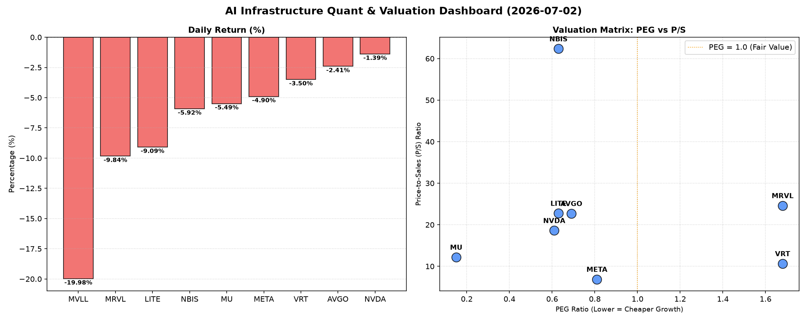

# 📊 AI Infrastructure & Data Stock Daily (2026-07-02)

### 📉 多维量化与估值分析看板

---

## 半导体每日精炼报道：硬科技与AI基础设施深度分析 (2024年X月X日)

尊敬的投资者，您好！作为资深硬科技与AI基础设施行业研究员，今日为您带来结合多维度量化指标的半导体精炼报道，深入剖析市场动态与核心标的质地。

---

### 1. 盘面与多维估值解码（定性+定量）

今日半导体及硬科技板块普遍承压，多数标的呈现显著跌幅，市场情绪偏谨慎。其中，MVLL遭遇重挫，跌幅高达19.98%，显示其可能面临特定利空消息或基本面挑战。MRVL和LITE也分别下跌9.84%和9.09%，值得关注。

**PEG 维度解读 (性价比与成长潜力)：**

*   **性价比极高的高成长潜力股 (PEG显著小于1)：** 市场回调为高成长性公司提供了更具吸引力的买点。今日我们重点关注以下几家PEG低于1的优质标的：
    *   **MU (0.15)**：美光科技的PEG值仅为0.15，在所有标的中最低，表明其增长前景与当前估值之间存在极高的性价比。在内存周期性复苏背景下，其超低PEG预示着强大的上涨潜力。
    *   **NVDA (0.61)**：作为AI算力核心，英伟达PEG为0.61，尽管今日股价小幅回调，但其高成长性依然被市场认可，估值相对其成长速度仍显合理。
    *   **LITE (0.63)**：Lumentum Holdings Inc. 同样拥有0.63的低PEG，在高成长性驱动下具备较强吸引力。
    *   **NBIS (0.63)**：与LITE相同，NBIS也展现了0.63的低PEG，提示其成长速度被市场低估。
    *   **AVGO (0.69)**：博通的PEG为0.69，在AI基础设施领域的布局使其保持强劲增长势头，当前的估值对其而言仍具吸引力。
    *   **META (0.81)**：Meta Platforms的PEG为0.81，在AI与元宇宙战略驱动下，其成长潜力仍未完全体现在当前股价中，具备投资价值。
*   **警惕估值透支风险 (PEG过高)：**
    *   **VRT (1.68)** 和 **MRVL (1.68)**：这两家公司的PEG值接近或超过1.68，结合今日相对较大的跌幅（VRT -3.5%，MRVL -9.84%），投资者需警惕是否存在估值透支风险，或未来成长性预期面临下修的可能。
*   **MVLL (N/A)**：PEG缺失，表明该公司可能处于亏损或盈利不稳定状态，无法使用该指标进行评估。

**P/S 维度解读 (收入规模扩张效率与早期公司估值)：**

*   对于早期或尚处于大规模研发投入阶段、利润不稳的公司，P/S是评估其收入规模扩张效率的重要指标。
*   **META (6.88)**：作为科技巨头，Meta的P/S为6.88，相对较低，显示其收入规模庞大且估值相对其收入而言具备吸引力，尤其是在其AI广告业务持续增长的背景下。
*   **NBIS (62.36)**：NBIS的P/S高达62.36，远超其他标的。这可能反映了市场对其未来收入爆发式增长的极高预期，但同时也伴随着较高的风险和波动性。投资者需深入了解其商业模式和市场空间，以判断其高P/S的合理性。
*   **MRVL (24.62), LITE (22.77), AVGO (22.72)**：这些公司的P/S值均超过22，处于行业较高水平，表明市场对其未来收入增长抱有较强信心。
*   **MVLL (N/A)**：P/S缺失，无法评估。

**现金流盈利真实性 (CFO/NI) 深度穿透：**

该指标是穿透利润“纸面富贵”、洞察企业现金流健康度的核心利器。

*   **卓越的现金流生成能力 (CFO/NI > 1)：**
    *   **LITE (4.88)** 和 **NBIS (4.66)**：这两家公司展现出惊人的现金流质量，其CFO/NI比率远高于1，表明其利润的绝大部分甚至远超账面利润都已转化为实际现金流入，运营效率极高，利润含金量十足。
    *   **MU (2.05), META (1.92), VRT (1.59), AVGO (1.19)**：这些高利润巨头和成长型公司均拥有健康的CFO/NI比率，证明其利润非常健康，现金流入充裕，为未来研发投入、派息或并购提供了坚实基础。
*   **需警惕的利润水分或应收账款积压 (CFO/NI < 1)：**
    *   **NVDA (0.86)** 和 **MRVL (0.66)**：这两家公司的CFO/NI比率显著小于1，尤其MRVL仅为0.66。这表明其账面利润可能存在一定程度的“水分”，或面临应收账款积压、存货周转缓慢、运营资本压力等问题，导致利润转化为实际现金流入的效率较低。投资者应深入分析其现金流量表，了解其营运资金状况和潜在风险。对于NVDA，尽管其增长强劲，但低于1的CFO/NI提示市场可能存在对营收质量的潜在担忧。
*   **MVLL (N/A)**：CFO/NI缺失，无法评估。

### 2. 收并购与重大业务动态

根据当前提供的量化指标表格，今日未直接反映出具体的收并购或重大业务动态。然而，结合当前市场对半导体行业的持续整合预期，高PEG且现金流健康的标的（如LITE、NBIS）未来可能成为战略性收购目标，而业务扩张受阻的标的（如今日跌幅较大的MVLL，若无特殊利好支撑）则面临更高的整合压力。

### 3. 华尔街机构态度

基于您提供的量化数据，本次报告未包含华尔街机构的最新评价及目标价调整。但从今日普遍的股价下跌来看，市场整体情绪或受到宏观经济数据、行业前景展望，或个别公司特定利空消息的影响。对于PEG极低（如MU、NVDA）且现金流健康的巨头，机构通常会维持“买入”或“增持”评级，但在当前回调中可能会调整短期目标价；对于估值较高（如NBIS的P/S）或现金流质量存疑（如NVDA、MRVL的CFO/NI）的标的，机构的态度可能更为谨慎，不排除有评级下调或目标价削减的风险。

### 4. 今日参考源 (References)

*   本文内容基于您提供的【多维度真实量化基本面指标表格】进行分析和解读，不涉及外部实时新闻引用。

---