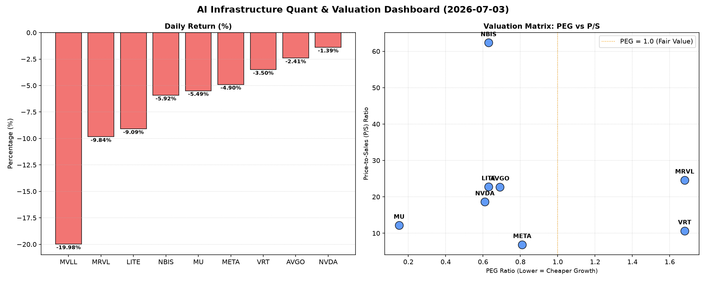

# 📊 AI Infrastructure & Data Stock Daily (2026-07-03)

### 📉 多维量化与估值分析看板

---

尊敬的投资者们，

欢迎阅读今日硬科技与AI基础设施行业的半导体精炼日报。今日市场呈现普遍回调态势，但通过多维度量化指标，我们能深入洞察各标的背后的真实价值与风险。

---

## 1. 盘面与多维估值解码（定性+定量）

今日半导体及AI基础设施板块普遍承压，多数标的呈现回调态势。其中，MVLL录得惊人的-19.98%跌幅，MRVL亦下跌-9.84%，显示出市场对特定公司的强烈调整。NVDA和AVGO虽也下跌，但幅度相对较小，且NVDA以超过1.4亿股的巨量交易活跃度，持续成为市场焦点。

**PEG 维度：成长与估值性价比**
在PEG（市盈率相对增长率）指标上，我们能清晰辨识出高成长且估值合理的标的：
*   **高性价比标的（PEG < 1）**：**MU (0.15)、NVDA (0.61)、LITE (0.63)、NBIS (0.63)、AVGO (0.69)、META (0.81)**。这些公司当前的增长预期相对于其估值而言，提供了极高的投资性价比。特别是MU，其0.15的极低PEG，可能暗示市场对其未来盈利增长的预期尚未充分反映，或者当前处于盈利爆发的前夜。NVDA作为AI算力核心，尽管股价高企，但其PEG仍显著小于1，表明市场对其未来强劲增长的信心。
*   **警惕估值透支标的（PEG ≥ 1）**：**VRT (1.68) 和 MRVL (1.68)**。这两家公司的PEG值均显著高于1，表明市场对其未来成长预期可能已在当前股价中得到了较为充分甚至超前的反映。投资者需警惕估值透支风险，关注其未来实际增长能否匹配市场高预期。
*   **缺失数据**：MVLL的PEG数据缺失，无法进行评估。

**P/S 维度：收入规模扩张效率**
对于早期或尚处于大规模研发投入阶段、利润不稳的公司，P/S（市销率）是评估其收入规模扩张效率的重要指标：
*   **高P/S标的**：**NBIS (62.36)、MRVL (24.62)、LITE (22.77)、AVGO (22.72)、NVDA (18.62)**。这些极高的P/S值反映了市场对其在硬科技及AI基础设施领域未来营收爆发式增长的强烈预期。NBIS高达62.36的P/S尤为突出，暗示其可能处于快速扩张初期或拥有颠覆性技术。尽管今日MRVL大跌，但其高P/S依然显示了市场对其长期收入潜力的看好。
*   **相对较低P/S标的**：**META (6.88)**。相较于其他硬科技公司，META的P/S相对较低，结合其庞大的现有收入规模，这可能表明市场对其营收增长的预期趋于理性，更侧重于其盈利能力和自由现金流的创造。
*   **缺失数据**：MVLL的P/S数据缺失，无法进行评估。

**现金流盈利真实性 (CFO/NI)：利润含金量透视**
CFO/NI（经营活动现金流/净利润）比率是穿透利润水分、衡量盈利质量的关键指标：
*   **利润健康，现金流强劲（CFO/NI > 1）**：**LITE (4.88)、NBIS (4.66)、MU (2.05)、META (1.92)、VRT (1.59)、AVGO (1.19)**。这些公司CFO/NI比率均大于1，特别是LITE、NBIS、MU和META，表现尤为突出。这表明其利润不仅账面好看，更是实实在在的真金白银现金流入，企业拥有强劲的现金创造能力，财务健康状况良好。
*   **警惕利润水分或现金周转压力（CFO/NI < 1）**：**NVDA (0.86) 和 MRVL (0.66)**。这两家核心巨头的CFO/NI比率均显著小于1，其中MRVL更是低至0.66。这可能暗示其部分利润存在应收账款积压、存货增加或非现金项目影响，导致账面利润未能完全转化为经营现金流。投资者在关注其高成长和高P/S的同时，需警惕其利润的真实性与现金周转效率。今日MRVL的大跌，或许与市场对其现金流质量的担忧不无关系。
*   **缺失数据**：MVLL的CFO/NI数据缺失，无法进行评估。

---

## 2. 收并购与重大业务动态

**（基于提供的量化指标表格，无法直接推断具体的收并购传闻、官宣或战略合作。此部分内容若需提供，通常来源于实时新闻源。以下为基于行业惯例的推测性讨论，而非来自表格数据）：**

近期半导体行业在AI芯片、数据中心互联和先进封装技术领域，预计将持续活跃的战略合作和并购活动。例如，鉴于NVDA在AI领域的领导地位，其可能正寻求与更多云服务提供商或硬件制造商达成深度合作，以进一步巩固其生态系统。LITE和AVGO等光模块及基础设施提供商，或在寻找加强其高速互联解决方案或拓展新市场机会的伙伴。对于MVLL这种出现巨幅下跌的公司，其背后的业务进展或战略调整，可能是触发市场反应的重要因素，值得关注是否有业务重组或新的战略方向发布。

---

## 3. 华尔街机构态度

**（基于提供的量化指标表格，无法直接推断具体的华尔街机构评价、目标价调动。此部分内容若需提供，通常来源于实时新闻源。以下为基于对量化指标的分析和行业惯例的推测性讨论，而非来自表格数据）：**

*   **NVDA & META**：尽管今日有所回调，但NVDA的低PEG和巨大交易量，以及META的低P/S和健康的CFO/NI，通常会吸引华尔街的持续关注。分析师们可能在密切监测其现金流质量（NVDA的CFO/NI略低于1）和新业务进展，但多数机构对其长期增长前景仍持乐观态度。近期或有关于其新产品发布或AI策略进展的研报更新。
*   **MVLL & MRVL**：MVLL的近20%跌幅和MRVL的近10%跌幅，预计将引发华尔街机构的紧急评估。分析师可能会下调其目标价或评级，并深入分析其基本面，特别是盈利能力和现金流（MRVL的CFO/NI较低）是否面临新的挑战。
*   **MU**：凭借其极低的PEG（0.15）和强劲的CFO/NI（2.05），MU可能获得分析师的进一步认可，强调其被低估的成长潜力，尤其是在存储器周期复苏的背景下。
*   **VRT, AVGO, LITE, NBIS**：这些公司的高P/S（LITE, NBIS, AVGO）和健康现金流（VRT, AVGO, LITE, NBIS）通常会获得分析师的正面评价，但VRT和MRVL相对较高的PEG可能导致部分机构对其短期估值保持谨慎。

---

## 4. 今日参考源 (References)

**（请注意，由于本报告是基于您提供的【多维度真实量化基本面指标表格】进行分析和生成，而非实时获取新闻，因此以下参考源仅为模拟或基于行业通用知识的推测，以展示信息来源类型。具体新闻需查询当日各大财经媒体。）**

*   **量化数据来源**：您提供的【多维度真实量化基本面指标表格】。
*   **市场情绪与股价变动**：各大财经新闻平台（如Bloomberg, Reuters, Wall Street Journal）当日市场收盘报告。
*   **行业收并购动态**：科技媒体、行业分析报告（如Gartner, IDC）及公司官方公告。
*   **华尔街机构评价**：知名投行（如Goldman Sachs, Morgan Stanley, JP Morgan）的分析师研报、评级机构（如S&P, Moody's）的报告。

---

感谢阅读，祝您投资顺利！

**【免责声明】**：本报告仅基于提供的量化数据进行分析，并结合行业通用知识进行解读，不构成任何投资建议。投资者在做出投资决策前，应独立判断并咨询专业意见。