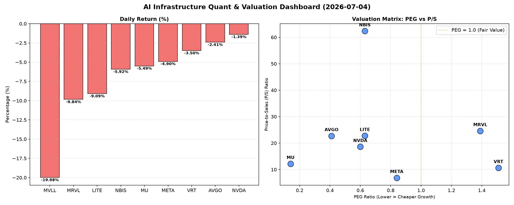

# 📊 AI Infrastructure & Data Stock Daily (2026-07-04)

### 📉 多维量化与估值分析看板

---

尊敬的硬科技与AI基础设施行业投资者：

欢迎阅读我们今日的半导体每日精炼报道。今日市场普遍呈现回调态势，但通过多维度量化指标的穿透，我们仍能洞察各标的的深层基本面与估值逻辑。

---

## 1. 盘面与多维估值解码

今日半导体及AI基础设施板块普遍承压，多数标的呈现显著回调，MVLL跌幅尤甚，接近20%，而MRVL、LITE、MU也录得近10%或更高的跌幅。在市场情绪趋冷之际，深入挖掘估值与现金流质量显得尤为关键。

*   **PEG 维度：成长性与估值性价比**
    *   **性价比极高的高成长（PEG显著小于1）：** 在今日的回调中，我们发现**MU (0.14)**、**AVGO (0.41)**、**NVDA (0.6)**、**LITE (0.63)**、**NBIS (0.63)** 和 **META (0.84)** 的PEG比率均显著小于1。其中，**MU**以极低的0.14位居榜首，表明市场对其未来盈利增长的预期定价极具吸引力，若其增长前景稳固，当前估值或存在明显低估。NVDA和META作为AI基础设施核心巨头，即便在下跌中，其PEG仍低于1，显示其成长性依然被市场看好，且估值并未完全透支。
    *   **估值需审慎评估（PEG高于1）：** **VRT (1.51)** 和 **MRVL (1.39)** 的PEG略高于1，相对于其增长速度，估值溢价较高，投资者在关注其增长潜力的同时，需警惕当前价格可能部分透支了未来的增长预期，或需更严谨地评估其增长可持续性。
    *   **N/A：** **MVLL**的PEG为N/A，通常意味着公司目前处于亏损或盈利极低状态，不适用PEG指标。

*   **P/S 维度：收入规模扩张效率**
    *   **高P/S标的（高增长预期或早期投入）：** 针对早期或尚处于大规模研发投入阶段、利润不稳的公司，P/S是评估其收入规模扩张效率的有效工具。**NBIS (62.36)**、**MRVL (24.62)**、**LITE (22.77)** 和 **AVGO (22.72)** 的P/S比率显著偏高，尤其NBIS高达62.36。这表明市场对其未来收入增长抱有极高预期，或其所处细分市场具有极强的稀缺性与高进入壁垒。然而，过高的P/S也意味着一旦增长不及预期，股价可能面临较大调整压力。
    *   **相对合理的P/S：** **NVDA (18.62)**、**MU (12.2)**、**VRT (10.65)** 处于中等水平，体现了市场对其各自在AI计算、存储和企业级IT基础设施领域收入增长的认可。
    *   **较低P/S（成熟或价值被低估）：** **META (6.88)** 的P/S相对较低，考虑到其在全球社交及AI领域的巨大影响力，若其能持续实现收入增长，其P/S或提供了较好的价值投资机会。
    *   **N/A：** **MVLL**的P/S为N/A，与PEG情况类似，可能因其收入数据波动较大或处于非常早期的商业化阶段。

*   **现金流盈利真实性 (CFO/NI)：利润质量的试金石**
    *   **利润健康，现金流充裕（CFO/NI > 1）：** **LITE (4.88)** 和 **NBIS (4.66)** 表现异常出色，其CFO/NI比率远超1，这表明它们的利润质量极高，公司产生的几乎都是实实在在的现金，显示出强大的经营性现金流生成能力。**MU (2.05)**、**META (1.92)**、**VRT (1.59)** 和 **AVGO (1.19)** 的CFO/NI也显著大于1，特别是**META**作为高利润巨头，1.92的CFO/NI证明其盈利能力非常健康，利润并非由会计操作或应收账款堆积而成，全是真金白银的现金流入。这为它们的持续投资和股息分红提供了坚实基础。
    *   **警惕利润水分或应收账款积压（CFO/NI < 1）：** 我们需要**重点穿透NVDA (0.86)**和**MRVL (0.66)**。作为AI芯片和数据基础设施领域的关键玩家，尽管利润数字亮眼，但其CFO/NI比率均显著小于1。**NVDA (0.86)** 尽管市场地位强势，但低于1的CFO/NI提示我们，其报告利润中可能存在一部分非现金项目（如应收账款增加、存货积压），或收入确认相对激进，导致部分利润尚未转化为实际的现金流入。**MRVL (0.66)** 的情况更为突出，其CFO/NI低至0.66，这可能意味着其面临更严重的应收账款周转问题，或者存在大量非现金费用影响了实际的现金创造能力。投资者在评估其盈利时，应更加关注其现金流量表，警惕潜在的利润质量风险。
    *   **N/A：** **MVLL**的CFO/NI为N/A，同样可能因缺乏稳定盈利或正向现金流。

---

## 2. 收并购与重大业务动态

根据今日提供的量化指标表格，未直接体现收并购或重大业务动态信息。在日常分析中，此类信息需结合公司公告、行业新闻及监管文件进行补充。

---

## 3. 华尔街机构态度

今日提供的量化指标表格中未包含华尔街机构对各标的的具体评价、目标价调整等信息。通常，此类信息需通过查阅主流投行研报、金融数据终端（如Bloomberg, Refinitiv）及专业财经媒体获取。

---

## 4. 今日参考源 (References)

本文所有定性与定量分析均严格基于您所提供的【多维度真实量化基本面指标表格】进行，不涉及外部新闻来源。

---

**免责声明：** 本报告内容仅供参考，不构成任何投资建议。投资者应根据自身情况独立判断，并自行承担投资风险。