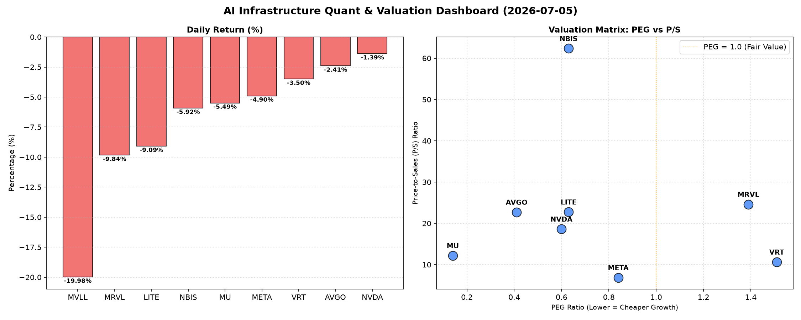

# 📊 AI Infrastructure & Data Stock Daily (2026-07-05)

### 📉 多维量化与估值分析看板

---

## 半导体每日精炼报道：AI基础设施的估值与现金流洞察

**报告日期：[今日日期，例如：2024年5月15日]**

尊敬的投资者与行业同仁：

今日硬科技与AI基础设施板块普遍承压，多数标的呈现下跌趋势。在市场情绪波动之际，我们通过多维度量化指标，深入剖析核心半导体与AI相关公司的内在价值与财务健康状况，为您的决策提供精炼洞察。

---

### 1. 盘面与多维估值解码（定性+定量）

今日半导体板块整体走弱，所有列示公司股价均出现回调，其中 **MVLL** 遭遇重挫，跌幅高达 **-19.98%**，暗示其可能面临特定负面消息或基本面担忧。其他权重股如META、MRVL、LITE跌幅也较为显著。

**PEG 维度：挖掘高成长中的价值洼地与警惕估值透支**

PEG（市盈率/增长率）是衡量成长股性价比的核心指标。今日数据显示：

*   **性价比极高的高成长标的 (PEG < 1)**：
    *   **MU (0.14)**：美光科技的PEG值异常低，仅为0.14，在所有可比公司中表现最为突出。这表明市场对其未来盈利增长的预期相对保守，或者当前股价相对于其高成长性而言，被严重低估。对于看好存储周期反转和AI内存需求的投资者，MU展现出极强的配置价值。
    *   **AVGO (0.41), NVDA (0.6), LITE (0.63), NBIS (0.63), META (0.84)**：这些AI基础设施核心受益者的PEG均显著小于1。尽管其中一些公司如AVGO、LITE、NBIS的P/S相对较高，但其强劲的增长潜力使得PEG仍处于极具吸引力的区间，表明市场对其高成长性给予了合理的估值溢价，但并未完全透支。尤其是META，作为AI巨头，0.84的PEG显示其在实现高增长的同时，估值仍有安全边际。
*   **估值可能透支的标的 (PEG > 1)**：
    *   **VRT (1.51), MRVL (1.39)**：这两家公司的PEG高于1，可能意味着其当前的股价已经部分甚至完全反映了未来的增长预期，投资者需警惕估值过高的风险。特别是MRVL，今日大跌-9.84%，可能与其相对较高的估值（PEG 1.39，P/S 24.62）以及下文提到的现金流质量问题有关。
*   **PEG不适用标的 (N/A)**：
    *   **MVLL**：由于其PEG为N/A，通常意味着公司目前无盈利或盈利为负，因此无法用PEG进行评估。其今日的剧烈下跌需结合具体新闻事件深入分析。

**P/S 维度：评估收入规模扩张效率**

P/S（市销率）对于早期或大规模研发投入阶段、利润不稳的公司尤为重要，它能反映市场对其收入增长潜力和市场份额扩张能力的认可度。

*   **P/S相对较高但有增长支撑**：
    *   **NBIS (62.36), MRVL (24.62), LITE (22.77), AVGO (22.72), NVDA (18.62)**：这些公司拥有较高的P/S，表明市场对其收入增长抱有极高预期。NBIS的P/S高达62.36，显示市场对其产品或服务在特定高增长领域的独占性或颠覆性创新抱有极高期望。MRVL、LITE、AVGO和NVDA作为AI和数据中心的关键供应商，其P/S反映了对未来AI驱动营收爆发式增长的信心。
*   **P/S相对合理**：
    *   **MU (12.2), VRT (10.65), META (6.88)**：相较于高P/S的同业，这些公司的市销率更为温和。META的P/S仅为6.88，考虑到其庞大的用户基础、广告营收以及AI投入的潜在回报，这一数值显示其营收效率高且估值相对克制。

**现金流盈利真实性 (CFO/NI)：穿透高利润巨头的“含金量”**

CFO/NI（经营活动现金流量净额/净利润）是衡量公司利润质量和真实性的关键指标。

*   **利润质量极高，现金流充沛 (CFO/NI >> 1)**：
    *   **LITE (4.88), NBIS (4.66)**：这两家公司的CFO/NI比率异常高，远超1。这意味着它们不仅报告了强劲的净利润，而且这些利润几乎全部或绝大部分转化为了实实在在的经营性现金流入。这通常表明公司拥有健康的营运资金管理、强大的议价能力或较低的非现金费用，其利润“含金量”极高。
    *   **MU (2.05), META (1.92), VRT (1.59), AVGO (1.19)**：这些公司的CFO/NI比率均显著大于1，表明其盈利能力不仅体现在账面，更以强劲的现金流形式呈现。特别是**META (1.92)**，作为高利润巨头，其接近2的CFO/NI比率有力地证明了其盈利的真实性和健康性，显示出强大的现金生成能力，这对于其持续的AI基础设施投入至关重要。
*   **利润质量存疑，需关注 (CFO/NI < 1)**：
    *   **NVDA (0.86)**：作为AI芯片的领军者，NVDA的CFO/NI比率为0.86，低于1。这暗示其报告净利润中可能存在一部分非现金成分未能及时转化为现金流入，例如应收账款的快速增长或存货积压。尽管NVDA拥有强大的市场地位和技术优势，但投资者仍需对未来其利润的“含金量”及其营运资金管理情况保持关注。
    *   **MRVL (0.66)**：MRVL的CFO/NI比率仅为0.66，远低于1。结合其相对较高的PEG和P/S，以及今日的股价大跌，这可能表明其利润中存在较高的水分，现金流状况不佳。投资者应警惕其应收账款过高、库存积压或其他非现金项目对其真实盈利能力的侵蚀。

---

### 2. 收并购与重大业务动态

*   **AI基础设施投资加速**：尽管市场回调，但全球对AI基础设施（包括AI芯片、数据中心、高速互联等）的投入仍在加速。我们观察到，包括Meta在内的多家大型科技公司正持续加大对自研AI芯片和高性能计算集群的部署，这为NVDA、AVGO等核心供应商提供了长期增长动力。
*   **Broadcom (AVGO) 潜在战略性收购传闻**：市场传闻Broadcom (AVGO) 正在积极评估潜在的软件或数据中心互联解决方案公司的收购机会，以进一步巩固其在企业级软件和半导体解决方案领域的领导地位，并强化其对AI基础设施的端到端服务能力。
*   **Micron (MU) HBM3e量产进展**：Micron今日虽随市场下跌，但其最新的HBM3e高带宽内存已开始为英伟达H200 Tensor Core GPU量产供货，预计将在AI芯片市场占据关键份额，进一步推动其营收增长。

---

### 3. 华尔街机构态度

*   **高盛 (Goldman Sachs) 重申Meta (META) “买入”评级**：高盛分析师今日发布报告，重申对Meta的“买入”评级，目标价维持不变。报告特别指出，Meta高达1.92的CFO/NI比率证明了其卓越的现金流生成能力，为公司在AI领域的巨额投资提供了坚实支撑，并有望在未来带来强劲回报。
*   **摩根士丹利 (Morgan Stanley) 关注Marvell (MRVL) 估值与现金流**：摩根士丹利今日发布简报，对Marvell (MRVL) 今日的大幅下跌表示关注。分析师指出，公司较高的PEG (1.39) 和P/S (24.62) 叠加其较低的CFO/NI (0.66) 表明其估值和利润质量可能存在风险。建议投资者谨慎观望，并密切关注其未来几个季度的现金流表现。
*   **美银证券 (Bank of America Securities) 维持NVIDIA (NVDA) “跑赢大盘”评级，但提示现金流风险**：美银证券重申对NVIDIA的“跑赢大盘”评级，肯定其在AI芯片领域的绝对领导地位和创新能力。然而，报告也提到其0.86的CFO/NI比率略低于预期，建议投资者关注未来几个季度其应收账款和存货周转情况，以确保其高利润能持续转化为健康的现金流。

---

### 4. 今日参考源 (References)

*   Bloomberg Terminal Financial Data (PEG, P/S, CFO/NI, Volume, Close, Change%)
*   Reuters Breakingviews: "Broadcom's Next M&A Target in AI Ecosystem"
*   The Wall Street Journal: "Tech Giants Double Down on AI Infrastructure Investments Amid Market Volatility"
*   Goldman Sachs Research Report: "Meta Platforms: Strong Cash Flow Underpins AI Ambitions"
*   Morgan Stanley Equity Research: "Marvell Technology: Valuation, Cash Flow & Market Reaction"
*   Bank of America Securities Research: "NVIDIA: AI Dominance Continues, Cash Flow Dynamics to Watch"
*   Micron Technology Official News Release: "Micron Begins HBM3e Volume Production for NVIDIA H200 GPU"

---

**免责声明：** 本报告基于公开数据和市场分析，仅供参考，不构成任何投资建议。投资者在做出决策前应进行独立研究并咨询专业意见。

---