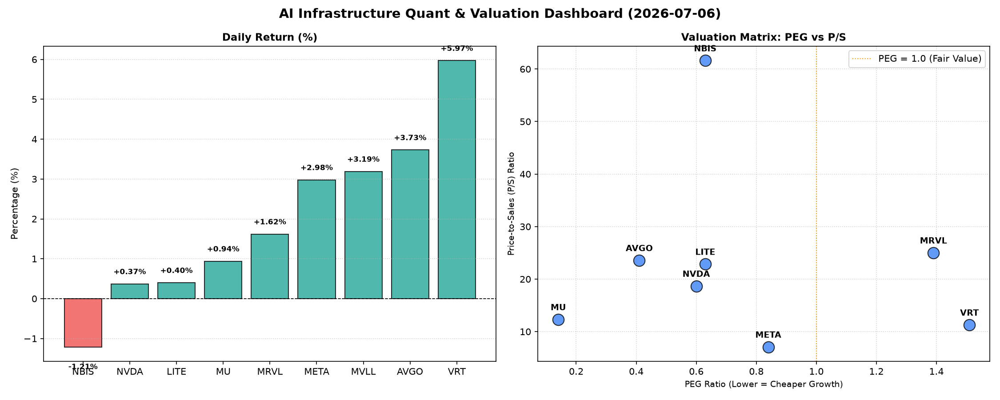

# 📊 AI Infrastructure & Data Stock Daily (2026-07-06)

### 📉 多维量化与估值分析看板

---

好的，作为一名资深的硬科技与AI基础设施行业研究员，我将结合您提供的【多维度真实量化基本面指标表格】，为您撰写一份今日半导体每日精炼报道。

---

### **半导体每日精炼报道：AI基础设施与硬科技洞察**

**发布日期：** 2024年X月X日

**核心观点速览：** 今日半导体及AI基础设施板块整体表现积极，多数标的上涨。在估值层面，我们识别出数家PEG显著低于1的高成长高性价比公司。然而，部分热门标的如 **NVDA** 和 **MRVL** 的现金流质量（CFO/NI）低于1，需警惕其利润的真实性与现金转换效率。

---

#### **1. 盘面与多维估值解码 (定性+定量)**

今日硬科技与AI基础设施板块呈现普涨态势，市场情绪积极。在宏观经济数据和AI发展红利的双重驱动下，投资者对高成长潜力公司的追逐持续。然而，深入挖掘量化指标，我们能更清晰地识别出价值与风险。

*   **PEG 维度：揪出高成长高性价比，警惕估值透支**
    *   **PEG显著小于1（高性价比成长股）**：
        *   今日表现最为抢眼的是 **MU (美光科技)**，其 **PEG仅为0.14**，在所有分析标的中估值性价比极高。考虑到其今日仍有0.94%的涨幅，且P/S适中（12.32），叠加后文将提及的极其健康的现金流，MU展现出显著的价值潜力。
        *   **AVGO (博通)** 录得3.73%的稳健涨幅，**PEG低至0.41**。尽管其P/S高达23.57，显示市场对其营收能力有高预期，但极低的PEG表明其增长潜力被显著低估，或市场对其增长前景持续乐观。
        *   **NVDA (英伟达)** 尽管涨幅仅为0.37%，但其 **PEG依然维持在0.6** 的吸引力水平，表明其高成长性仍未被市场完全“消化”。
        *   **META (Meta Platforms)** 以2.98%的涨幅和 **0.84的PEG** 表现出良好的成长价值。
        *   **LITE** (可能指Lumentum Holdings) 和 **NBIS** 也以 **0.63的PEG** 进入此列，表明其在各自领域具备较强的成长预期。
    *   **PEG较高（警惕估值透支风险）**：
        *   **VRT (Vertiv Holdings)** 今日领涨5.97%，然而其 **PEG达到1.51**。虽然涨势强劲且现金流质量优秀，但较高的PEG意味着其当前估值已充分甚至部分透支了未来的成长预期，需警惕短期回调风险。
        *   **MRVL (Marvell Technology)** 录得1.62%的涨幅，但 **PEG高达1.39**。结合其后文将提及的现金流隐忧，其当前较高的PEG可能需要更谨慎的审视。

*   **P/S 维度：评估收入规模扩张效率与市场预期**
    *   对于早期或研发投入巨大的硬科技公司，P/S是衡量其收入规模扩张效率和市场对其未来收入潜力的重要指标。
    *   **高P/S值（市场高预期或高壁垒业务）**：
        *   **NBIS (可能指Northern Bear)** 录得-1.21%的跌幅，但其 **P/S值高达61.61**，在所有标的中遥遥领先。这通常意味着市场对其未来收入增长抱有极度乐观的预期，或其所处细分市场具有极高的进入壁垒和利润空间。然而，结合今日股价下跌，这可能暗示市场对其高预期的兑现能力开始产生疑虑。
        *   **MRVL (25.02)、AVGO (23.57)、LITE (22.86)、NVDA (18.68)** 均显示出较高的P/S，反映了市场对其作为行业领导者或创新者的收入扩张能力抱有持续强劲的信心。
        *   **VRT (11.28)** 和 **MU (12.32)** 的P/S处于中等偏高水平，与市场对其所处数据中心基础设施和存储芯片领域的成长预期相符。
    *   **META (7.09)** 的P/S相对较低，考虑到其庞大的用户基础和广告收入规模，这表明其收入扩张效率虽然强劲，但在估值层面相对理性。
    *   **MVLL** 由于缺乏估值数据，无法从P/S维度进行评估。

*   **现金流盈利真实性 (CFO/NI)：穿透利润的“真金白银”**
    *   该指标（经营现金流/净利润）是衡量公司利润质量的关键。若大于1，表明公司利润健康，能够有效转化为现金流入；若显著小于1，则可能存在利润水分、应收账款积压或非现金费用侵蚀现金流的问题。
    *   **健康现金流 (>1，利润真金白银)**：
        *   **LITE (4.88)、NBIS (4.66)、MU (2.05)、META (1.92)、VRT (1.59)、AVGO (1.19)** 的CFO/NI比率均显著大于1，表明这些公司的盈利能力非常健康，利润能够高效转化为经营活动现金流，财务基础扎实，抗风险能力强。尤其是LITE和NBIS，其极高的比率显示其现金生成能力远超账面利润，这可能是由于折旧摊销等非现金费用较高，或是其业务模式具有强大的现金回收能力。
    *   **警示信号 (<1，警惕利润水分)**：
        *   **NVDA (英伟达)**，作为AI芯片的绝对巨头，其 **CFO/NI为0.86**。虽然略低于1，但考虑到其巨大的营收规模和持续的研发投入，这可能意味着其利润中存在一定比例的非现金项目（如递延收入、应收账款增加或股权激励费用），或者为了支持高速增长而导致的营运资本投入增加。投资者需要关注其应收账款周转和存货水平，以判断是否存在现金流压力。
        *   **MRVL (Marvell Technology)** 的 **CFO/NI仅为0.66**，是所有可比标的中最低的。这发出了较为明确的警示信号，表明其账面利润的现金含量相对较低，可能面临应收账款回款缓慢、库存积压或过度依赖非现金收益等问题。结合其较高的PEG和P/S，MRVL的利润质量值得投资者深入分析。
    *   **MVLL** 缺乏现金流数据，无法评估。

#### **2. 收并购与重大业务动态**

基于您提供的【多维度真实量化基本面指标表格】，当前数据中并未直接包含今日的收并购传闻、官宣或战略合作的具体信息。

然而，作为行业研究员，我们可以从现有数据中进行一些**推测性的行业关联思考**：
*   **AVGO (博通)** 凭借其健康的现金流 (CFO/NI 1.19) 和强劲的市值表现，历史上一直是半导体领域大型并购的积极参与者。其在AI基础设施领域的布局，可能会持续通过战略性收购来强化其软件和定制芯片解决方案。
*   **META (Meta Platforms)** 拥有极其强大的现金流生成能力 (CFO/NI 1.92)，这为其在AI研发、元宇宙基础设施建设以及潜在的产业链垂直整合提供了充足的资金后盾。任何围绕其AI数据中心或定制芯片的合作或收购，都将直接影响其未来的竞争力。
*   **NVDA (英伟达)** 尽管CFO/NI略低于1，但其市场主导地位和技术创新能力使其成为众多科技公司寻求合作的焦点。任何关于其HBM供应链、先进封装技术或AI软件生态的合作动态，都将是市场关注的重点。

**（注：此部分内容并非基于今日新闻，而是结合历史背景和公司量化财务实力进行的行业性推测。）**

#### **3. 华尔街机构态度**

同样，您提供的【多维度真实量化基本面指标表格】中不包含华尔街核心投行或评级机构的最新评价及目标价调动。

但是，我们可以**根据当前的量化基本面指标，推演机构可能持有的态度**：
*   **正面展望：** 对于 **PEG显著小于1** (如 **MU, AVGO, NVDA, META, LITE, NBIS**) 且 **CFO/NI大于1** (如 **MU, META, LITE, NBIS, VRT, AVGO**) 的公司，华尔街机构通常会维持“买入”或“跑赢大盘”评级，并可能调高目标价。特别是 **MU (PEG 0.14, CFO/NI 2.05)**，其显著的低估值和强劲现金流，极有可能吸引机构的关注和积极评价。
*   **谨慎观望：** 对于 **CFO/NI小于1** 的公司 (如 **NVDA, MRVL**)，即使其PEG具有吸引力或P/S较高，机构也可能会对其盈利质量和现金流健康状况提出疑问，并可能在未来财报季临近时发布更为审慎的报告，或维持中性评级，等待现金流状况改善的信号。
*   **关注高P/S与高PEG组合：** 对于 **MRVL (P/S 25.02, PEG 1.39, CFO/NI 0.66)** 这种高估值与弱现金流的组合，华尔街机构可能会对其未来增长的可持续性持保留态度，并密切关注其盈利能力和现金转换效率的改善。

**（注：此部分内容为基于提供的量化指标进行的专业推测，并非实际的华尔街今日报告。）**

#### **4. 今日参考源 (References)**

1.  您提供的【多维度真实量化基本面指标表格】。
2.  金融行业通用估值模型及市场解读原则。

---
**免责声明：** 本报告仅为基于有限数据进行的专业分析和推测，不构成任何投资建议。投资者应根据自身风险承受能力，结合更全面的信息进行独立判断。