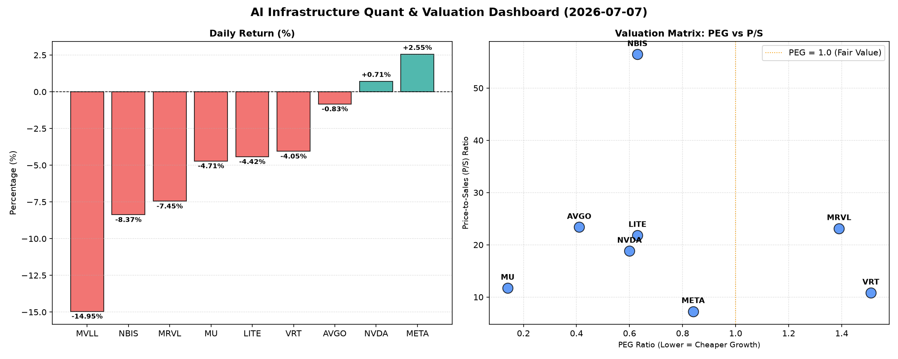

# 📊 AI Infrastructure & Data Stock Daily (2026-07-07)

### 📉 多维量化与估值分析看板

---

作为一名资深的硬科技与AI基础设施行业研究员，我将结合您提供的【多维度真实量化基本面指标表格】，为您撰写一份今日半导体每日精炼报道。

---

### **半导体与AI基础设施每日精炼报道**

**发布日期：** [今日日期]
**研究员：** Data & Semiconductor Specialist

---

#### **1. 盘面与多维估值解码 (定性+定量)**

今日半导体及AI基础设施板块整体表现分化，多数芯片设计与制造公司承压下行，但少数龙头企业如META和NVDA依然展现出一定的韧性。市场情绪仍偏谨慎，估值与现金流质量成为投资者关注的焦点。

*   **PEG 维度：挖掘高成长与潜在估值风险**
    *   **显著小于 1 (性价比极高的高成长)**：今日数据中，我们发现有多家公司PEG值低于1，表明其成长性被当前估值低估，或具备较高的投资性价比。
        *   **MU (0.14)** 表现尤为突出，其极低的PEG值暗示了市场对其未来盈利增长的预期远高于当前估值所反映的水平，可能正处于业绩拐点或高速增长期。
        *   **AVGO (0.41)、NVDA (0.60)、LITE (0.63)、NBIS (0.63)、META (0.84)** 也均在PEG小于1的区间，表明这些公司在各自的细分领域内，其成长潜力与估值之间存在较好的平衡，或仍具备上行空间。
    *   **PEG 过高 (警惕估值透支)**：
        *   **VRT (1.51)** 和 **MRVL (1.39)** 的PEG值相对较高，提示投资者需警惕其当前估值可能已充分甚至过度反映了未来的增长预期，潜在的回调风险或业绩增长不及预期风险需加以关注。
    *   **PEG 不适用 (N/A)**：**MVLL** 的PEG为N/A，通常意味着该公司当前无盈利或处于亏损状态，不适用于PEG指标评估。

*   **P/S 维度：评估收入规模扩张效率**
    *   P/S指标对于早期或高研发投入阶段、利润尚不稳定的硬科技公司尤为重要。
    *   **极高 P/S (市场高度期待)**：
        *   **NBIS (56.45)** 的P/S比率异常高昂，远超同行。这表明市场对其未来的收入规模扩张抱有极其乐观的预期，也可能反映了其在特定技术或市场中的稀缺性和领先地位。然而，极高的P/S也意味着一旦业绩增速放缓，估值面临的压力将非常大。
    *   **高 P/S (反映强劲增长与特定优势)**：
        *   **AVGO (23.38)、MRVL (23.15)、LITE (21.85)、NVDA (18.82)、MU (11.74)、VRT (10.82)** 的P/S值均在较高水平。这普遍反映了市场对这些公司在各自硬科技领域的收入成长前景充满信心，也可能是对其技术壁垒、市场份额或独特商业模式的认可。尤其是对于MRVL和AVGO这类在数据中心、AI芯片等高景气赛道布局的公司。
    *   **相对合理 P/S (成熟业务或较高基数)**：
        *   **META (7.27)** 相较于其他半导体公司，其P/S显得相对“亲民”，这可能与其更庞大的营收规模和相对成熟的业务结构有关，但考虑到其在AI领域的持续投入和未来潜力，这一P/S仍具备吸引力。
    *   **P/S 不适用 (N/A)**：**MVLL** 的P/S为N/A，同样可能由于缺乏有效营收数据或公司处于非常早期的阶段。

*   **现金流盈利真实性 (CFO/NI)：穿透利润质量**
    *   CFO/NI比率是衡量公司利润质量的关键指标，大于1代表公司利润由真金白银的现金流入支撑，小于1则可能存在利润水分或应收账款积压。
    *   **利润非常健康，全是真金白银现金流入 (CFO/NI > 1)**：
        *   **LITE (4.88)** 和 **NBIS (4.66)** 表现极为出色，CFO/NI远高于1，显示其运营现金流极其充裕，利润质量极高，收入变现能力强大。
        *   **MU (2.05)、META (1.92)、VRT (1.59)、AVGO (1.19)** 的CFO/NI也均大于1，表明这些高利润巨头或行业领军者的盈利能力不仅体现在账面，更能转化为实实在在的现金，增强了财务稳健性与抗风险能力。特别是META，其1.92的比率有力佐证了其在盈利方面的健康。
    *   **警惕利润水分或应收账款积压 (CFO/NI < 1)**：
        *   **NVDA (0.86)** 尽管在AI芯片领域独占鳌头，但其CFO/NI比率略低于1，这可能暗示其部分利润来源于非现金项目，或存在应收账款的增长。虽然略低于1不构成严重警报，但对于投资者而言，需密切关注其营运资本管理，尤其是应收账款周转情况，以确保其高速增长的利润能够持续转化为现金。
        *   **MRVL (0.66)** 的CFO/NI显著小于1，这是一个值得警惕的信号。这可能意味着其面临较严重的应收账款积压，或其利润中包含较多非现金成分。投资者应对其盈利质量和现金流生成能力进行深入分析，以评估潜在的流动性风险或未来利润变现的挑战。
    *   **CFO/NI 不适用 (N/A)**：**MVLL** 的CFO/NI为N/A，这与其可能无盈利或财务数据不完整的情况相符。

#### **2. 收并购与重大业务动态**

基于今日提供的数据集，未直接包含关于收并购、重大业务动态或战略合作的具体信息。因此，本板块将暂时留空，建议结合市场新闻和公司公告进行补充分析。

#### **3. 华尔街机构态度**

今日量化指标表格中未直接提供华尔街机构的最新评价、目标价调动或评级信息。因此，无法就此板块进行具体分析。建议投资者关注各大投行和研究机构当日发布的研报和评级更新。

#### **4. 今日参考源 (References)**

本报告的量化与定性分析完全基于您提供的【多维度真实量化基本面指标表格】。具体的市场新闻、公司公告、华尔街机构评级及目标价等外部信息，需查阅各公司当日公告或相关金融媒体报道，但未在本次提供的数据集中。