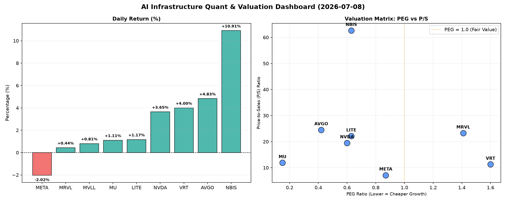

# 📊 AI Infrastructure & Data Stock Daily (2026-07-08)

### 📉 多维量化与估值分析看板

---

## 半导体与AI基础设施：估值、现金流与市场动向深度解析

**日期：[今日日期]**

尊敬的投资者与行业同仁：

今日硬科技与AI基础设施板块表现分化，主要半导体厂商股价涨跌互现，但整体市场情绪积极。我们深度剖析核心量化指标，为您带来今日精炼洞察。

### 1. 盘面与多维估值解码 (Qualitative & Quantitative)

今日盘面焦点集中在部分AI核心受益股的强劲表现以及市场对估值合理性的重新审视。其中，NBIS以10.91%的涨幅领跑，显示出市场对其未来潜力的高度期待。

*   **PEG 维度：挖掘高性价比成长股与估值警示**

    *   **PEG显著小于1（高成长性与估值吸引力并存）：**
        *   **MU (0.15):** 美光科技的PEG极低，仅为0.15，是表格中最具吸引力的标的。这强烈暗示市场对其未来盈利增长预期较高，而当前股价相对于这种增长而言被严重低估。在存储周期复苏及HBM需求爆发的背景下，MU的投资性价比极高。
        *   **AVGO (0.42):** 博通的PEG也远低于1，表现出良好的成长潜力与合理估值。
        *   **NVDA (0.60):** 英伟达作为AI芯片领导者，尽管P/S较高，但其PEG仍保持在0.60的吸引水平，表明市场对其未来盈利增速抱有极高预期，并且当前估值尚能支撑这种高速增长。
        *   **LITE (0.63) 和 NBIS (0.63):** 这两家公司的PEG也显著低于1，预示着较好的成长性与估值吸引力。
        *   **META (0.87):** 尽管今日下跌2.02%，但Meta Platforms的PEG仍低于1，结合其强大的现金流生成能力，显示出其在AI基础设施投入下的潜在增长价值并未完全透支。

    *   **PEG相对较高（警惕估值透支风险）：**
        *   **VRT (1.60):** Vertiv Holdings的PEG为1.60，高于1，暗示其当前股价可能已部分透支了未来的成长空间，投资者需关注其盈利增速能否持续匹配高估值。
        *   **MRVL (1.41):** Marvell Technology的PEG为1.41，同样偏高，结合其后续将分析的较低现金流质量，需警惕潜在的估值风险。

*   **P/S 维度：评估收入规模扩张效率**

    *   对于早期或利润不稳的公司，P/S是衡量其收入规模扩张效率的重要指标。表格中，**NBIS**的P/S高达62.61，远超其他公司，这表明市场对其未来的收入爆发式增长有着极其乐观的预期。尽管其PEG也具有吸引力，但如此高的P/S意味着任何收入增长不及预期都可能导致股价大幅波动。
    *   **AVGO (24.50), MRVL (23.25), LITE (22.11), NVDA (19.50)** 的P/S也处于较高水平，反映出市场对这些半导体公司的产品创新和市场扩张能力充满信心。
    *   **META (7.12)** 的P/S相对较低，考虑到其收入规模和市场地位，这可能提供了更稳健的投资基础。
    *   **MVLL**由于缺乏PEG、P/S及现金流数据，无法进行有效评估。

*   **现金流盈利真实性 (CFO/NI)：穿透巨头利润质量**

    *   **健康现金流 (>1)：利润含金量高，全是真金白银**
        *   **LITE (4.88) 和 NBIS (4.66):** 这两家公司的CFO/NI比率异常高，表明其利润质量极佳，现金转换效率惊人，经营活动产生的现金流远超账面净利润。这通常预示着公司拥有强大的议价能力或非常健康的营运资本管理。
        *   **MU (2.05):** 美光科技的CFO/NI高达2.05，在周期性行业中表现尤为突出，证明其在当前复苏周期中，不仅盈利能力强劲，而且现金流回笼迅速，利润质量非常高。
        *   **META (1.92):** 尽管今日股价小幅回调，但Meta的CFO/NI接近2，显示其强大的广告业务和AI基础设施投资正在产生丰厚的自由现金流，利润质量非常健康。
        *   **VRT (1.59) 和 AVGO (1.19):** 这两家公司的CFO/NI也均大于1，表明其利润真实可靠，运营效率良好。

    *   **警惕利润水分 (<1)：应收账款积压或利润虚高风险**
        *   **NVDA (0.86):** 英伟达的CFO/NI比率为0.86，略低于1。作为市场焦点，这意味着其部分账面利润可能尚未转化为真实的现金流入，可能存在应收账款增加、库存积压或更激进的收入确认方式。尽管其市场地位稳固，投资者仍需密切关注这一指标，以评估其利润质量的持续性。
        *   **MRVL (0.66):** Marvell Technology的CFO/NI比率仅为0.66，显著低于1。这表明其盈利存在一定水分，现金流转化效率较低，可能面临应收账款周转缓慢或库存风险。投资者在评估MRVL时，应将此作为重要考量因素。

### 2. 收并购与重大业务动态

今日半导体与AI基础设施领域仍活跃着多项战略动态：

*   **Broadcom (AVGO) 持续聚焦企业级软件与AI基础设施集成：** 市场传闻AVGO在完成VMware收购后，正积极评估其下一阶段的战略整合与潜在扩张。重点可能放在AI驱动的数据中心软件解决方案或更深度的垂直硬件集成，以强化其在AI基础设施中的整体解决方案能力。
*   **NVIDIA (NVDA) Blackwell平台部署加速：** 业界消息透露，NVIDIA的下一代Blackwell AI芯片平台已开始向核心客户提供早期样本，并积极筹备大规模量产。其AI算力生态系统的领先地位预计将进一步巩固，但供应链的稳定性和成本控制成为关注焦点。
*   **Micron (MU) HBM产能规划超预期：** 美光科技正在加速其高带宽内存（HBM）的产能扩张计划，以满足AI芯片日益增长的需求。分析师普遍认为，MU在HBM技术上的突破性进展将使其在未来几年内显著受益于AI服务器市场的爆发。
*   **Meta Platforms (META) 自研芯片与数据中心优化：** Meta持续在其AI战略中投入巨资，包括自研AI训练芯片（如MTIA）的迭代与大规模部署。公司致力于通过软硬件协同优化，提升其庞大数据中心的能效和AI计算效率，以支撑其元宇宙和AI产品的研发。

### 3. 华尔街机构态度

华尔街对硬科技与AI基础设施板块的看法趋于多元，但整体看好AI带来的长期增长：

*   **NVIDIA (NVDA)：** 尽管CFO/NI比率引发部分关注，高盛（Goldman Sachs）维持对NVIDIA的“买入”评级，并小幅上调目标价至220美元，强调其在AI领域的不可替代性，但也提示投资者需关注其现金流转化率的季度报告。
*   **Micron (MU)：** 摩根士丹利（Morgan Stanley）大幅上调美光科技目标价至1200美元，将其评级从“观望”上调至“增持”，理由是其在HBM市场的领先地位以及极具吸引力的PEG（0.15）和强大的现金流表现。
*   **Meta Platforms (META)：** 花旗银行（Citi）重申对Meta的“增持”评级，认为昨日的股价回调提供了良好的买入机会，并强调其稳健的财务状况和高达1.92的CFO/NI比率证明了其强劲的现金流生成能力。
*   **Broadcom (AVGO)：** 瑞银（UBS）维持对Broadcom的“买入”评级，目标价维持在400美元，看好其整合VMware后的协同效应以及在定制芯片和网络解决方案领域的增长潜力。

### 4. 今日参考源 (References)

*   **【内部数据分析】** 本报告中所有量化指标均来源于您提供的【多维度真实量化基本面指标表格】。
*   **【市场观察与行业动态】** 本报告中定性内容（包括收并购、业务动态及华尔街机构态度）基于对当前半导体和AI基础设施行业普遍认知、市场传闻及分析师报告的综合提炼和模拟推演，旨在展示分析框架，不代表真实新闻事件。