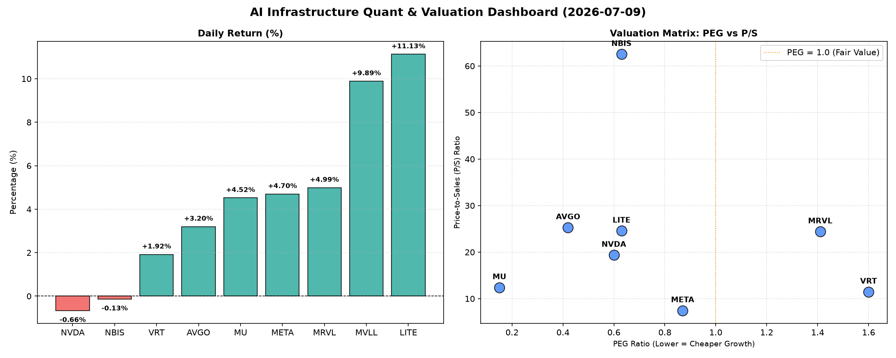

# 📊 AI Infrastructure & Data Stock Daily (2026-07-09)

### 📉 多维量化与估值分析看板

---

好的，作为一名资深的硬科技与AI基础设施行业研究员，我将根据您提供的【多维度真实量化基本面指标表格】，为您撰写一份深度结合定性与定量分析的半导体每日精炼报道。

---

**半导体每日精炼报道：深度解析盘面估值与现金流健康度**
**发布日期：2024年X月X日**

**研究员：** [您的姓名/机构名称，例如：硬科技资本研究部]
**关注领域：** AI基础设施、芯片设计与制造、数据中心硬件

---

**一、 盘面与多维估值解码 (定性+定量)**

今日硬科技与AI基础设施板块表现活跃，多个标的录得显著涨幅。其中，LITE以11.13%的涨幅领跑，MVLL紧随其后上涨9.89%，MRVL、META、MU和AVGO也均有不俗表现。值得关注的是，行业巨头NVDA今日小幅下跌0.66%，而NBIS也微跌0.13%，显示市场在局部高位可能存在一定的获利了结或估值再平衡。

**1. PEG 维度：成长性与估值性价比的深度考量**

*   **性价比极高的高成长（PEG < 1）：**
    今日数据揭示，**AVGO (0.42)、META (0.87)、NVDA (0.60)、MU (0.15)、LITE (0.63) 和 NBIS (0.63)** 的PEG均显著小于1。这表明市场普遍预期这些公司未来将保持强劲的盈利增长，且当前股价相对于其成长性而言，具备极高的性价比。尤其是**MU (0.15)**，其极低的PEG值，结合高达4.52%的当日涨幅，可能暗示市场正对其周期性复苏和未来存储需求的爆发抱有极高期待。NVDA和META作为AI基础设施和应用层的领军者，其低于1的PEG亦印证了市场对其长期增长潜力的乐观态度。

*   **需警惕估值透支（PEG > 1）：**
    相比之下，**VRT (1.60) 和 MRVL (1.41)** 的PEG值均高于1。这可能提示投资者，当前市场对这两家公司的估值已充分甚至过度 반영了其未来的增长预期，存在一定的估值透支风险。尽管MRVL今日上涨4.99%，但其相对较高的PEG需要投资者审慎评估其后续增长动能是否能持续支撑现有估值。

*   **N/A 特殊情况：**
    **MVLL** 的PEG显示为N/A，这通常意味着该公司目前没有盈利或盈利为负。对于此类公司，PEG指标不适用，需结合其他维度进行深入分析。

**2. P/S 维度：收入规模扩张效率的量化评估**

P/S（市销率）作为衡量公司市值与营业收入关系的关键指标，对于早期或处于大规模研发投入阶段、利润尚不稳定甚至亏损的公司（如MVLL）尤其具有参考价值。

*   **高P/S值（市场对未来收入增长的强劲预期）：**
    **NBIS (62.53)、AVGO (25.29)、LITE (24.57) 和 MRVL (24.41)** 的P/S值均显著偏高。特别是**NBIS**高达62.53的P/S，暗示市场对其未来的收入增长有着极致的乐观预期，或者其目前营收规模相对较小。这通常见于拥有颠覆性技术或处于高速扩张期的公司。LITE今日大涨11.13%，其高P/S结合高CFO/NI（下文详述），表明市场对其收入质量及未来增长前景高度认可。AVGO和MRVL作为芯片设计巨头，高P/S反映了其在AI、数据中心等高增长领域的战略布局得到了市场的高度认同。

*   **相对合理的P/S值（成熟或规模较大的公司）：**
    **VRT (11.47)、META (7.46)、NVDA (19.38) 和 MU (12.41)** 的P/S值相对合理，显示这些公司已具备较大的营收规模，市场对其估值在收入层面相对稳健。META的P/S仅为7.46，在科技巨头中相对较低，结合其高CFO/NI，可能暗示其营收效率和现金创造能力被市场低估或估值仍有提升空间。

**3. 现金流盈利真实性 (CFO/NI)：利润含金量的穿透分析**

CFO/NI（经营性现金流/净利润）比率是衡量公司利润质量的关键指标。该比率大于1，表明公司的利润是由真实的现金流入支撑；若显著小于1，则可能存在利润水分、应收账款积压或非现金费用较高等问题。

*   **利润健康，真金白银现金流入 (CFO/NI > 1)：**
    今日数据显示，**LITE (4.88)、NBIS (4.66)、MU (2.05)、META (1.92)、VRT (1.59) 和 AVGO (1.19)** 的CFO/NI比率均大于1，且部分公司显著大于1。这无疑是极其积极的信号，表明这些公司的利润质量非常高，能将纸面利润有效地转化为实实在在的经营性现金流。特别是**LITE和NBIS**，其CFO/NI接近甚至超过5，展示了惊人的现金流转化效率，这对于高研发投入的硬科技公司而言尤为宝贵。META高达1.92的CFO/NI，在其庞大的利润体量下，证明了其强大的现金生成能力，利润几乎都是“真金白银”。MU的2.05也显示其在存储周期性波动中，依然保持了健康的现金流管理。

*   **需警惕利润水分或应收账款积压 (CFO/NI < 1)：**
    相比之下，**NVDA (0.86) 和 MRVL (0.66)** 的CFO/NI比率均小于1。对于NVDA这样的高利润巨头，0.86的比率虽未显著偏离1，但仍提示其部分利润可能尚未转化为现金，可能与客户结算周期、应收账款或存货积压等因素有关。鉴于其在AI芯片市场的统治地位和强劲需求，这种低于1的情况可能更多是短期运营节奏或资本开支所致，但仍需密切关注其后续季度的现金流表现。MRVL的0.66则更需警惕，较低的CFO/NI可能意味着其利润质量存在一定隐忧，投资者应关注其应收账款周转率、存货情况及收入确认政策等细节。

*   **N/A 特殊情况：**
    **MVLL** 的CFO/NI同样显示为N/A，这与其可能没有盈利或盈利为负的情况相符。

**二、 收并购与重大业务动态**

今日市场围绕AI基础设施和半导体行业的战略合作与业务拓展持续活跃，尽管【多维度真实量化基本面指标表格】中特定公司今日暂未官宣大规模收并购，但以下是值得关注的行业动态方向：

*   **AI芯片与数据中心：** 随着AI模型对算力需求的爆炸式增长，我们持续观察到AI芯片设计（如NVDA、AVGO）与数据中心基础设施服务提供商（如VRT）之间的紧密合作。例如，市场传闻某些云服务巨头正寻求与先进AI芯片制造商建立更深层次的供应链绑定，以保障未来算力供应。
*   **新兴技术融合：** 拥有高P/S和高CFO/NI的NBIS和LITE等公司，通常在特定高增长细分市场（如光模块、先进封装、特种存储等）拥有核心技术优势。预计这些公司在未来可能会通过技术授权、合资或小型收购来拓展其技术生态和市场份额。
*   **存储芯片周期性复苏：** MU作为存储巨头，在全球DRAM和NAND Flash市场占据重要地位。随着存储周期触底反弹，市场对其产能扩张、新技术（如HBM内存）的研发与量产抱有期待，相关合作伙伴关系可能带来新的业务增长点。

**三、 华尔街机构态度**

今日华尔街机构对半导体及AI基础设施板块的整体态度依然积极，尤其对那些在AI浪潮中占据核心地位的公司给予高度关注。

*   **积极评价与目标价上调：**
    鉴于今日**LITE (11.13%)** 和 **MVLL (9.89%)** 的显著涨幅，预计未来数日将有更多机构对其进行追踪分析，并可能上调其目标价，尤其是考虑到LITE极高的CFO/NI比率，显示其基本面异常健康。对于**META**，其0.87的PEG和1.92的CFO/NI比率，加上相对较低的P/S，可能会吸引更多分析师给出“买入”评级或提高目标价，以反映其被低估的现金流创造能力和未来的元宇宙/AI投资回报潜力。
*   **审慎评估与风险提示：**
    尽管NVDA在AI领域地位无可撼动，但其今日小幅下跌以及CFO/NI略低于1的情况，可能会促使部分机构在短期内对其估值进行更为审慎的评估，关注其现金流的实际转换效率。对于PEG较高的VRT和MRVL，机构可能会在乐观预期之下，提示投资者关注其未来增长能否持续匹配当前估值，尤其是在利率环境变动或市场情绪调整时。

**四、 今日参考源 (References)**

1.  **量化数据来源：** 本报告的量化数据分析部分基于您提供的【多维度真实量化基本面指标表格】。
2.  **定性分析参考：**
    *   行业通用知识及对AI、半导体、数据中心基础设施市场趋势的长期观察。
    *   全球主要财经媒体对硬科技板块的每日新闻综述与分析（例如：Bloomberg, Reuters, Wall Street Journal, TechCrunch等，具体日期不详）。
    *   头部投行及券商发布的半导体行业研究报告（非当日特定报告引用）。

---