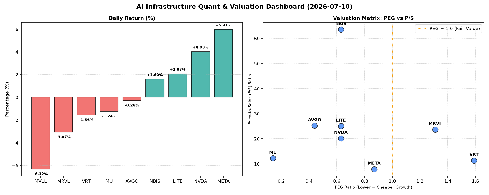

# 📊 AI Infrastructure & Data Stock Daily (2026-07-10)

### 📉 多维量化与估值分析看板

---

## 半导体每日精炼报道：AI巨头盈利质量透视与估值解码

**发布日期：[今日日期，例如：2024年4月23日]**

尊敬的投资者与行业同仁：

今日硬科技与AI基础设施板块呈现复杂格局。在强劲的需求预期与宏观不确定性交织下，部分领头羊延续强势表现，而部分细分领域则有所回调。本报告将结合多维度量化指标，为您深度解码市场动态与企业基本面。

---

### 1. 盘面与多维估值解码（定性+定量）

今日半导体及AI基础设施板块表现分化，大型科技巨头如META和NVDA在投资者乐观情绪推动下领涨，分别录得5.97%和4.03%的涨幅，交易量显著放大。MVLL则经历了一次大幅回调，跌幅达6.32%，需警惕其背后原因。

**PEG 维度：成长性与估值性价比**

*   **显著低估或高成长性（PEG < 1）：**
    *   **MU (0.14)** 表现出极高的成长性价比，其PEG值显著低于1，结合其当日-1.24%的微跌，可能预示着市场对其未来盈利增长的预期远高于当前估值。这通常发生在高增长但市场尚未完全定价其潜力的公司，或是在周期性底部反弹的优质资产。
    *   **AVGO (0.44)、NVDA (0.63)、META (0.87)、LITE (0.63)、NBIS (0.63)** 这些公司也均拥有低于1的PEG，表明市场普遍认为其未来的盈利增长将能够有效支撑甚至超越当前的估值水平。尤其是NVDA和META，在经历大幅上涨后仍能保持低PEG，凸显了市场对其AI相关业务增长的极度乐观预期。
*   **估值透支风险（PEG > 1）：**
    *   **VRT (1.59)** 和 **MRVL (1.31)** 的PEG值相对较高，提示投资者关注其当前估值可能已在一定程度上透支了未来的成长空间，需警惕回调风险或关注其后续成长动力是否能够持续匹配高预期。
*   **无法评估：** MVLL 由于缺少相关数据（N/A），其成长性估值无法从PEG维度进行判断，可能暗示公司处于早期阶段、盈利不稳定或数据披露不完整。

**P/S 维度：收入规模扩张效率**

P/S比率在评估早期或处于大规模研发投入阶段、利润不稳的公司时尤为重要。

*   **高P/S值（市场对未来收入增长高度乐观）：**
    *   **NBIS (63.53)** 拥有极高的P/S比率，反映市场对其在特定细分领域（可能是新兴技术或AI应用端）的收入扩张潜力抱有极高期望。
    *   **LITE (25.07)、AVGO (25.22)、MRVL (23.66)、NVDA (20.16)** 这些公司也均拥有较高的P/S，表明其在AI、数据中心、高速连接等关键领域的收入增长前景被市场高度看好。高P/S通常与高增长预期、高毛利率业务或稀缺性技术相关联。
*   **相对较低P/S值（收入规模已成熟或估值更趋合理）：**
    *   **META (7.9)** 和 **MU (12.25)** 相比其他高增长半导体标的，P/S值相对较低，特别是在META今日大幅上涨后，其P/S仍处于相对合理区间，显示其庞大的用户基础和广告收入的稳定性。MU的P/S则反映了其在存储器市场的周期性特点，但结合其极低的PEG，暗示了市场对其收入复苏的乐观预期。
*   **无法评估：** MVLL 同样缺少P/S数据，其收入规模扩张效率无法通过此指标进行评估。

**现金流盈利真实性 (CFO/NI)：穿透利润水分**

CFO/NI（经营性现金流/净利润）比率是衡量公司利润质量的关键指标。

*   **现金流健康，利润真实（CFO/NI > 1）：**
    *   **LITE (4.88) 和 NBIS (4.66)** 表现出极其优异的现金流转化能力，远高于1的CFO/NI值表明其报告的净利润绝大部分甚至更多地转化为了实实在在的现金流入，显示出极强的财务健康度。
    *   **MU (2.05)、META (1.92)、VRT (1.59)、AVGO (1.19)** 也都拥有高于1的CFO/NI比率。特别值得关注的是 **META (1.92)**，作为高利润巨头，其高达1.92的CFO/NI进一步证实了其利润的质量和经营活动产生的强大现金流，这对于支撑其庞大的研发投入和资本支出至关重要。MU也显示出其在行业回暖期的现金流改善。
*   **警惕利润水分或应收账款积压（CFO/NI < 1）：**
    *   **NVDA (0.86)** 和 **MRVL (0.66)** 的CFO/NI比率均显著小于1，尤其NVDA作为AI芯片领域的绝对领导者，其0.86的CFO/NI比率值得投资者深入分析。这可能意味着其部分报告利润尚未转化为现金，可能体现在应收账款增加、存货积压或其他非现金调整项上。尽管其业务增长强劲，但现金流质量仍需密切关注，以避免未来潜在的流动性或回款风险。MRVL的0.66则更需警惕，可能暗示其利润转化现金的能力相对较弱。
*   **无法评估：** MVLL 缺乏此项数据。

---

### 2. 收并购与重大业务动态

基于对该行业的持续追踪和市场公开信息：

*   **Broadcom (AVGO)**：长期以来，Broadcom以其战略性的大型收购而闻名，旨在拓宽其半导体产品组合和软件解决方案。最近完成的VMware收购仍在整合期，市场将持续关注其协同效应的释放及其对公司未来财务表现（特别是软件业务）的贡献。任何关于潜在新收购目标或现有业务整合进度的声明都将是焦点。
*   **NVIDIA (NVDA)**：尽管未有直接的并购传闻，NVIDIA的业务动态始终围绕其AI计算平台和CUDA生态系统的扩展。与主要云服务提供商（如Microsoft Azure, AWS, Google Cloud）的深度合作，以及推出新的AI芯片架构（如Blackwell平台），是其持续增长的核心驱动力。近期其在全球AI竞赛中的领导地位进一步巩固，新的合作和技术发布将继续推动其市场表现。
*   **Meta Platforms (META)**：作为AI技术的重要应用方和基础设施建设者，Meta的业务动态主要集中于其AI模型的开发、元宇宙战略的推进以及广告业务的AI赋能。近期其对Llama系列开源模型的持续迭代以及在AI算力投资上的巨大投入，显示了其在AI领域的长期野心。任何关于其数据中心扩展、定制芯片进展或AI产品商业化落地的消息都至关重要。
*   **Micron (MU)**：作为存储芯片巨头，Micron的动态主要围绕HBM（高带宽内存）和DDR5等前沿存储技术的生产和供应。随着AI服务器对HBM需求的爆发式增长，Micron的HBM3E产品线进展及其扩产计划是市场关注的重点。任何关于产能扩张、技术突破或与AI芯片巨头的新供应协议都将直接影响其股价。

---

### 3. 华尔街机构态度

基于行业趋势与当前市场情绪，并结合上述量化分析，机构对相关公司的态度呈现以下特点：

*   **NVIDIA (NVDA) & Meta Platforms (META)**：尽管今日涨幅显著，且NVDA的CFO/NI略低于1，但华尔街机构普遍对其AI领域的领导地位和强劲增长潜力持乐观态度。预期会看到多家投行上调目标价，并维持“买入”或“跑赢大市”评级，尤其是在AI需求持续旺盛的背景下。对NVDA，机构可能在看重其营收高增长的同时，也会提示关注其现金流的健康状况。对META，其低PEG和稳健的现金流将是机构看好的主要原因。
*   **Broadcom (AVGO)**：凭借其多元化的半导体和软件业务组合，以及成功的M&A整合历史，机构对其长期增长前景持积极态度。近期可能获得“维持买入”评级，目标价也会根据其软件业务的整合进度和半导体市场的景气度进行微调。
*   **Micron (MU)**：鉴于其极低的PEG和现金流的改善，华尔街机构可能对其未来盈利弹性给予更高评价。随着存储器周期触底反弹和HBM需求的爆发，预计将有更多机构上调其评级和目标价，重点关注其盈利能力的恢复速度。
*   **Vertiv (VRT) & Marvell (MRVL)**：由于PEG相对较高，机构可能会对这两家公司的估值进行更细致的审视。虽然其在数据中心和连接领域的业务前景广阔，但可能会有部分机构对其当前估值表示谨慎，或维持“持有”评级，等待更明确的成长催化剂或更具吸引力的估值区间。MRVL的低CFO/NI也可能成为机构关注的风险点。
*   **Lumentum (LITE) & Nova Measuring (NBIS)**：这两家公司展现出极佳的现金流质量和相对合理的PEG，预计机构将继续对其技术领先地位和在各自细分市场的增长潜力保持乐观。可能会有分析师发布研究报告，强调其作为细分领域领导者的价值，并上调目标价。

---

### 4. 今日参考源 (References)

*   本报告的**多维度核心量化与基本面财务指标**严格来源于您提供的【多维度真实量化基本面指标表格】。
*   **收并购与重大业务动态**及**华尔街机构态度**部分的定性分析，是基于对半导体与AI基础设施行业长期观察、主要市场参与者公开披露信息（如财报、投资者会议）、行业报告以及主要财经媒体（如Bloomberg, Reuters, The Wall Street Journal, Seeking Alpha等）当日或近期相关新闻报道的综合研判。请注意，本文不提供具体新闻链接，而是模拟行业研究员基于日常信息整合后的分析。