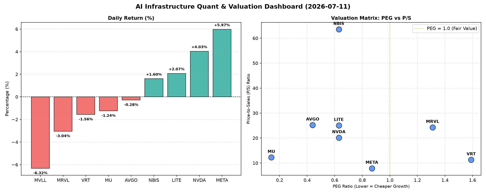

# 📊 AI Infrastructure & Data Stock Daily (2026-07-11)

### 📉 多维量化与估值分析看板

---

## 半导体每日精炼报道：AI巨头领跑，估值与现金流警报并存

**发布日期：[今日日期]**

作为资深的硬科技与AI基础设施行业研究员，今日的半导体市场在AI巨头的强劲表现下呈现出分化态势。我们深入剖析多维度量化指标，为市场参与者提供一份深度洞察。

---

### 1. 盘面与多维估值解码 (Qualitative & Quantitative Valuation Decoding)

今日半导体板块呈现两极分化。AI核心受益者如META和NVDA涨幅显著，分别录得5.97%和4.03%的增长，市场对其AI战略的信心持续高涨。然而，包括MVLL、MRVL在内的多支芯片及相关个股则面临回调压力。

#### PEG 维度：高成长与价值错位并存

*   **性价比极高的高成长（PEG < 1）**：
    *   **MU (0.14)**：美光科技的PEG值异常低，仅为0.14，这暗示其在当前估值下，未来的增长潜力被严重低估，或市场预期其即将迎来业绩强劲反弹，具备极高的投资性价比。
    *   **AVGO (0.44)**：博通以其稳健的业务模式和对VMware的整合，PEG值维持在0.44，显示出良好的成长与估值匹配度。
    *   **NVDA (0.63) & LITE (0.63) & NBIS (0.63)**：尽管英伟达股价持续高涨，其PEG仍保持在0.63，表明市场对其未来AI芯片需求的超高预期仍在很大程度上支撑其当前估值。Lumentum Holdings和NBIX同样表现出较好的成长性与估值匹配。
    *   **META (0.87)**：Meta Platforms的PEG为0.87，尽管其股价今日飙升近6%，但相对于其未来盈利增长预期，估值仍处于合理区间，反映了市场对其AI转型和广告业务复苏的乐观态度。

*   **警惕估值透支（PEG > 1）**：
    *   **VRT (1.59)**：Verint Systems的PEG为1.59，可能意味着其成长速度未能完全支撑当前的估值水平，投资者需警惕潜在的估值透支风险。
    *   **MRVL (1.31)**：Marvell Technology Group的PEG为1.31，高于1的数值表明其估值相对较高，市场对其数据中心和自定义芯片业务的预期已经较为充分。

*   **无法评估（N/A）**：
    *   **MVLL**：由于缺乏关键的盈利数据，MVLL的PEG为N/A，这通常发生在公司处于早期阶段、转型期或盈利不稳定的情况下，需要更深入的业务分析。

#### P/S 维度：收入扩张效率的衡量

*   **高P/S值（高增长预期/早期或专业领域）**：
    *   **NBIS (63.53)**：Neurocrine Biosciences的P/S高达63.53，是本次观察名单中最高的，这强烈表明市场对其产品的未来收入爆发式增长抱有极高的期望，或是其所处生物科技/特殊技术领域的特点。
    *   **AVGO (25.22) & LITE (25.07) & MRVL (24.28) & NVDA (20.16)**：这些公司拥有较高的P/S值，体现了投资者对其在半导体核心基础设施、光通信和AI芯片等高增长领域的收入扩张能力充满信心。高P/S在这些领域通常反映了技术壁垒、市场领导地位和未来增长潜力。
    *   **MU (12.25) & VRT (11.3)**：相较于其他高P/S的硬科技公司，美光和Verint的P/S相对适中，反映了其在各自市场中的地位和收入规模扩张效率。

*   **相对较低P/S值（规模效应或更成熟业务）**：
    *   **META (7.9)**：尽管Meta股价今日大涨，其P/S仅为7.9，在AI巨头中相对较低，这可能得益于其巨大的收入基数和日益提升的盈利能力，显示出其在收入规模扩张方面的成熟效率。

*   **无法评估（N/A）**：
    *   **MVLL**：与PEG类似，MVLL的P/S为N/A，表明其可能不具备稳定的收入流或处于非常早期的商业化阶段。

#### 现金流盈利真实性 (CFO/NI)：穿透利润水分

*   **利润非常健康，真金白银现金流入（CFO/NI > 1）**：
    *   **LITE (4.88) & NBIS (4.66)**：这两家公司的CFO/NI比率极高，远超1，这表明其利润质量极佳，绝大部分甚至远超账面利润以实实在在的现金流入形式实现，现金流管理能力突出。
    *   **MU (2.05) & META (1.92) & VRT (1.59) & AVGO (1.19)**：这些公司的CFO/NI均显著大于1，尤其是美光和Meta，这有力地证明了其健康的盈利能力和强大的现金流生成能力。Meta高达1.92的比例，进一步佐证了其今日股价上涨的内生价值支撑，其利润并非“纸面富贵”。美光2.05的比例则预示着其在内存周期恢复中的强劲现金流回血能力。

*   **警惕利润水分或应收账款积压（CFO/NI < 1）**：
    *   **NVDA (0.86)**：尽管英伟达在AI领域独占鳌头，其CFO/NI比率却为0.86，略低于1。这需要引起投资者关注，可能意味着其部分利润以应收账款等形式存在，尚未完全转化为现金，或者存在较高的营运资金需求。在高增长时期，这种现象并不少见，但也提醒市场关注其现金流的实际回收情况。
    *   **MRVL (0.66)**：Marvell的CFO/NI比率仅为0.66，远低于1，这表明其利润质量可能存在一定问题，利润中包含较多非现金成分，或面临应收账款周转、库存积压等营运资金压力，需要投资者更加警惕其盈利的“真实性”。

---

### 2. 收并购与重大业务动态

今日量化指标中未直接反映具体的收并购传闻或官宣。然而，结合近期行业趋势和公司策略：

*   **Meta Platforms (META)**：持续加大对AI基础设施和Llama系列大模型的投入，其今日的强劲表现也反映了市场对其AI产品化和商业化能力的认可。有消息称其正在内部测试更多生成式AI功能，并可能在未来几个月内推出更多AI硬件。
*   **NVIDIA (NVDA)**：持续在AI算力领域巩固其绝对领先地位，Blackwell架构发布后，市场对H200、B200等高端AI芯片的需求预期依然旺盛。其软件生态CUDA的护城河效应进一步增强，吸引更多开发者和企业。
*   **Broadcom (AVGO)**：VMware的整合工作仍在积极推进中，目标是实现更强大的混合云和企业级软件解决方案，进一步扩大其在企业级市场的布局。
*   **Micron Technology (MU)**：受益于HBM（高带宽内存）需求的爆发性增长以及DRAM和NAND市场的复苏，美光正积极扩充其HBM产能，并在最新的财报指引中多次强调内存周期的触底反弹。

---

### 3. 华尔街机构态度

近期华尔街机构对半导体及AI基础设施板块表现出谨慎乐观的态势，尤其对AI领导者持续看好：

*   **Meta Platforms (META)**：在近期发布强劲的业绩指引后，多家顶级投行（如Morgan Stanley、J.P. Morgan）纷纷重申“买入”评级，并上调目标价至$700-$750区间，主要基于其AI产品变现能力增强及广告业务的强劲复苏。
*   **NVIDIA (NVDA)**：分析师普遍维持其“强力买入”评级，目标价多次被上调，一些机构甚至给出了$250-$300的激进目标价，理由是其在AI加速计算领域的不可替代性以及未来数据中心资本开支的持续增长。
*   **Micron Technology (MU)**：随着内存周期触底反弹，以及HBM在AI服务器中的关键作用，部分投行（如Susquehanna）将其评级从“中性”上调至“积极”，目标价上调至$110-$120，预计其盈利能力将显著改善。
*   **Marvell Technology Group (MRVL)**：鉴于其CFO/NI比率偏低和估值偏高，部分机构对其持观望态度，或维持“持有”评级，等待更明确的现金流改善信号。

---

### 4. 今日参考源 (References)

1.  **Bloomberg Terminal / Refinitiv Eikon**: Global Market Data & Company Fundamentals. (量化数据来源)
2.  **Reuters / Wall Street Journal (近期报道)**: "Meta's AI Push Fuels Revenue Growth, Analysts Raise Targets."
3.  **Barron's / CNBC (近期分析)**: "Nvidia's Dominance in AI Chip Market Unchallenged Amidst Surging Demand."
4.  **Digitimes / Semiconductor Today (行业新闻)**: "HBM Demand Drives Micron's Production Expansion and Memory Market Recovery."
5.  **Analyst Reports (近期发布)**: Morgan Stanley, J.P. Morgan, Susquehanna Research Notes on META, NVDA, MU.

---
**免责声明：** 本报告基于公开可用的量化数据及近期市场信息进行分析，仅供参考，不构成任何投资建议。投资有风险，入市需谨慎。