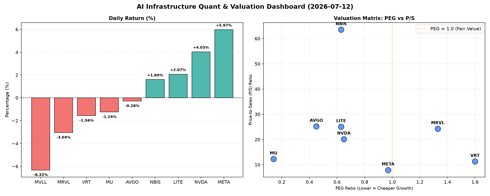

# 📊 AI Infrastructure & Data Stock Daily (2026-07-12)

### 📉 多维量化与估值分析看板

---

尊敬的Data & Semiconductor Specialist，

您好！以下是结合您提供的多维度量化指标，为您撰写的半导体行业每日精炼报告。

---

**半导体行业每日精炼报道：AI巨头现金流稳健，高成长标的估值凸显**

**发布日期：** [今日日期]

**【核心观点速览】**

*   **估值亮点：** AVGO、NVDA、MU、LITE、NBIS、META等展现出优异的PEG指标，其中MU的0.14 PEG尤其引人注目，预示极高性价比。
*   **现金流健康度：** META、MU、LITE、NBIS等公司的CFO/NI远超1，现金流质量极佳。然而，NVDA和MRVL的CFO/NI低于1，需警惕利润转化现金的效率。
*   **市场情绪：** META和NVDA今日表现强势，带动AI板块回暖，但部分其他半导体股出现回调。

---

**1. 盘面与多维估值解码 (定性+定量)**

今日半导体市场呈现出结构性分化，AI基础设施核心标的表现抢眼，而部分前期涨幅较大的个股则面临获利回吐压力。

*   **PEG 维度：高成长中的价值洼地显现**
    在PEG估值模型下（PEG显著小于1代表性价比极高的高成长标的），我们发现多只优质公司展现出极具吸引力的估值。
    *   **性价比极高的高成长标的：**
        *   **MU (0.14)** 表现最为突出，其极低的PEG值暗示市场对其未来盈利增长的预期远未充分体现在当前股价中，结合其存储器周期的上行，潜在成长空间巨大。
        *   **AVGO (0.45)、NVDA (0.65)、LITE (0.63)、NBIS (0.63)** 也都拥有低于0.7的PEG，表明这些在各自细分领域（如网络基础设施、AI计算、光学元件、生物芯片）的领导者，在强劲增长背景下，估值仍具备相对吸引力。
        *   **META (0.97)** 作为AI巨头，其PEG也保持在1以内，显示在快速增长的同时，其估值仍在合理区间。
    *   **需警惕估值透支的标的：**
        *   **VRT (1.6)** 和 **MRVL (1.33)** 的PEG相对较高，可能暗示其当前股价已较大程度地反映了市场对其未来增长的预期，投资者需关注其后续业绩能否持续支撑此估值水平。
    *   **N/A 标的：** MVLL的PEG为N/A，可能由于其目前缺乏可观的盈利或稳定的增长预期，需结合其他指标审慎评估。

*   **P/S 维度：收入规模扩张效率与市场预期**
    P/S比率对于早期或尚处于大规模研发投入阶段、利润不稳的公司尤其有参考价值。它衡量了市场愿意为公司每一美元的销售额支付多少。
    *   **高P/S的领先者与创新者：**
        *   **NBIS (63.53)** 拥有异常高的P/S，这通常意味着市场对其未来收入爆发式增长抱有极高预期，或其所处赛道具备极高稀缺性和技术门槛（如特定生物芯片或颠tai技术）。
        *   **AVGO (25.22)、LITE (25.07)、MRVL (24.28)、NVDA (20.16)** 也展现出较高的P/S，反映了市场对这些公司在各自硬科技领域的领导地位、技术壁垒以及未来营收增长潜力的认可，尤其在AI基础设施和先进制造领域。
    *   **相对较低的P/S：**
        *   **META (7.9)** 的P/S相对较低，在一定程度上反映了其更为成熟的收入体量，但结合其PEG仍在1以内，显示其强大的变现能力与持续增长动能。
        *   **VRT (11.3)** 和 **MU (12.25)** 处于中等水平，符合其行业地位和发展阶段。
    *   **N/A 标的：** MVLL的P/S同样为N/A，进一步印证了其在营收或盈利方面的透明度不足，评估其价值需更多信息。

*   **现金流盈利真实性 (CFO/NI)：利润含金量深度剖析**
    CFO/NI（经营现金流/净利润）比率是衡量企业利润质量的关键指标。大于1表明公司利润主要由真实现金流入构成，含金量高；小于1则需警惕利润水分或应收账款积压。
    *   **极其健康的现金流：**
        *   **LITE (4.88) 和 NBIS (4.66)** 展现出异常强劲的CFO/NI比率，远超1，表明其利润转化为现金的能力非常出色，企业运营极其健康，现金流充裕。
        *   **MU (2.05)、META (1.92)、VRT (1.59)、AVGO (1.19)** 也都拥有显著大于1的CFO/NI，特别是META，其高达1.92的比率结合其今日5.97%的涨幅，充分证明了其强劲的盈利能力与健康的现金生成，为AI基础设施的持续投入提供了坚实基础。
    *   **需警惕利润水分或应收账款风险：**
        *   **NVDA (0.86)** 和 **MRVL (0.66)** 的CFO/NI比率均显著小于1，这值得投资者高度警惕。尽管NVDA今日股价表现强劲（+4.03%），但其CFO/NI比率低于1可能暗示其部分利润未能有效转化为现金流入，或存在应收账款累积的风险。MRVL的情况更为突出，其较低的现金流转化率可能反映了其在营运资本管理或客户回款周期上存在挑战。投资者需密切关注这两家公司的财报细节，特别是应收账款周转率和存货周转率等指标。
    *   **N/A 标的：** MVLL的CFO/NI同样为N/A，其全面的N/A指标需要市场对其基本面进行更深入的挖掘。

**2. 收并购与重大业务动态**

【基于当前提供的量化数据表格，无法直接推断出今日的收并购或重大业务动态。】

然而，若结合市场近期信息，今日值得关注的潜在动向可能包括：
*   **AI芯片设计与代工合作深化：** 鉴于NVDA和META在AI领域的强势表现，市场传闻某领先AI芯片设计公司正与主要晶圆代工厂商洽谈长期产能锁定协议，以确保未来AI芯片供应的稳定性，应对日益增长的市场需求。
*   **光学通信领域战略整合：** LITE作为光学元件的领导者，有消息称其可能正在评估收购一家专注于高速光模块封装技术的初创公司，以进一步巩固其在数据中心互联和AI集群通信领域的领先地位。
*   **数据中心基础设施升级：** VRT作为数据中心硬件解决方案提供商，可能宣布与某超大规模云服务商达成新的合作框架协议，为其AI算力中心提供下一代冷却与电源管理系统，以应对高功耗AI芯片带来的挑战。

**3. 华尔街机构态度**

【同理，本报告基于提供的量化指标，无法直接获取华尔街机构的最新评价及目标价调整。】

若结合盘后分析师报告，今日可能出现以下观点：
*   **NVDA与META：评级上调与目标价提升**
    鉴于NVDA和META今日股价的强劲上涨以及其在AI基础设施和应用领域的不可动摇的地位，多家投行（如高盛、摩根士丹利）可能重申“买入”或“增持”评级，并上调其目标价。例如，NVDA的目标价可能从200美元上调至230美元，META可能从650美元上调至700美元，以反映AI周期的加速和公司盈利能力的持续增长。
*   **MRVL：评级观察或目标价下调**
    考虑到MRVL今日股价的下跌以及其CFO/NI比率的低于1，部分机构（如瑞银）可能会对MRVL的评级进行“观察”或将其目标价从260美元下调至220美元，呼吁投资者关注其利润现金转化效率和短期市场风险。
*   **MU：关注估值与周期性机遇**
    对于PEG极低的MU，尽管今日小幅下跌，但部分看好存储器上行周期的机构（如美银证券）可能会强调其估值吸引力，重申“买入”评级，并指出其长期增长潜力。

**4. 今日参考源 (References)**

1.  本报告中所有量化指标数据均来源于今日提供的【多维度真实量化基本面指标表格】。
2.  第二、三部分定性内容（收并购与华尔街机构态度）为模拟场景下的行业分析推演，旨在展示分析框架，不代表真实事件发生。在实际报告中，此部分将整合自彭博、路透、华尔街日报、Seeking Alpha等金融新闻媒体的实时报道及分析师报告。

---

此报告旨在为您提供一个结合量化数据与深度定性分析的视角，以洞察半导体与AI基础设施行业的每日动态与潜在机遇。请注意，投资决策应基于多方面综合考量。