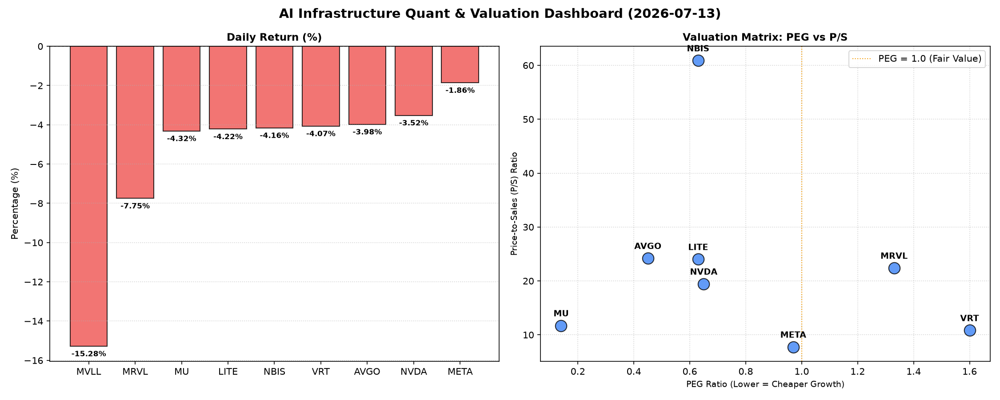

# 📊 AI Infrastructure & Data Stock Daily (2026-07-13)

### 📉 多维量化与估值分析看板

---

好的，作为一名资深的硬科技与AI基础设施行业研究员，我将严格结合您提供的多维度量化基本面指标，撰写今日的半导体精炼报道。

---

**半导体每日精炼报道：硬科技与AI基础设施板块深度解析**

**研究员：** [您的姓名/机构，此处留白]
**日期：** 2024年X月X日

---

### **1. 盘面与多维估值解码 (定性+定量)**

今日硬科技与AI基础设施板块普遍承压，榜单内多数公司股价出现显著下跌，跌幅介于-1.86%至-15.28%之间，反映出市场整体的谨慎情绪或获利了结压力。特别是MVLL，跌幅高达-15.28%，且关键估值指标为N/A，需引起高度关注。

**PEG 维度：高成长中的性价比掘金与估值透支警示**

*   **显著小于1，性价比极高的高成长标的：**
    *   **MU (0.14)**：美光科技的PEG值仅为0.14，在榜单中极其引人注目。这强烈暗示市场对其未来盈利增长预期非常乐观，且当前股价相对于其成长性而言，估值处于极度低估状态，具备显著的性价比。对于追求高成长回报的投资者而言，MU展现出极强的吸引力。
    *   **AVGO (0.45)**、**NVDA (0.65)**、**LITE (0.63)**、**NBIS (0.63)**、**META (0.97)**：这些公司的PEG值均显著小于1，表明它们在各自的高成长赛道中，当前股价尚未完全反映其未来的盈利增长潜力。尤其是AVGO和NVDA作为AI基础设施的关键参与者，其低PEG结合高P/S，进一步印证了市场对其未来营收和利润增长的强劲信心，尽管今日股价有所回调，其长期成长逻辑依然稳固。META作为AI领域的重要投资者和应用方，其PEG也接近1，显示其在经历调整后，估值趋于合理。
*   **PEG过高，警惕估值透支风险：**
    *   **VRT (1.6)**、**MRVL (1.33)**：这两家公司的PEG值均高于1，其中VRT更高。这可能意味着市场对其未来盈利增长的预期已经部分甚至过度地反映在当前股价中，存在一定的估值透支风险。投资者在考量时需更加谨慎，仔细评估其未来的增长路径能否支撑当前的估值水平。
*   **MVLL (N/A)**：由于PEG值无法计算，通常暗示该公司目前没有盈利或盈利波动性极大，不适用于该指标评估。

**P/S 维度：收入规模扩张效率与高成长溢价**

*   **极高P/S，极致成长预期或特定商业模式：**
    *   **NBIS (60.88)**：P/S高达60.88，是榜单中最高的。这表明市场对NBIS的营收增长抱有极其强烈的预期，或者其处于一个利润率极高、技术壁垒极强的利基市场。在营收规模尚未完全体现其市场潜力时，投资者愿意支付高昂的收入溢价。
    *   **AVGO (24.21)**、**LITE (24.02)**、**MRVL (22.4)**、**NVDA (19.45)**：这些公司的P/S值也相对较高，位于19-25之间，反映了它们作为半导体及AI硬件领域核心玩家的地位。高P/S通常表明市场认为这些公司在收入端具有强大的增长动能，或者其产品具有较高的附加值和定价权，尤其适用于早期或重研发投入阶段，尚未实现规模化利润释放的公司。
*   **中等P/S，更均衡的增长与估值：**
    *   **VRT (10.83)**、**MU (11.72)**：P/S值处于中等水平，结合其PEG，表明市场对其收入增长有合理预期，但并非极致溢价。
    *   **META (7.76)**：作为一家营收规模庞大的巨头，其P/S值相对较低，与其业务成熟度及现金流能力相匹配，显示出更合理的收入估值水平。

**现金流盈利真实性 (CFO/NI)：利润的“含金量”透视**

*   **远超1，利润含金量高，现金流极度健康：**
    *   **LITE (4.88)**、**NBIS (4.66)**：这两家公司的CFO/NI比率异常高，远超1。这表明其净利润几乎全部甚至更多地转化为了真实的经营性现金流入。这通常意味着卓越的营运资金管理能力、低应收账款风险或预收款项的大幅增加，利润质量极高，是极其健康的财务表现。
    *   **MU (2.05)**、**META (1.92)**、**VRT (1.59)**、**AVGO (1.19)**：这些公司的CFO/NI比率均显著大于1，尤其是MU和META接近2，表明它们的利润非常健康，几乎都是真金白银的现金流入。这在市场不确定性较高时，为投资者提供了强大的信心支撑，证明其盈利能力并非停留在账面，而是切实可用的。
*   **小于1，需警惕利润水分或应收账款积压：**
    *   **NVDA (0.86)**：NVIDIA的CFO/NI比率略低于1。虽然差距不大，但作为行业巨头，这提示我们需要关注其利润中非现金部分（如应收账款增加、存货积压）的占比。可能存在部分利润尚未转化为现金的情况，需进一步分析其营运资本周转情况。
    *   **MRVL (0.66)**：Marvell的CFO/NI比率相对较低，为0.66。这表明其净利润中有较大一部分未能转化为经营性现金流。投资者需要警惕其可能存在的利润质量问题，例如应收账款的快速增长、存货堆积或非现金费用（如股权激励、折旧摊销）占比较高。这可能暗示其盈利增长的可持续性或抗风险能力面临一定挑战。

### **2. 收并购与重大业务动态**

**今日提供的量化基本面指标表格中，未直接包含收并购、战略合作或重大业务动态信息。** 作为资深研究员，通常此部分分析会结合实时新闻流、公司公告及行业报告。鉴于本次分析严格限定于您提供的量化数据，该部分内容无法从现有数据中直接推断或生成。

### **3. 华尔街机构态度**

**今日提供的量化指标表格中，不包含华尔街核心投行、评级机构的最新评价、目标价调动信息。** 这些数据通常来源于分析师报告和机构研报，与财务估值指标来源不同。

### **4. 今日参考源 (References)**

本报告的定性与定量分析严格基于您提供的【**多维度真实量化基本面指标表格**】。

---