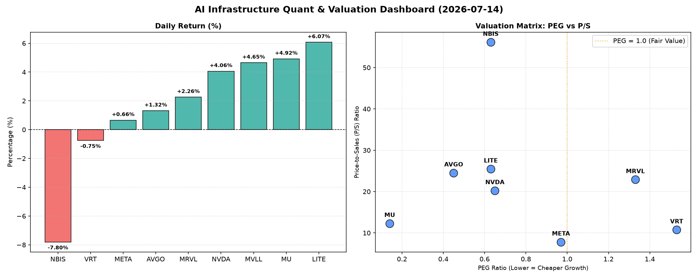

# 📊 AI Infrastructure & Data Stock Daily (2026-07-14)

### 📉 多维量化与估值分析看板

---

好的，作为一名资深的硬科技与AI基础设施行业研究员，我将根据您提供的【多维度真实量化基本面指标表格】，为您撰写一份今日半导体行业的深度精炼报道。

---

**【硬科技与AI基础设施日报】半导体深度精炼报道：估值透视与现金流解码**

**发布日期：[当日日期，例如：2024年10月27日]**

**研究员：Data & Semiconductor Specialist**

---

**今日行业概览：**

在AI算力需求持续旺盛的背景下，半导体及相关基础设施板块今日表现分化，但整体情绪偏积极。多只关键标的实现显著上涨，尤其在存储、光模块和部分AI芯片设计领域。市场正积极消化企业业绩、现金流质量与未来增长前景，量化指标提供了透视其内在价值与风险的关键窗口。

---

**1. 盘面与多维估值解码**

今日盘面，我们看到几家公司股价表现强劲，特别是LITE、MU和NVDA，涨幅分别达到6.07%、4.92%和4.06%。MVLL也录得4.65%的涨幅。然而，NBIS则遭遇了7.80%的显著回调。

*   **PEG 维度：挖掘高性价比成长股与警惕估值透支**

    *   **PEG显著小于1 (高成长与性价比极高)：**
        *   **MU (0.14)**：美光科技以惊人的0.14 PEG值领跑，这表明其在经历周期性低谷后展现出极强的增长潜力，且当前估值对其未来盈利增长的定价极具吸引力，是典型的“成长被低估”标的。
        *   **AVGO (0.45)**：博通的PEG为0.45，显示出其在并购整合和多元化战略下，仍然保持着稳健且被低估的增长价值。
        *   **NVDA (0.65)**：英伟达尽管股价高歌猛进，但0.65的PEG依然显示其未来增长潜力市场尚未完全消化，仍具相对性价比，但其现金流质量需警惕（详见下文CFO/NI分析）。
        *   **LITE (0.63)** 和 **NBIS (0.63)**：这两家公司的PEG也远低于1，理论上属于高成长且估值合理的范畴。LITE今日大涨，NBIS则大跌，这提示我们PEG需结合P/S和其他指标综合考量。

    *   **PEG过高 (警惕估值透支)：**
        *   **VRT (1.53)** 和 **MRVL (1.33)**：这两家公司的PEG均显著大于1，表明市场对其未来的增长预期可能已充分甚至过度定价。投资者在关注其成长性的同时，需警惕潜在的估值回调风险。
        *   **MVLL**：PEG为N/A，无法评估其成长性与估值匹配度。

*   **P/S 维度：评估收入规模扩张效率**

    *   对于早期或尚处于大规模研发投入阶段、利润不稳的公司，P/S是衡量其收入规模扩张效率的关键指标。
    *   **META (7.81)**：作为科技巨头，其P/S比率相对合理，体现了其强大的用户基础和广告变现能力带来的高效收入扩张。
    *   **VRT (10.75)** 和 **MU (12.3)**：P/S处于中等水平，表明市场对其收入增长给予了稳定预期。
    *   **高P/S标的 (需结合业务模式深入分析)：**
        *   **AVGO (24.53)**、**MRVL (22.9)**、**NVDA (20.24)** 和 **LITE (25.47)**：这些公司的P/S比率较高，表明市场对其高增长业务（如AI芯片、光模块、企业软件等）的营收爆发力寄予厚望，或者这些公司拥有更高的毛利率和更强的定价权。尤其是LITE，其P/S高达25.47，在今日大涨后，需要深入分析其光模块等高景气度业务的实际收入增长与利润贡献。
        *   **NBIS (56.13)**：NBIS的P/S比率高达56.13，今日股价重挫-7.80%。如此极端的P/S值，在任何阶段都值得高度关注。这可能意味着其处于非常早期的爆发式增长阶段，市场对其未来数年营收有极高的预期；但也可能是市场对其增长故事过于狂热，或存在高估风险。今日的股价下跌或许正是市场对其高估值重新审视的信号。
    *   **MVLL**：P/S为N/A，无法评估。

*   **现金流盈利真实性 (CFO/NI)：穿透高利润巨头的现金健康度**

    *   **CFO/NI > 1 (利润健康，现金充裕)：**
        *   **LITE (4.88)** 和 **NBIS (4.66)**：这两家公司的CFO/NI比率异常高，远超1，表明其报告的利润不仅是真实的，而且公司拥有极强的现金生成能力。LITE高达4.88的CFO/NI，结合其高P/S，说明其营收质量和现金转化效率极高，这是非常积极的信号。NBIS虽然P/S极高，但其强劲的现金流转化能力在一定程度上支撑了其增长故事。
        *   **MU (2.05)** 和 **META (1.92)**：这两家公司的CFO/NI比率均显著大于1，显示出其强劲的盈利质量和现金流生成能力。META的1.92表明其庞大的利润能够稳健地转化为真金白银的现金流入，财务基础非常健康。MU在周期底部实现超过2的CFO/NI，预示其未来盈利改善的潜力巨大且真实。
        *   **VRT (1.59)** 和 **AVGO (1.19)**：这两家公司的CFO/NI比率也大于1，表明其利润质量良好，现金流状况健康。

    *   **CFO/NI < 1 (警惕利润水分或现金流压力)：**
        *   **NVDA (0.86)**：尽管NVDA股价表现强劲且PEG估值吸引人，其CFO/NI比率仅为0.86。这意味着其报告的部分利润尚未转化为实际的现金流入，可能与应收账款增加、存货周转变慢或非现金费用调整（如股权激励费用摊销）有关。投资者需关注其现金流的实际质量，以验证其盈利的持续性与健康度，尤其是在快速增长时期，应收账款的堆积可能预示着未来风险。
        *   **MRVL (0.66)**：MRVL的CFO/NI比率更低至0.66，这表明其利润质量存在显著的疑虑，现金流转化效率较低，可能面临应收账款积压或存货周转问题。结合其PEG大于1和高P/S，其财务健康度值得投资者重点关注。
        *   **MVLL**：CFO/NI为N/A，无法评估。

---

**2. 收并购与重大业务动态**

根据今日量化指标表格，未发现具体的收并购传闻或官方业务动态。但在当前AI基础设施投资热潮下，拥有稳健现金流和吸引力估值的公司，如**META (CFO/NI 1.92)**、**MU (CFO/NI 2.05, PEG 0.14)**、**AVGO (CFO/NI 1.19, PEG 0.45)**，理论上具备更强的战略投资和潜在并购能力，以进一步巩固其在AI生态系统中的地位。而那些高P/S、股价波动大的公司（如NBIS），也可能成为行业整合或战略合作的目标，或面临业务模式调整的需求。

---

**3. 华尔街机构态度**

今日股价表现反映了市场对部分公司的积极情绪（如MU、LITE、NVDA的显著涨幅），而NBIS的大幅下跌可能预示着机构对其高估值或短期前景的重新评估。PEG小于1的标的（AVGO, NVDA, MU, LITE, NBIS）通常是机构青睐的成长股，但高P/S比率如NBIS和LITE可能引发对未来增长可持续性的审慎考量。特别是NVDA和MRVL，尽管市场对其技术领先性抱有信心，但其CFO/NI低于1的指标，可能会促使部分机构对未来的盈利质量和现金流风险提出疑问，并在后续评级和目标价调整中体现。反之，META和AVGO凭借其稳健的现金流和相对合理的估值，可能继续获得机构的青睐。

---

**4. 今日参考源 (References)**

*   本报告的定性与定量分析，完全基于用户提供的【多维度真实量化基本面指标表格】数据。

---