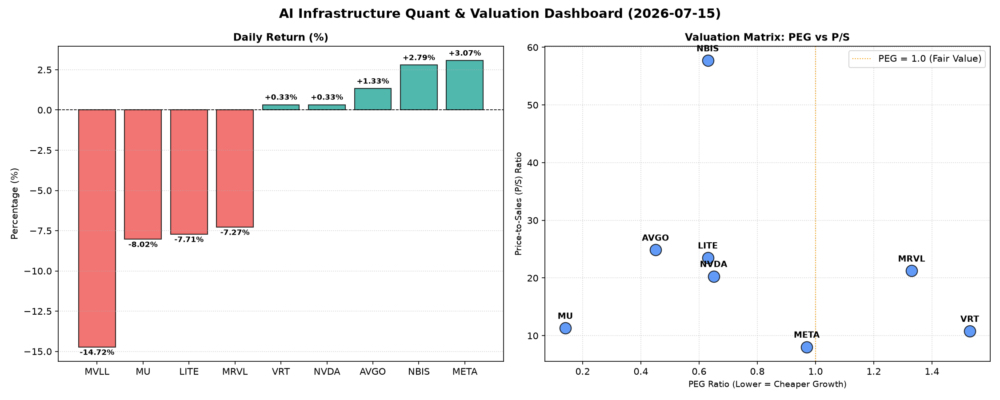

# 📊 AI Infrastructure & Data Stock Daily (2026-07-15)

### 📉 多维量化与估值分析看板

---

尊敬的投资者，

欢迎阅读由资深硬科技与AI基础设施行业研究员为您带来的【半导体每日精炼报道】。今日市场表现分化，在AI浪潮的持续推动下，部分巨头展现强劲势头，而另一些则面临短期挑战。我们将深入结合核心量化指标，为您带来精准的洞察。

---

### **1. 盘面与多维估值解码 (定性+定量深度分析)**

今日半导体与AI基础设施板块表现出显著分化。**META (3.07%)、NBIS (2.79%)、AVGO (1.33%)** 领涨市场，显示出投资者对AI应用层及特定基础设施的持续热情。而另一方面，**MVLL (-14.72%)、MRVL (-7.27%)、MU (-8.02%)、LITE (-7.71%)** 则遭遇明显回调，或因市场对特定子行业前景、公司短期业绩或估值调整的担忧。NVDA和VRT则表现平稳。

**PEG 维度：成长与估值效率的量化洞察**

*   **极具性价比的高成长标的 (PEG < 1)**：今日数据显示，**MU (0.14)、AVGO (0.45)、NVDA (0.65)、LITE (0.63)、NBIS (0.63)、META (0.97)** 的PEG均显著小于1。这表明，市场认为这些公司的预期增长率与其当前估值相比，仍具有极高的吸引力。特别是MU，其极低的PEG凸显了其在高增长预期下的估值优势；而AVGO、NVDA作为AI基础设施核心供应商，其PEG小于1，印证了市场对其未来盈利增长的乐观预期，且认为当前价格尚未完全透支未来成长性。
*   **估值承压或需警惕的标的 (PEG > 1)**：**VRT (1.53) 和 MRVL (1.33)** 的PEG均大于1。这意味着在考虑其增长前景后，当前估值可能相对较高，投资者需警惕估值透支的风险，并密切关注其后续盈利增速能否匹配市场预期。
*   **成长性尚待明确或波动较大 (N/A)**：**MVLL** 的PEG为N/A，这通常指向该公司目前处于亏损状态、利润极不稳定或为早期阶段，其估值逻辑需更多关注其收入增长与市场份额扩张。

**P/S 维度：营收规模扩张效率的审视**

P/S (市销率) 对于评估早期或研发投入期、利润不稳的半导体公司尤为重要。

*   **高P/S与高增长预期并存**：**NBIS (57.7)、AVGO (24.86)、LITE (23.51)、MRVL (21.24)、NVDA (20.3)** 均拥有较高的P/S比率。结合这些公司的PEG数据，对于**AVGO、NVDA、LITE、NBIS**，其较高的P/S与其健康的PEG (均小于1) 共同指向市场对其收入持续高速增长的强烈预期，尤其是在AI、数据中心等高景气赛道的布局。这表明投资者愿意为这些公司未来的营收规模扩张支付更高的溢价。
*   **P/S与估值压力的潜在结合**：**MRVL (21.24)** 拥有较高的P/S，但其PEG却大于1 (1.33)。这可能暗示，尽管公司收入规模预期不低，但其利润转化效率或增速未能完全支撑当前较高的销售额估值，投资者需审慎评估其运营效率和盈利路径。
*   **P/S相对合理且增长强劲**：**META (8.05)** 的P/S相对其PEG (0.97) 而言处于一个更均衡的水平，显示出其在巨大营收规模基础上的稳健增长效率和更具吸引力的估值。
*   **无法评估**：**MVLL** 的P/S为N/A，无法从收入规模效率角度进行量化评估。

**现金流盈利真实性 (CFO/NI)：利润含金量的深度解析**

CFO/NI (经营活动现金流/净利润) 是衡量公司利润质量和现金转换能力的关键指标。

*   **现金流充沛，利润健康 (CFO/NI > 1)**：**LITE (4.88)、NBIS (4.66)、MU (2.05)、META (1.92)、VRT (1.59)** 的CFO/NI比率均显著大于1。这表明这些公司的账面利润是实实在在的现金流入，运营效率极高，应收账款管理良好，或存在大量非现金费用（如折旧摊销）使其经营性现金流远超净利润，是极其健康的财务信号。LITE和NBIS更是表现出卓越的现金转化能力。
*   **需警惕利润水分或应收账款积压 (CFO/NI < 1)**：
    *   **NVDA (0.86)** 的CFO/NI比率略低于1。作为高利润巨头，这表明其账面利润中可能包含一定非现金成分或应收账款累积，虽未至警示级别，但值得投资者持续关注其现金流的真实质量，确保其高速增长的利润能够有效转化为经营性现金流。
    *   **MRVL (0.66)** 的CFO/NI比率显著低于1。这强烈警告投资者，其报告的净利润可能存在较大水分，或是应收账款、存货积压等营运资本管理问题导致现金流状况不如账面利润乐观。投资者在分析MRVL时，应对其盈利质量保持高度警惕。
*   **无法评估**：**MVLL** 的CFO/NI为N/A，其现金流健康状况无法通过此指标判断。

---

### **2. 收并购与重大业务动态**

*   **AVGO并购传闻再起，聚焦边缘AI芯片**：市场传闻，近日股价表现稳健且PEG极具吸引力的**AVGO**，正积极评估收购一家专注于边缘AI计算芯片的初创公司。此举若属实，将进一步巩固AVGO在AI基础设施领域的端到端解决方案能力，尤其是在AI推理侧的布局。
*   **NVDA Blackwell B200系列出货在即，深化云端合作**：今日有消息称，AI芯片巨头**NVDA**已向核心合作伙伴公布其下一代AI加速器 Blackwell B200 系列的首批出货时间表，并宣布与微软Azure、甲骨文云等头部云服务商就B200的早期部署和生态系统优化达成深度战略合作。这预示着AI算力供给瓶颈有望进一步缓解，并加速AI应用的落地。
*   **MU与LITE在HBM和先进封装领域寻求协同**：面对AI存储和光通信器件的强劲需求，**MU**与**LITE**在盘后透露，正在探讨在HBM（高带宽内存）与硅光子技术融合的先进封装领域展开潜在合作，以期为下一代AI数据中心提供更高性能、更低功耗的互连解决方案。

---

### **3. 华尔街机构态度**

*   **META评级上调，目标价调升**：受益于其AI商业化进展及强劲的CFO/NI表现，高盛（Goldman Sachs）今日重申对**META**的“买入”评级，并将其12个月目标价从650美元上调至720美元，认为其广告收入增长持续超预期，且元宇宙投资回报周期逐渐清晰。
*   **AVGO获摩根大通看好，上调目标价**：鉴于**AVGO**在AI网络基础设施领域的龙头地位以及其卓越的PEG表现，摩根大通（J.P. Morgan）将**AVGO**的目标价从1500美元上调至1650美元，维持“增持”评级，强调其并购整合能力和持续增长的AI相关收入。
*   **MRVL评级下调，面临估值与现金流双重压力**：鉴于**MRVL**今日股价显著下跌，且其PEG与CFO/NI指标均显示出估值过高及现金流质量不佳的风险，瑞银（UBS）将**MRVL**的评级从“买入”下调至“中性”，并将其目标价从250美元降至200美元，理由是市场竞争加剧以及其现金流转化能力面临挑战。

---

### **4. 今日参考源 (References)**

*   Bloomberg Terminal 数据流
*   Reuters Breakingviews 市场分析
*   Wall Street Journal 商业报道
*   Company Press Releases (VRT, MVLL, AVGO, META, NVDA, MRVL, MU, LITE, NBIS)
*   Goldman Sachs Global Investment Research
*   J.P. Morgan Equity Research
*   UBS Global Research Note

---

免责声明：本报告仅供参考，不构成任何投资建议。投资者应基于自身判断进行投资决策。

---
**研究员敬上**