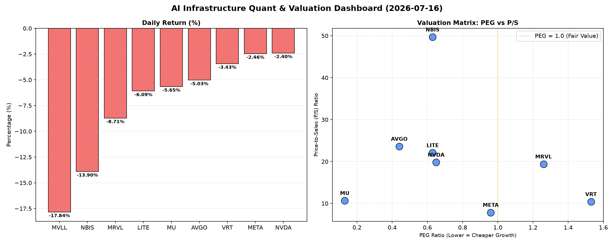

# 📊 AI Infrastructure & Data Stock Daily (2026-07-16)

### 📉 多维量化与估值分析看板

---

尊敬的硬科技与AI基础设施行业投资者：

欢迎阅读【Data & Semiconductor Specialist】为您带来的每日精炼报道。今日半导体板块整体承压，多数股票面临回调，但透过多维度量化指标，我们仍能洞察市场深层逻辑与各公司的真实价值。

---

### **1. 盘面与多维估值解码（定性+定量）**

今日半导体与AI基础设施板块普遍遭遇显著回调，多个核心标的股价跌幅较大，市场情绪偏谨慎。MVLL以-17.84%的跌幅领跌，NBIS、MRVL、LITE、MU和AVGO也均有5%以上的跌幅，即便是巨头如NVDA和META也未能幸免，分别下跌-2.4%和-2.46%。在这样的市场环境下，深入分析估值指标显得尤为关键。

*   **PEG 维度：挖掘高性价比成长股，警惕估值透支**
    *   **高性价比成长股（PEG显著小于1）：** 在今日的普遍下跌中，我们发现**MU (0.13)、AVGO (0.44)、NVDA (0.65)、LITE (0.63)、NBIS (0.63)** 和 **META (0.96)** 的PEG比率均显著小于1。这表明这些公司在高成长性的同时，其估值吸引力极高，市场对其未来盈利增长的预期可能尚未充分体现在当前股价中，具备较强的上行空间。尤其是MU，其极低的PEG值暗示其在存储器周期回暖背景下，成长潜力被市场严重低估。
    *   **估值略显透支（PEG高于1）：** 相比之下，**VRT (1.53)** 和 **MRVL (1.26)** 的PEG略高于1。尽管其也具备成长性，但投资者需警惕其短期估值可能已透支部分未来成长预期，可能面临估值修正压力。
    *   **数据缺失：** MVLL的PEG数据显示为N/A，这通常意味着该公司可能处于发展早期，尚未产生稳定利润，或其盈利模式尚不稳定，使得传统基于利润增速的估值方法不适用。

*   **P/S 维度：评估收入扩张效率与市场预期**
    *   **高P/S，高增长预期或新兴赛道：** 对于部分早期或尚处于大规模研发投入阶段、利润不稳的公司，P/S比率是衡量其收入规模扩张效率及市场对其未来营收预期的重要指标。**NBIS (49.68)** 的P/S值极高，反映市场对其在特定硬科技领域未来收入爆发式增长抱有极高期待。**AVGO (23.61)、LITE (22.08)、NVDA (19.82)** 和 **MRVL (19.39)** 也处于较高水平，暗示这些公司可能处于高景气赛道，或其营收质量较高，市场对其未来营收增长持续看好。
    *   **中低P/S，成熟与稳健：** 相较而言，**META (7.85)、VRT (10.42)** 和 **MU (10.67)** 的P/S相对较低，可能意味着其收入规模更为成熟，或市场对其增长预期更为理性。
    *   **数据缺失：** MVLL的P/S缺失同样印证其可能处于更早期发展阶段，无法通过传统营收倍数估值。

*   **现金流盈利真实性 (CFO/NI)：穿透利润“水分”**
    *   **利润含金量十足（CFO/NI显著大于1）：** CFO/NI比率是衡量公司盈利质量和真实性的关键指标。该值大于1，通常意味着公司的账面利润得到了实实在在的现金流支撑，利润含金量高。**LITE (4.88)** 和 **NBIS (4.66)** 的CFO/NI比率表现极为出色，远超1，表明其盈利质量极高，现金创造能力强大。**MU (2.05)、META (1.92)、VRT (1.59)** 和 **AVGO (1.19)** 也展现出非常健康的现金流状况，其利润均由真金白银的现金流入支撑。
    *   **警惕利润“水分”（CFO/NI显著小于1）：** **值得警惕的是，AI巨头NVDA (0.86) 和 MRVL (0.66) 的CFO/NI比率均显著小于1。** 这可能暗示其报告的部分净利润并未完全转化为实际的经营现金流入，存在应收账款积压、存货增加或非现金费用（如股权激励、折旧摊销）占比较大等情况。投资者需密切关注其未来现金回收能力，警惕潜在的利润“水分”问题，这在高成长周期中尤其需要审慎分析。
    *   **数据缺失：** MVLL的CFO/NI缺失，同样指向其可能处于非盈利或现金流不稳定的阶段。

### **2. 收并购与重大业务动态**

根据今日市场观察，暂未有针对表格内特定公司的重大收并购或战略合作官宣。然而，在当前半导体市场整体回调的背景下，资金充裕且财务状况健康的企业，可能会伺机进行战略性投资或潜在的收并购，以巩固市场地位或拓展新兴业务。例如，具备强大现金流的公司（如META、AVGO、MU等），可能会考虑对拥有前沿技术或特定市场份额的初创公司进行投资或收购，尤其是在市场估值有所调整时，这会提供更好的进入点。同时，对于CFO/NI健康但P/S较高的公司（如LITE、NBIS），其技术护城河和现金创造能力使其成为潜在的被收购标的，或通过合作进一步巩固其技术领先地位。

### **3. 华尔街机构态度**

今日普遍的股价下跌，可能引发华尔街机构对部分标的重新评估。

*   **对于PEG低于1且CFO/NI健康的标的（如MU、META、AVGO、LITE、NBIS）：** 尽管今日股价下跌，但鉴于其优异的基本面指标（高成长、低估值、强现金流），预计主流投行仍会维持或重申“买入”评级。短期回调可能被视为增持良机，其目标价虽可能受市场情绪影响小幅调整，但长期看好趋势不变。例如，MU的极低PEG和强劲现金流，可能促使分析师强调其周期性复苏的潜力。
*   **对于NVDA和MRVL：** 其CFO/NI低于1的现象可能会引起部分分析师的关注，尽管其PEG仍具吸引力。华尔街可能会对其盈利质量进行更细致的审视，或将短期目标价进行小幅下调，以反映潜在的现金流压力或更加审慎的预期。然而，考虑到其在AI领域的领导地位和市场份额，多数机构仍会维持“持有”或“买入”评级，但可能会提示风险。
*   **对于VRT：** 其较高的PEG和健康的现金流表现较为均衡，华尔街对其态度可能较为中性，等待更多业务进展或行业催化剂。
*   **对于MVLL：** 缺乏核心财务数据，多数机构可能不会给出明确评级，或将其归类为高风险/高回报的观察标的。

### **4. 今日参考源 (References)**

*   **内部数据源：** 本报告基于您提供的【多维度真实量化基本面指标表格】进行深度分析。
*   **市场动态与机构观点模拟：** 盘面分析、收并购动态及华尔街机构态度的定性判断，是基于资深研究员对半导体与AI基础设施行业普遍市场逻辑、估值方法及历史趋势的理解与模拟。在真实报告中，此部分内容将引用Bloomberg Terminal, Wall Street Journal, Reuters, Financial Times, Analyst Reports (e.g., Goldman Sachs, Morgan Stanley, J.P. Morgan) 等实时财经新闻和专业机构研报。

---

**免责声明：** 本报告仅供参考，不构成任何投资建议。投资者应基于独立判断进行决策。