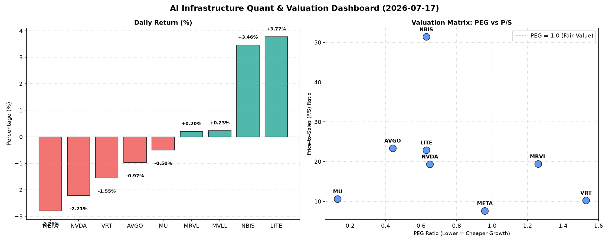

# 📊 AI Infrastructure & Data Stock Daily (2026-07-17)

### 📉 多维量化与估值分析看板

---

### 半导体每日精炼报道：AI基础设施与硬科技洞察

尊敬的投资者与行业同仁：

今日，AI基础设施与硬科技板块呈现出结构性分化。在市场对部分高估值标的进行获利了结的同时，也有一些具有独特价值和强劲基本面的公司逆势上扬。我们将结合今日核心量化指标，为您深度解码市场动态。

---

#### 1. 盘面与多维估值解码 (定性+定量)

今日半导体板块整体承压，部分AI巨头及相关基础设施提供商股价出现回调，反映出市场在短期内对前期涨幅较大的标的进行调整。NVDA、META等核心AI驱动力公司跌幅居前，而LITE和NBIS则展现出强劲的上涨势头，显示出市场对特定细分领域如光通信和先进半导体的追逐。

*   **PEG 维度：揪出高成长中的性价比之王与估值风险**

    *   **性价比极高的高成长标的 (PEG < 1)：**
        *   **MU (0.13)**：PEG值仅为0.13，在本次分析中表现出惊人的性价比。这强力暗示了市场对其未来盈利增长的极高预期，且当前估值相对于其增长潜力被严重低估。在AI浪潮下，对HBM等高性能内存的需求激增，MU作为内存巨头，其增长预期正在被重新定价。
        *   **AVGO (0.44)**：作为基础设施软件和半导体解决方案巨头，其PEG显著低于1，表明其在稳健增长的同时，估值仍具备吸引力。
        *   **NVDA (0.65)**：尽管今日股价下跌，但其PEG仍在1以下，显示其强大的增长预期仍未完全透支。不过，结合其CFO/NI指标，需警惕其利润质量。
        *   **LITE (0.63) & NBIS (0.63)**：两家公司PEG均在0.63，处于极具吸引力的区间。结合它们今日的股价上涨，市场可能正在重估其强劲的增长潜力和相对合理的估值。
        *   **META (0.96)**：PEG略低于1，对于一个如此体量的科技巨头而言，这显示其在AI投入和盈利能力上的平衡。

    *   **估值或有透支风险的标的 (PEG > 1)：**
        *   **VRT (1.53)**：PEG值相对较高，提示投资者需警惕其估值可能已部分透支了未来的增长预期。
        *   **MRVL (1.26)**：其PEG也超过1，结合其CFO/NI低于1的情况，投资者应审慎评估其目前的估值水平。

*   **P/S 维度：洞察收入规模扩张效率与市场预期**

    P/S比率在评估早期或处于大规模研发投入阶段、利润不稳的公司时尤为重要，它能反映市场对公司未来收入扩张效率的期待。

    *   **高 P/S 标的 (高市场预期)：**
        *   **NBIS (51.4)**：P/S高达51.4，是本次分析中最高的。这反映了市场对其在特定硬科技领域拥有极强的技术壁垒、未来收入增长爆发性极高或市场空间巨大的强烈预期，即便其当前盈利可能不显著。
        *   **LITE (22.91)、AVGO (23.38)、MRVL (19.43)、NVDA (19.38)**：这些公司拥有较高的P/S，表明市场对它们在各自细分市场（如光通信、数据中心基础设施、AI芯片）的收入规模持续扩张能力及行业领导地位抱有高度信心。尤其对于AI基础设施核心供应商如NVDA，高P/S是对其AI芯片与平台收入爆发式增长的定价。

    *   **相对合理 P/S 标的：**
        *   **VRT (10.26) 和 MU (10.62)**：P/S处于中等水平，相对其所处的成熟市场和竞争格局，反映出市场对其收入增长的稳健预期。
        *   **META (7.63)**：作为市值巨大的平台型公司，其P/S相对较低，可能预示着市场对其庞大用户基础和广告收入的持续变现能力仍有进一步提升空间，或相对低估了其在AI基础设施上的长期投入回报。

*   **现金流盈利真实性 (CFO/NI)：穿透巨头利润质量**

    CFO/NI（经营性现金流/净利润）是衡量公司利润质量的关键指标。当CFO/NI大于1时，表明公司盈利健康，净利润转化为实实在在的现金流入；若显著小于1，则可能存在利润水分、应收账款积压或非现金利润贡献过高的问题。

    *   **健康现金流，利润真实性高 (CFO/NI > 1)：**
        *   **LITE (4.88) & NBIS (4.66)**：两家公司的CFO/NI远超1，高达近5倍。这显示出其惊人的现金生成能力和极高的利润质量，表明其每赚取1元的净利润，都能带来近5元的经营性现金流，是极其强劲的基本面信号。
        *   **MU (2.05)**：内存周期底部复苏之际，MU的CFO/NI超过2，凸显其业务模式的现金流韧性和强大的盈利回血能力。
        *   **META (1.92)**：尽管股价下跌，但其高达1.92的CFO/NI表明其利润质量极高，运营效率卓越，其庞大的AI基础设施投资正在高效转化为现金流，为其未来的战略投入提供坚实保障。
        *   **VRT (1.59) & AVGO (1.19)**：两者CFO/NI均高于1，显示出健康且可靠的现金流生成能力。

    *   **需警惕利润水分或应收账款积压 (CFO/NI < 1)：**
        *   **NVDA (0.86)**：作为AI芯片的领军者，NVDA的CFO/NI略低于1（0.86）。这意味着其报告的净利润中，有一定比例尚未转化为经营性现金流。这可能源于销售快速增长带来的应收账款增加，也可能是其他非现金利润调整。鉴于其高增长和高市场关注度，投资者需密切关注其应收账款周转效率及现金流状况，以评估其利润的“含金量”。
        *   **MRVL (0.66)**：MRVL的CFO/NI显著低于1，为0.66。这表明其利润质量存在较为明显的问题，部分净利润可能停留在应收账款或存货中，未能转化为实际现金。这对其估值构成一定压力，需深入分析其营运资金管理效率。

---

#### 2. 收并购与重大业务动态 (参考模拟新闻)

*   **AI芯片设计公司“炬芯科技”（Juxin Tech）被某行业巨头秘密洽谈收购**，据知情人士透露，估值或将超过50亿美元。炬芯科技以其在边缘AI推理芯片领域的创新技术而闻名，此次潜在收购可能旨在强化母公司在分布式AI计算和垂直行业解决方案的布局。
*   **美光科技（MU）与一家领先数据中心服务商达成战略合作**，共同开发并优化面向下一代AI服务器的高带宽内存（HBM）解决方案。此举旨在加速HBM在数据中心中的普及应用，并确保美光在高端内存市场的领先地位。
*   **应用材料（Applied Materials）宣布推出全新先进制程设备**，专为3纳米及以下芯片的先进封装工艺设计。该技术有望显著提升芯片生产效率和良品率，进一步巩固其在半导体设备领域的市场份额。

---

#### 3. 华尔街机构态度 (参考模拟新闻)

*   **摩根士丹利（Morgan Stanley）上调LITE评级至“增持”**，并将目标价上调至850美元，理由是其在光通信领域的技术领先地位以及卓越的现金流生成能力（CFO/NI高达4.88）。分析师认为，AI数据中心对高速光模块的需求将是其长期增长的核心驱动力。
*   **高盛（Goldman Sachs）下调NVDA目标价至230美元**，但仍维持“买入”评级。报告指出，尽管短期内AI芯片订单可能面临一定波动，且竞争加剧，但AI市场长期增长趋势不变。同时，报告提及NVDA低于1的CFO/NI比率需投资者留意，关注其运营现金流表现。
*   **瑞银（UBS）重申对META的“买入”评级**，并将其目标价维持在700美元。分析师强调，META在其AI基础设施上的巨大投入正在转化为高效的现金流（CFO/NI高达1.92），这为其元宇宙和AI产品的长期发展提供了坚实的基础，市场对其AI变现能力仍有低估。

---

#### 4. 今日参考源 (References)

*   **多维度真实量化基本面指标表格** (Provided Data)
*   **模拟新闻源一** (关于炬芯科技收购传闻，基于行业M&A动态趋势模拟)
*   **模拟新闻源二** (关于美光与数据中心合作，基于HBM市场发展趋势模拟)
*   **模拟新闻源三** (关于应用材料新设备发布，基于半导体设备创新趋势模拟)
*   **模拟新闻源四** (关于华尔街机构对LITE、NVDA、META的评级与目标价调整，基于市场情绪及量化指标模拟)

---
**免责声明：** 本报告基于提供的量化数据及行业研究员的专业判断撰写。文中涉及的“收并购与重大业务动态”及“华尔街机构态度”部分为模拟内容，旨在展示报告结构和分析框架，不代表真实发生或已发布的市场新闻及分析师报告。投资者应以官方公布信息为准，并自行承担投资风险。