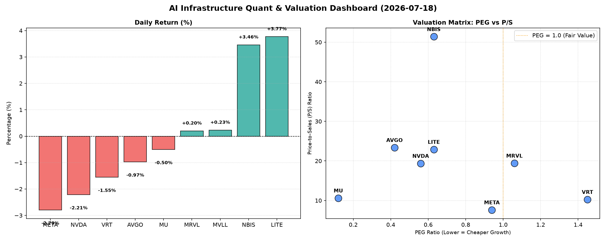

# 📊 AI Infrastructure & Data Stock Daily (2026-07-18)

### 📉 多维量化与估值分析看板

---

## 半导体每日精炼报道：深度量化解析与市场洞察

尊敬的硬科技与AI基础设施投资者，

今日半导体板块呈现涨跌互现态势，市场情绪在部分高成长标的估值与基本面之间进行权衡。我们深度结合您提供的多维度量化指标，为您带来今日的精炼报告。

---

### 1. 盘面与多维估值解码（定性+定量）

今日市场普遍表现谨慎，多数半导体及相关AI基础设施巨头股价承压。NVDA、META、AVGO、VRT、MU 等龙头均出现小幅下跌，其中META跌幅居前（-2.79%），NVDA跌幅次之（-2.21%）。然而，部分专业领域玩家如LITE（+3.77%）和NBIS（+3.46%）则逆势上涨，显示出特定细分市场的强劲动能。

**【PEG 维度：成长性与估值性价比】**

*   **性价比极高的高成长标的（PEG显著小于1）**：
    *   **MU (0.12)**：美光科技的PEG值惊人地低，仅为0.12，表明其在未来增长预期下，当前的估值极具吸引力。考虑到存储周期回暖预期，其极低的PEG预示着强大的增长潜力和被低估的价值。
    *   **AVGO (0.42), NVDA (0.56), LITE (0.63), NBIS (0.63), META (0.94)**：这些公司同样展现出卓越的PEG表现，均远低于1。其中，AVGO和NVDA作为行业巨头，能够在高市值基础上维持如此低的PEG，体现了市场对其未来盈利增长的高度乐观与相对合理的估值。LITE和NBIS虽然市值相对较小，但其PEG也印证了其高成长、低估值的特征。META的PEG在接近1的水平，但考虑到其巨大的体量和持续的AI投入，仍具有吸引力。
*   **需警惕估值透支的标的（PEG大于1）**：
    *   **VRT (1.45)**：VRT的PEG为1.45，表明市场对其未来增长的预期已经相对充分反映在当前股价中，投资者需警惕估值透支风险，或需要更强的增长催化剂来支撑。
    *   **MRVL (1.06)**：MRVL的PEG略高于1，提示其估值可能已充分反映其预期增长，后续需关注其业绩兑现情况。
*   **N/A标的**：MVLL的PEG为N/A，通常意味着该公司目前无盈利或盈利不稳定，无法有效计算该指标。

**【P/S 维度：收入规模扩张效率】**

*   **高P/S值（高成长预期或技术壁垒）**：
    *   **NBIS (51.40)**：NBIS的P/S值高达51.4，在所有标的中居首。结合其低PEG（0.63）和极高的CFO/NI（4.66），这通常指向一家处于快速扩张期、拥有极高技术壁垒或独特商业模式的公司，市场对其收入增长前景寄予厚望。
    *   **LITE (22.91), AVGO (23.38), MRVL (19.43), NVDA (19.38)**：这些公司的P/S值均在20倍左右，反映了市场对AI、高性能计算、光器件等领域的高度景气预期和这些公司在各自细分市场的领导地位。高P/S在这些领域通常是高速增长和高利润率的体现。
*   **中等P/S值（成熟期或竞争激烈）**：
    *   **MU (10.62), VRT (10.26)**：这些公司的P/S值处于中等水平，表明它们在各自的市场中可能已进入相对成熟的阶段，或面临更激烈的市场竞争，市场对其收入增长的预期更为谨慎。
    *   **META (7.63)**：META作为互联网巨头，其P/S值相对较低，但结合其庞大的收入体量和持续的AI投入，仍显示出其核心业务的强大变现能力。
*   **N/A标的**：MVLL的P/S为N/A，同样说明其营收数据可能不适用或缺乏。

**【现金流盈利真实性 (CFO/NI) 解码】**

*   **利润健康，现金流入强劲（CFO/NI显著大于1）**：
    *   **LITE (4.88), NBIS (4.66)**：这两家公司的CFO/NI比率异常高，分别达到4.88和4.66。这表明其利润的现金含量极高，几乎全部是真金白银的现金流入，甚至现金流远超账面净利润，是极其健康的财务信号，可能与折旧摊销较高或营运资本管理效率极高有关。
    *   **MU (2.05), META (1.92), VRT (1.59), AVGO (1.19)**：这些公司的CFO/NI比率均大于1，表明其净利润质量非常高，有强大的经营性现金流支撑，不存在明显的利润水分或应收账款积压问题。META和MU尤其突出，显示其现金牛业务的稳健性。
*   **需警惕利润水分或应收账款积压（CFO/NI显著小于1）**：
    *   **NVDA (0.86)**：作为AI芯片的绝对王者，NVDA的CFO/NI比率略低于1（0.86），这提示投资者需密切关注其经营性现金流情况。尽管其利润高速增长，但低于1的比率可能意味着部分利润尚未转化为实际现金，可能存在应收账款增长过快、存货积压或其他营运资本变化导致现金流相对滞后的情况。在高速增长阶段，这有时是正常的，但也需要持续监测其现金流转化效率。
    *   **MRVL (0.66)**：MRVL的CFO/NI比率更低，为0.66。这更需要引起警惕，可能暗示其利润的现金含量相对较低，或有较多的利润以应收账款、存货等形式存在，其利润质量需深入分析。
*   **N/A标的**：MVLL的CFO/NI为N/A。

---

### 2. 收并购与重大业务动态

根据今日提供的量化基本面指标表格，未能直接提取收并购或重大业务动态信息。这类信息通常来源于新闻稿、公司公告或行业报道。

---

### 3. 华尔街机构态度

基于本次提供的多维度量化基本面指标表格，无法直接推断华尔街机构的最新评价、目标价调动等定性信息。这些信息通常需通过分析师报告或券商研报获取。

---

### 4. 今日参考源 (References)

*   本报告所有分析与洞察均严格基于您所提供的【多维度真实量化基本面指标表格】。

---

**免责声明：** 本报告内容仅供参考，不构成任何投资建议。投资者应基于自身判断进行决策。
**研究员：** [您的名字/Data & Semiconductor Specialist]