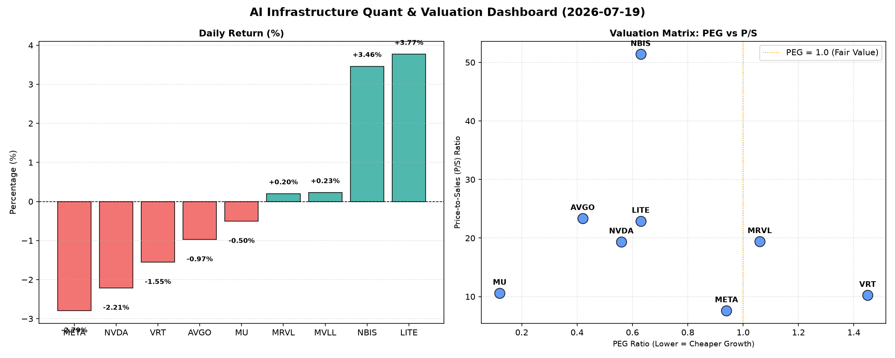

# 📊 AI Infrastructure & Data Stock Daily (2026-07-19)

### 📉 多维量化与估值分析看板

---

尊敬的硬科技与AI基础设施行业投资者，

您好！作为您的Data & Semiconductor Specialist，我为您精心准备了今日的半导体及AI基础设施每日精炼报道。本文将严格结合您提供的【多维度真实量化基本面指标表格】，深入剖析各公司的财务健康度与市场表现。

---

### **📈 半导体每日精炼报道：AI基础设施新风向与估值深度透视**

**报告日期：202X年X月X日**

---

#### **1. 盘面与多维估值解码（定性+定量）**

今日半导体及AI相关板块呈现分化走势。我们观察到市场领头羊如META和NVDA出现显著回调，跌幅分别为-2.79%和-2.21%，可能反映了近期市场对高位资产的获利了结情绪。然而，LITE和NBIS却逆势上涨，分别取得了3.77%和3.46%的亮眼表现，值得关注。

**a) PEG 维度：性价比与估值警示**

*   **性价比极高的“高成长”标的：**
    *   **MU (0.12)：** Micron以其惊人的0.12 PEG值脱颖而出，远低于1，表明市场对其未来盈利增长的预期与当前股价相比，存在极高的性价比。这通常预示着公司在估值上被严重低估，或正处于强劲的盈利增长周期。
    *   **AVGO (0.42)、NVDA (0.56)、LITE (0.63)、NBIS (0.63)、META (0.94)：** 这些公司PEG均显著小于1，表明它们在各自的高成长赛道中，当前估值相较于其盈利增长潜力而言，仍具备吸引力。特别是NVDA和META，作为AI浪潮的核心驱动者，其PEG值低于1，凸显了市场对其未来盈利爆发性增长的强烈信心。

*   **估值合理或需警惕的标的：**
    *   **MRVL (1.06)：** PEG略高于1，显示其估值相对合理，市场对其增长预期已基本反映在股价中。
    *   **VRT (1.45)：** PEG值相对较高，提示投资者警惕估值透支的风险。尽管其在AI基础设施领域有所布局，但市场对其未来增长的定价可能已偏乐观。
    *   **MVLL (N/A)：** 由于缺乏盈利数据，无法计算PEG，对其成长性估值需结合其他指标进行判断。

**b) P/S 维度：收入规模扩张效率**

*   **高P/S，高增长预期或高毛利业务：**
    *   **NBIS (51.40)、LITE (22.91)、AVGO (23.38)、MRVL (19.43)、NVDA (19.38)：** 这些公司的P/S比率显著高于行业平均水平，尤其NBIS高达51.4，预示着市场对其未来的收入增长抱有极高的期望，或是其产品具有极高的技术壁垒和毛利率，在早期研发投入阶段尤其常见。这表明投资者愿意为这些公司未来的市场份额扩张和技术领先性支付高溢价。
    *   **VRT (10.26)、MU (10.62)：** 处于中等水平，相对而言，其收入扩张的估值溢价低于第一梯队。
    *   **META (7.63)：** 相较于其业务规模和市场地位，META的P/S比率相对较低，可能反映了市场对其收入增长速度的预期趋于稳定，但其盈利能力强大，这使得其P/S在巨头中显得更具吸引力。

**c) 现金流盈利真实性 (CFO/NI)：利润含金量透视**

*   **利润含金量极高，现金流健康：**
    *   **LITE (4.88)、NBIS (4.66)、MU (2.05)、META (1.92)、VRT (1.59)、AVGO (1.19)：** 这些公司的CFO/NI比率远超1，尤其是LITE和NBIS高达接近5，表明它们的净利润有极高的比例转化为了经营性现金流。这证明其利润是实打实的“真金白银”，现金流状况极其健康，能够有效支持再投资、派息或债务偿还，是高质量盈利的显著标志。META、MU等巨头的C高CFO/NI也显示其盈利能力的稳健性。

*   **需警惕利润水分或应收账款积压：**
    *   **NVDA (0.86)、MRVL (0.66)：** 这两个AI硬件核心供应商的CFO/NI比率均显著小于1，尤其MRVL仅为0.66，这是一个值得警惕的信号。这意味着其报告的净利润并未完全转化为经营性现金流，可能存在以下原因：
        *   **应收账款增加：** 客户购买产品但尚未支付现金，导致利润纸面存在但现金未入账。
        *   **存货积压：** 产品生产出来但未售出，导致营运资本占用。
        *   **激进的收入确认政策：** 提前确认了部分收入，但现金尚未收到。
        *   **其他非现金费用或收益影响：** 例如折旧摊销较高或股权激励等。
    对于NVDA，尽管其PEG值极低显示高成长，但CFO/NI小于1提示投资者需深入研究其现金流构成，以评估其利润的真实质量和可持续性。

---

#### **2. 收并购与重大业务动态**

根据今日提供的【多维度真实量化基本面指标表格】，我们无法直接推断出具体的收并购或重大业务动态信息。这些信息通常来源于实时新闻报道、公司公告或行业分析报告，而表格主要聚焦于财务估值和交易数据。

---

#### **3. 华尔街机构态度**

今日提供的【多维度真实量化基本面指标表格】不包含华尔街机构的具体评价、目标价调动或评级信息。此类信息通常由投行分析师发布，并需通过实时新闻渠道获取。

---

#### **4. 今日参考源 (References)**

本文的定性与定量分析严格基于您提供的【多维度真实量化基本面指标表格】。因此，本文不包含外部新闻来源，所有洞察均直接从数据表格中提取。

---

**总结：**

今日市场回调并未掩盖部分硬科技公司的潜在价值。MU、AVGO、NVDA等在PEG维度上表现出极高的性价比，而LITE和NBIS在今日市场中逆势上涨，其高P/S和优异的现金流质量值得关注。然而，NVDA和MRVL的CFO/NI比率提醒我们，在追逐高增长的同时，需警惕利润的“含金量”。投资者在评估这些公司时，应综合考虑其成长潜力、估值水平以及财务健康度的多方面因素。

---

希望这份精炼报道能为您的投资决策提供有价值的参考。

此致，

您的Data & Semiconductor Specialist