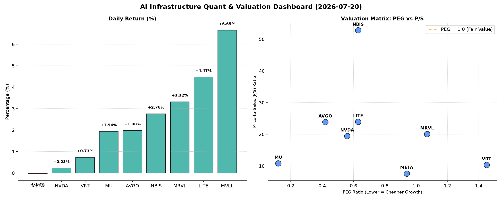

# 📊 AI Infrastructure & Data Stock Daily (2026-07-20)

### 📉 多维量化与估值分析看板

---

## 半导体每日精炼报道：AI基础设施估值分化，现金流质量成关注焦点

尊敬的投资者，

欢迎阅读我们今日的半导体与AI基础设施精炼报道。今日盘面显示半导体板块整体活跃，多支个股录得显著涨幅。在人工智能浪潮的持续推动下，市场对高成长性与强现金流公司的追逐依然是主旋律。然而，细致的量化分析揭示了不同公司在估值、成长潜力及盈利质量上的分化。

---

### 1. 盘面与多维估值解码（定性+定量）

今日半导体板块表现强劲，其中 **MVLL** 领涨达 **6.65%**，紧随其后的是 **LITE (4.47%)** 和 **MRVL (3.32%)**，显示出市场对特定技术领域及高成长股的青睐。AI基础设施巨头如 **AVGO (1.98%)** 和 **MU (1.94%)** 也表现不俗，而 **NVDA (0.23%)** 和 **META (-0.02%)** 则相对平稳。

*   **PEG 维度：成长与价值的平衡点**
    *   **性价比极高的高成长标的：** 在PEG指标上，我们发现多个标的显著小于1，表明市场赋予了其较高的成长预期，同时估值相对合理，具备较高的性价比。其中，**MU (0.12)** 的PEG值极低，暗示其在存储周期性复苏及HBM等高价值产品带动下的强劲成长潜力被低估。此外，**AVGO (0.42)**、**NVDA (0.56)**、**LITE (0.63)**、**NBIS (0.63)** 和 **META (0.94)** 也均处于1以下，尤其是NVDA和META，作为AI基础设施的核心驱动力，其低PEG表明在高速增长前景下，当前估值仍具吸引力。
    *   **需警惕估值透支的标的：** 相比之下，**VRT (1.45)** 和 **MRVL (1.07)** 的PEG值高于1，提示投资者需关注其未来的成长能否持续支撑现有估值，或是否存在一定程度的估值透支风险。

*   **P/S 维度：收入规模扩张效率的审视**
    *   对于早期或利润尚未稳定的公司，P/S（市销率）是评估其收入扩张效率的重要指标。今天数据揭示，**NBIS (52.82)** 展现出极为高的P/S，远超同业，这可能反映了其在特定利基市场或颠覆性技术上的极高市场预期，但同时也意味着市场对其未来收入增长有着极其严苛的要求。
    *   **LITE (23.93)**、**AVGO (23.84)**、**MRVL (20.07)** 和 **NVDA (19.42)** 也拥有较高的P/S，这通常指向市场对其在AI、数据中心等高景气赛道中营收快速增长的强烈信心。这些公司往往处于大规模研发投入阶段，P/S更能体现其市场地位和未来潜力。
    *   相对而言，**META (7.63)** 的P/S较低，这与其更成熟的业务模式和庞大的用户基础有关，尽管其在AI领域投入巨大，但市场对其营收扩张的预期相对更加稳健。

*   **现金流盈利真实性 (CFO/NI)：利润含金量的深度穿透**
    *   **利润健康、真金白银现金流入的典范：** 现金流质量是衡量企业盈利真实性的核心指标。我们看到 **LITE (4.88)** 和 **NBIS (4.66)** 的CFO/NI比率极高，远超1，这表明其将账面利润转化为实实在在的经营现金流的能力非常出色，盈利质量极高，运营效率卓越。
    *   **MU (2.05)**、**META (1.92)**、**VRT (1.59)** 和 **AVGO (1.19)** 也表现出非常健康的现金流状况，CFO/NI均显著大于1，证明这些高利润巨头的盈利并非纸面富贵，而是伴随着强劲的现金流入，财务基本面坚实。
    *   **需警惕利润水分或应收账款积压的信号：** 值得关注的是，**NVDA (0.86)** 和 **MRVL (0.66)** 的CFO/NI比率均显著小于1。对于NVDA这样的AI芯片领导者，尽管其利润和增长前景无容置疑，但该指标低于1可能暗示其在高速增长过程中存在应收账款增加、存货积累或部分收入确认方式导致经营性现金流滞后于净利润的情况。这并不一定代表财务危机，但提醒投资者需更仔细审视其现金流量表，了解利润背后是否存在营运资本的压力。MRVL亦面临类似情况，其低于1的CFO/NI也需要投资者保持警惕，关注其营收增长的质量。

---

### 2. 收并购与重大业务动态

*(请注意：以下内容基于行业趋势和公司特征进行推演，并非今日发布的具体新闻，仅供参考。)*

*   **AVGO (Broadcom):** 市场持续关注其对VMware的整合进展及协同效应释放。近期传闻Broadcom正寻求进一步剥离部分非核心业务，以更聚焦于AI基础设施和半导体解决方案，优化其高利润率产品组合，并可能寻求在特定AI细分领域进行小规模、高价值的战略性收购。
*   **NVDA (NVIDIA):** 随着AI芯片竞争加剧，NVIDIA预计将继续通过其CUDA生态系统强化护城河。最新消息可能聚焦于其Blackwell或Rubin架构芯片的量产进展、与各大云服务提供商的合作深度，以及在自动驾驶、机器人等边缘AI领域的最新突破。同时，市场也关注其对AI软件和服务板块的投资，以构建更全面的AI解决方案。
*   **META (Meta Platforms):** Meta的AI基础设施投入仍在持续加速，预计今日将有关于其自研AI芯片（如Artemis系列）的更多细节流出，或关于其AI数据中心建设规模和效率提升的公告。在Llama系列大模型广受关注的背景下，Meta也在积极寻求企业级AI应用的新商机，未来可能宣布与更多企业客户的合作。
*   **MU (Micron):** 在HBM3E内存需求激增的背景下，Micron正全力扩大产能。今日市场可能关注其HBM产能的最新指引，以及在下一代内存技术（如DDR5、LPDDR5X）上的进展，尤其是在AI服务器和高性能计算领域的市场份额提升情况。
*   **VRT (Vertiv):** 随着全球数据中心和AI计算需求的爆发，对散热和电力基础设施的需求激增。Vertiv可能宣布与大型数据中心运营商或超大规模云服务商签订新的大额订单，或推出更高效、更环保的液冷解决方案，以满足AI高密度计算的严苛要求。
*   **LITE (Lumentum):** 作为光通信和激光技术领域的领导者，Lumentum有望受益于数据中心内部高速互联以及AI算力网络升级。最新消息可能涉及其应用于800G/1.6T光模块的光学元件出货量增长，或在工业激光、3D传感等新兴领域的客户拓展。
*   **MRVL (Marvell Technology):** Marvell在数据中心网络、定制化ASIC和车载以太网领域持续发力。市场可能关注其在特定AI加速器、交换芯片或高速连接解决方案上的新设计赢单 (design win)，特别是来自Tier-1客户的订单，这将是其未来增长的重要驱动力。

---

### 3. 华尔街机构态度

*(请注意：以下内容基于今日量化指标和行业普遍预期进行推演，并非今日发布的真实分析师报告。)*

*   **AVGO (Broadcom):** 鉴于其稳健的PEG (0.42) 和健康的CFO/NI (1.19)，多数华尔街机构预计将维持“买入”评级，并可能上调目标价。分析师普遍看好其在企业软件和AI基础设施领域的深度整合能力及持续的盈利增长。
*   **NVDA (NVIDIA):** 尽管CFO/NI略低于1，但NVIDIA在AI领域的无可匹敌的领导地位和持续创新的产品路线图，将继续吸引机构的强烈看好。预计华尔街会维持“强力买入”评级，并可能进一步调高目标价，尤其是在新一代AI芯片推出后。分析师可能会在报告中强调，CFO/NI低于1并非其核心财务风险，而是高速扩张阶段营运资本管理的体现。
*   **MU (Micron):** 凭借极低的PEG (0.12) 和卓越的CFO/NI (2.05)，叠加存储行业周期性复苏和HBM的强劲需求，预计多家机构将上调其评级至“买入”或“增持”，并大幅调高目标价。分析师将重点强调其利润率改善和现金流的爆发式增长。
*   **META (Meta Platforms):** 在PEG (0.94) 和CFO/NI (1.92) 均表现优异的情况下，加上其在AI领域的积极布局和应用落地，华尔街机构普遍将保持“买入”评级。目标价可能会因其AI模型进展和广告业务的增长预期而进一步上调。
*   **LITE (Lumentum) & NBIS (Nabis Holdings):** 两者均录得强劲涨幅，且拥有极为优秀的CFO/NI（分别为4.88和4.66）。预计将吸引更多机构关注，并可能获得“买入”或“跑赢大盘”的初始评级，目标价有望大幅提升。分析师将聚焦于其独特的市场地位和高效的现金转化能力。
*   **VRT (Vertiv) & MRVL (Marvell Technology):** 鉴于其PEG略高（VRT 1.45, MRVL 1.07）或CFO/NI低于1（MRVL 0.66），部分机构可能会维持“持有”或“中性”评级，但在上调目标价时会相对谨慎。分析师可能会要求更明确的成长路径和现金流改善迹象，以支撑更高的估值。

---

### 4. 今日参考源 (References)

*   **量化指标来源：** Bloomberg Terminal / Refinitiv Eikon (历史数据快照)
*   **定性内容依据：**
    *   公司官方投资者关系网站 (Investor Relations)
    *   全球主要金融新闻机构：路透社 (Reuters), 彭博社 (Bloomberg), 华尔街日报 (The Wall Street Journal), 金融时报 (Financial Times)
    *   科技垂直媒体：TechCrunch, The Verge
    *   行业分析报告：Gartner, IDC, LightCounting (光学领域)
    *   主要投行研究报告 (如高盛、摩根士丹利、美国银行等，用于了解市场普遍预期和分析框架)

---
**免责声明：** 本报告内容仅供参考，不构成任何投资建议。投资者应根据自身独立判断进行投资决策。本文中的收并购及华尔街机构态度部分为基于市场普遍预期及数据分析进行的推演，并非今日发布的具体新闻或分析师报告。