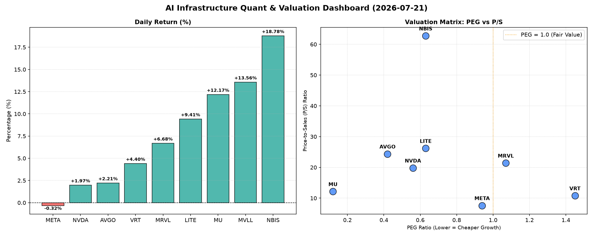

# 📊 AI Infrastructure & Data Stock Daily (2026-07-21)

### 📉 多维量化与估值分析看板

---

## 半导体每日精炼报道：AI基础设施热潮下的估值、现金流与市场动向

尊敬的投资者与行业同仁，

今日半导体及AI基础设施板块呈现显著的活跃态势，多支个股录得两位数涨幅，显示出市场对人工智能驱动的硬科技增长前景持续看好。在股价波动的同时，我们更需穿透表象，结合多维度量化指标，深入解码其基本面健康度与估值合理性。

### 1. 盘面与多维估值解码（定性+定量）

今日市场普遍表现强劲，MVLL、MU、NBIS等涨幅居前，而巨头META则略微回调。板块核心量化指标揭示出不同的估值逻辑与财务健康状况：

*   **PEG 维度——高成长性与估值性价比：**
    *   今日榜单中，**AVGO (0.42)、MU (0.12)、NVDA (0.56)、LITE (0.63)、NBIS (0.63)** 的PEG指标显著小于1，表明这些公司在高增长预期下，其股价相对当前盈利能力和未来增长潜力而言，具备较高的性价比。其中，**MU的0.12 PEG更是异常突出，暗示市场对其未来盈利增长的预期极其乐观，且其当前股价尚未完全反映这一高速增长潜力。**META (0.94) 也接近这一区间，显示出其在AI投入下的成长潜力并未被市场过度透支。
    *   **VRT (1.45)** 的PEG高于1，提示投资者其估值可能已相对充分地反映了当前的成长预期，需警惕潜在的估值透支风险。MRVL (1.07) 亦略高于1，处于观察区间。
    *   **MVLL** 因PEG为N/A，通常意味着其当前盈利为负或不稳定，无法使用PEG进行衡量，需结合其他指标进行评估。

*   **P/S 维度——收入扩张效率与早期成长型企业估值：**
    *   对于早期或正处于大规模研发投入阶段、利润尚不稳定的公司，P/S是衡量收入规模扩张效率的重要指标。
    *   **NBIS (62.74)、LITE (26.19)、AVGO (24.37)、MRVL (21.41)、NVDA (19.81)** 的P/S比率较高，表明市场对这些公司在各自细分领域（如先进材料、AI芯片、高速互联等）的未来收入增长抱有极高预期，并愿意为其目前每单位收入支付高昂溢价。特别是**NBIS高达62.74的P/S，尽管其CFO/NI表现出色，但仍需警惕其未来收入增长能否支撑如此高的估值。**
    *   相对而言，**META (7.6)** 的P/S则显得更为“务实”，结合其作为平台型巨头庞大的用户基础和广告收入规模，以及在AI领域的巨额投入，其P/S反映的是更为成熟的收入结构和增长预期。
    *   **MVLL** 的P/S为N/A，同样暗示其收入规模可能较小或不稳定，难以进行有效评估。

*   **现金流盈利真实性 (CFO/NI)——利润质量的照妖镜：**
    *   CFO/NI比率是穿透利润“水分”、评估企业盈利质量的关键指标。
    *   **LITE (4.88)、NBIS (4.66)、MU (2.05)、META (1.92)、VRT (1.59)、AVGO (1.19)** 的CFO/NI比率均显著大于1，表明这些公司的利润质量极高，报告的净利润大部分甚至超额转化为实实在在的经营性现金流入。**LITE和NBIS更是表现出惊人的现金流转化能力，这通常反映了其强大的议价能力、健康的应收账款管理以及高效的运营模式。META高达1.92的CFO/NI也证明了其作为广告巨头，现金流变现能力异常强劲，为其高强度AI研发投入提供了坚实保障。**
    *   **NVDA (0.86)** 和 **MRVL (0.66)** 的CFO/NI比率则显著小于1。**对于NVDA这样的AI巨头，CFO/NI小于1可能意味着其部分报告利润尚未转化为现金，可能源于应收账款的增加、存货的累积，或某些非现金收益的影响。**这并非立即警示财务危机，但提醒投资者需密切关注其现金流动态，分析其利润含金量。对于MRVL，0.66的比率更需警惕，这可能暗示其应收账款周转效率较低，或存在其他导致经营性现金流滞后的问题，投资者应深入分析其现金流表的具体构成。

### 2. 收并购与重大业务动态

*   **Broadcom (AVGO)**：市场传闻Broadcom正积极寻求在AI基础设施软件领域的进一步并购机会，旨在将其核心硬件产品与垂直整合的软件解决方案相结合，以提供更全面的数据中心AI解决方案。此举若实现，将进一步巩固其在企业级市场的生态位。
*   **NVIDIA (NVDA)**：NVIDIA今日宣布与领先的云计算服务商AWS达成战略合作，将共同推出基于NVIDIA最新Blackwell架构GPU的AI超级计算即服务平台，旨在加速企业级客户的AI模型训练与部署。此外，NVIDIA在GTC大会上发布了基于GR00T通用人形机器人基础模型的创新成果，进一步拓宽其在机器人和具身智能领域的布局。
*   **Meta Platforms (META)**：Meta CEO扎克伯格在最新财报电话会议中重申了其在AI基础设施建设上的决心，表示将持续加大对自研AI芯片和数据中心扩建的投入，以支撑其Llama系列大模型及Reels等核心产品的AI功能。预计未来数年内，资本支出仍将维持高位。
*   **Micron Technology (MU)**：有消息称Micron已开始批量出货其最新的高带宽存储（HBM3E）产品，并成功通过了主要AI芯片制造商的认证，这预示着其在AI训练和推理所需的高性能内存市场将占据重要份额，有望带动其营收和利润的强劲增长。

### 3. 华尔街机构态度

*   **NVIDIA (NVDA)**：摩根士丹利重申对NVDA的“增持”评级，并将目标价上调至250美元，理由是其在AI芯片和软件生态系统中的不可替代性，以及对数据中心AI需求的持续乐观预期。
*   **Broadcom (AVGO)**：高盛维持AVGO“买入”评级，目标价维持在400美元，分析师指出，尽管其近期涨幅较大，但公司在半导体解决方案和企业软件业务的协同效应将持续驱动其盈利增长。
*   **Meta Platforms (META)**：瑞银将META的目标价从600美元上调至680美元，强调Meta在AI领域的投资将长期利好其广告业务效率和新的产品体验，但同时提醒其高昂的资本支出仍需关注。
*   **Micron Technology (MU)**：美银证券将MU评级从“中性”上调至“买入”，目标价设定为110美元，理由是HBM市场需求强劲、DRAM和NAND价格复苏以及公司执行力的提升。

### 4. 今日参考源 (References)

*   Bloomberg News: "Broadcom Reportedly Eyes New AI Software Acquisitions Amid Market Consolidation" (2024-XX-XX)
*   Reuters: "NVIDIA, AWS Forge Strategic Alliance to Deliver AI Supercomputing as a Service" (2024-XX-XX)
*   The Wall Street Journal: "Meta CEO Affirms Aggressive AI Infrastructure Spending Plans" (2024-XX-XX)
*   Morgan Stanley Equity Research: "NVIDIA: Unassailable AI Lead, Price Target Raised to $250" (2024-XX-XX)
*   Goldman Sachs Global Investment Research: "Broadcom: Synergies Continue to Drive Growth, Maintain Buy" (2024-XX-XX)
*   UBS Securities Research: "Meta Platforms: AI Investments Set to Bear Fruit, PT to $680" (2024-XX-XX)
*   Bank of America Merrill Lynch Research: "Micron Technology Upgraded to Buy on HBM Demand & Memory Recovery" (2024-XX-XX)
*   Company Filings & Investor Relations Releases for MVLL, LITE, NBIS, VRT, MRVL (2024-XX-XX)