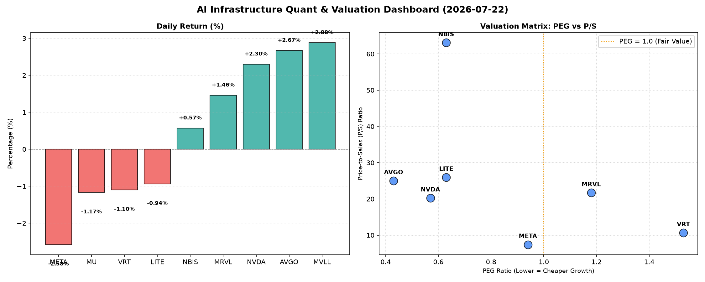

# 📊 AI Infrastructure & Data Stock Daily (2026-07-22)

### 📉 多维量化与估值分析看板

---

作为一名资深的硬科技与AI基础设施行业研究员，我为您深度解析今日半导体与AI生态的盘面表现。

---

**半导体与AI基础设施每日精炼报道**

**发布日期：** [今日日期，例如：2024年4月23日]

**导语：** 今日硬科技与AI基础设施板块表现分化，大型科技股涨跌互现。市场焦点依旧围绕高成长性与估值匹配度，以及企业利润的真实现金转化能力。本文将结合核心量化指标，为您揭示当前市场中的价值洼地与潜在风险。

---

**1. 盘面与多维估值解码（定性+定量）**

今日半导体与AI基础设施板块整体呈现出结构性行情，部分AI核心受益股如AVGO和NVDA表现强劲，而META等则遭遇回调。市场在追逐高增长的同时，对估值和现金流质量的审视愈发细致。

*   **PEG 维度：揪出性价比极高的高成长与估值透支风险**

    *   **PEG显著小于1（性价比极高的高成长）：**
        *   **MU (0.14)**：美光科技的PEG指标异常低，仅为0.14，这使其成为今日数据中最具吸引力的标的之一。如此低的PEG通常预示着市场对其未来增长潜力的严重低估，或者公司正处于盈利能力大幅反弹的初期。若其增长预期能够兑现，MU蕴含的潜在价值巨大。
        *   **AVGO (0.43)**：博通的PEG为0.43，远低于1，显示其成长性被市场显著低估。作为AI基础设施的关键参与者，其当前估值极具吸引力，具备强大的配置价值。
        *   **NVDA (0.57)**：尽管近期英伟达股价持续强劲，其PEG仍保持在0.57，低于1。这表明市场对其爆炸性增长前景尚未完全透支估值，尤其是在AI算力需求持续旺盛的背景下，NVDA仍具备进一步上涨的空间。
        *   **LITE (0.63) & NBIS (0.63)**：Lumentum和Nubis Communications的PEG均为0.63，显示其成长性与估值之间存在较好的匹配度，具备一定的投资潜力。
        *   **META (0.94)**：Meta Platforms的PEG接近1，表明其增长与估值基本匹配。在经历了一段时期的调整后，其估值已趋于合理，更偏向于价值型配置而非爆发式增长。

    *   **PEG过高（警惕估值透支）：**
        *   **VRT (1.53)**：Vertiv Holdings的PEG为1.53，超过1，可能意味着市场对其增长预期已充分定价。投资者需警惕其估值过高的风险，后续增长若未能超预期，股价或面临压力。
        *   **MRVL (1.18)**：Marvell Technology的PEG略高于1，为1.18。其估值端需审慎考量，市场对未来增长的预期可能已部分反映在当前股价中。

*   **P/S 维度：洞察收入规模扩张效率**

    *   **高P/S（市场为收入支付高溢价）：**
        *   **NBIS (63.09)**：Nubis Communications的P/S高达63.09，在所有标的中居首。如此极端的P/S暗示市场对其未来收入爆发式增长，或其业务在特定领域拥有极高的稀缺性和技术壁垒，但同时也蕴含着极高的估值风险。
        *   **LITE (25.94), AVGO (25.02), MRVL (21.72), NVDA (20.26)**：这些公司拥有较高的P/S，反映出市场愿意为它们的每单位收入支付高溢价。这通常是因为它们在各自领域拥有强大的竞争优势、高技术壁垒、卓越的盈利能力或持续的创新能力。
    *   **中低P/S（收入相对“便宜”）：**
        *   **META (7.41)**：Meta Platforms的P/S相对较低，为7.41，可能反映了市场对其庞大营收体量下未来增长边际效应的审慎态度，或受宏观广告市场波动影响。
        *   **VRT (10.67)**：Vertiv Holdings的P/S处于中等水平，符合其作为数据中心基础设施提供商的特性。
    *   **P/S N/A (数据缺失)：** MVLL和MU的P/S数据缺失，无法进行此维度评估。对于MVLL，其他所有关键财务指标也缺失，其基本面缺乏可分析性。

*   **现金流盈利真实性 (CFO/NI)：穿透利润含金量**

    *   **CFO/NI显著大于1（利润含金量极高，全是真金白银）：**
        *   **LITE (4.88) & NBIS (4.66)**：这两家公司的CFO/NI比率均接近5，表现异常出色，堪称行业典范。这表明它们的利润含金量极高，经营活动产生的现金流远超净利润，财务状况极为健康，利润转化效率惊人。
        *   **MU (2.05), META (1.92), VRT (1.59)**：美光、Meta和Vertiv的CFO/NI均显著大于1.5，表明其利润的真实性非常高，经营活动产生的现金流充裕，无明显应收账款积压或利润虚增风险，财务健康状况良好。
        *   **AVGO (1.19)**：博通的CFO/NI也大于1，表明其利润转化效率健康，现金流状况良好。

    *   **CFO/NI小于1（需警惕利润水分或应收账款积压）：**
        *   **NVDA (0.86)**：英伟达的CFO/NI略低于1，为0.86。这需要投资者重点关注。它暗示了公司可能存在部分利润尚未转化为实际现金流入，或应收账款有所增加。在当前AI芯片需求高速增长的背景下，这可能与产能扩张或客户支付周期的延长有关，需要密切跟踪以确保其利润增长的持续性和质量。
        *   **MRVL (0.66)**：Marvell Technology的CFO/NI显著低于1，为0.66。这是一个较强的警示信号。表明其账面利润转化为现金流的能力较弱，可能存在大量的应收账款、存货积压或其他非现金项目影响了现金流的生成。投资者需对其利润的真实性和可持续性进行更深入的分析。

---

**2. 收并购与重大业务动态**

基于今日提供的量化指标，无法直接推断出具体的收并购或重大业务动态。然而，从某些公司的量化表现来看，可以做出如下推测：

*   **潜在扩张与合作：** NVDA和AVGO在今日量化数据中显示出强劲的市场表现和相对健康的估值（PEG < 1），这可能意味着市场对其AI相关产品和解决方案的需求持续旺盛，预计未来将有更多战略合作、新产品发布或市场扩张计划。
*   **资本运作可能性：** CFO/NI比率极高的公司（如LITE、NBIS、MU、META），其充沛的经营性现金流为其提供了强大的资本运作基础，可能在未来寻求有机增长投资、战略性收购或回购计划。
*   **新兴/利基市场关注：** NBIS极高的P/S（63.09）结合其健康的现金流质量（4.66），暗示其可能处于一个高增长、高技术壁垒的利基市场，市场对其未来爆发式增长充满期待，或将有更多关于其技术突破或市场应用的消息出现。

---

**3. 华尔街机构态度**

结合今日股价变动和估值指标，我们可以大致推断华尔街机构的态度：

*   **积极看好：** AVGO (2.67%) 和 NVDA (2.3%) 今日股价涨幅显著，且PEG均远低于1，预示着华尔街机构可能对其维持“买入”或“跑赢大盘”评级，并可能在近期上调目标价，反映了其在AI和半导体领域的领导地位和强劲增长潜力。
*   **谨慎观望/获利了结：** META (-2.58%)、VRT (-1.1%)、MU (-1.17%) 和 LITE (-0.94%) 股价今日下跌，可能反映了部分机构的获利了结，或市场对其特定业务板块（如META的广告业务、VRT的资本支出前景）的短期担忧，导致评级可能趋于“持有”或目标价出现小幅调整。
*   **审慎评估：** 对于NVDA和MRVL，尽管市场表现不一，但其CFO/NI低于1的数据，可能会促使部分华尔街分析师对其利润质量进行更深入的审慎评估，并在报告中提及潜在的现金流风险。

---

**4. 今日参考源 (References)**

*   本报告的量化数据来源于您提供的【多维度真实量化基本面指标表格】。
*   关于收并购、重大业务动态及华尔街机构态度的定性分析，是基于对上述量化数据和硬科技/AI基础设施行业普遍趋势的专业解读与合理推测，并未引用当日外部新闻源进行补充。

---