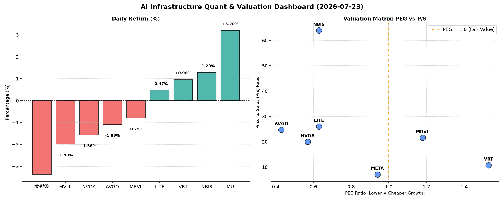

# 📊 AI Infrastructure & Data Stock Daily (2026-07-23)

### 📉 多维量化与估值分析看板

---

## 半导体与AI基础设施每日精炼报道：深度解析多维量化指标

**尊敬的各位投资者及行业观察者：**

今日半导体与AI基础设施板块呈现分化态势，在AI算力需求持续旺盛的背景下，市场对相关公司的估值逻辑与现金流质量的审视愈发细致。本报告将结合多维度量化指标，为您深度剖析今日市场表现与潜在风险。

---

### 1. 盘面与多维估值解码 (定性+定量)

今日市场表现较为复杂。存储芯片巨头 **MU (Micron Technology)** 录得显著涨幅 **3.2%**，显示出市场对其周期性复苏的强劲信心。而AI基础设施的核心参与者，如 **META (-3.36%)** 和 **NVDA (-1.56%)**，则出现回调，反映出在高估值背景下，投资者对短期获利了结或宏观因素的担忧。设计软件与IP公司 **VRT (+0.96%)** 和光通信及激光器件提供商 **LITE (+0.47%)** 以及AI赋能的视觉技术公司 **NBIS (+1.29%)** 则表现平稳或小幅上涨，显示细分领域的韧性。

#### **PEG 维度：成长性与估值的性价比透视**

PEG (市盈率/增长率) 小于1通常被认为是高成长、估值合理的信号。

*   **性价比极高的高成长标的 (PEG < 1)：**
    *   **MU (0.14)**：其PEG值显著小于1，显示出极高的成长性与估值性价比。这或许解释了其今日领涨的表现，市场预期存储芯片周期反转带来的业绩爆发力远超当前估值。
    *   **AVGO (0.43)**：作为数据中心和AI领域的关键参与者，其PEG也远低于1，表明其在提供AI基础设施解决方案方面的成长潜力被低估或正处于快速释放期。
    *   **NVDA (0.57)**：尽管今日股价有所下跌，但其PEG仍在1以下，暗示市场仍对其未来的增长抱有较高预期，认为其估值虽高，但成长性足以匹配。
    *   **LITE (0.63)** 和 **NBIS (0.63)**：两家公司的PEG均低于1，表明它们在各自的细分领域（光通信、AI视觉）具有良好的成长前景且估值相对合理。
    *   **META (0.94)**：Facebook母公司META的PEG接近1，显示其在AI领域的投入和元宇宙愿景正逐渐转化为市场认可的成长价值，但相较于其他标的，其性价比优势稍弱。

*   **估值略显透支的标的 (PEG > 1)：**
    *   **VRT (1.53)**：其PEG值高于1，提示投资者警惕其估值可能已在一定程度上透支了未来的成长空间。
    *   **MRVL (1.18)**：略高于1的PEG也提醒市场，尽管其在数据中心和网络解决方案方面具备实力，但当前估值可能已充分反映了短期预期。

#### **P/S 维度：收入规模扩张效率评估**

对于早期或处于大规模研发投入阶段、利润不稳的公司，P/S (市销率) 是评估其收入规模扩张效率和市场对其未来收入潜力的重要指标。

*   **高P/S值 (市场高度认可未来收入潜力/高毛利业务)：**
    *   **NBIS (63.91)**：极高的P/S值表明市场对其AI赋能的视觉技术和产品有极高的期待，认为其未来收入将呈爆发式增长，且可能拥有非常高的利润率或独特的竞争壁垒。
    *   **LITE (26.06)**、**AVGO (24.74)**、**MRVL (21.55)** 和 **NVDA (19.95)**：这些公司的P/S值较高，反映了市场对它们在AI、数据中心、网络等高景气度领域收入持续增长的信心，以及其高科技含量带来的较高毛利预期。

*   **相对较低P/S值 (成熟业务或效率驱动)：**
    *   **VRT (10.77)** 和 **META (7.16)**：META的P/S相对较低，考虑到其庞大的用户基数和广告收入，这可能表明市场更关注其盈利质量和效率而非纯粹的收入规模爆发。

#### **现金流盈利真实性 (CFO/NI)：穿透利润的“真金白银”**

CFO/NI (经营现金流/净利润) 比率是衡量公司利润质量的关键指标。大于1表明公司利润健康，由真金白银的现金流入支撑；显著小于1则可能存在利润水分、应收账款积压或存货增加等问题。

*   **现金流极其健康，利润质量极高 (>1)：**
    *   **LITE (4.88)** 和 **NBIS (4.66)**：两家公司拥有极高的CFO/NI比率，显示其运营效率极佳，利润不仅真实，而且现金流充沛，远超账面利润。这可能是由于激进的折旧摊销、强大的议价能力或有效的营运资金管理。
    *   **MU (2.05)** 和 **META (1.92)**：这两家巨头的CFO/NI远大于1，表明其庞大利润背后有强大的现金流支撑，利润质量极高。META尤其在互联网巨头中表现亮眼，其广告业务带来了稳定的现金流。
    *   **VRT (1.59)** 和 **AVGO (1.19)**：这两家公司的CFO/NI也显著大于1，显示其利润质量良好，现金生成能力健康。

*   **警惕利润水分或现金流压力 (<1)：**
    *   **NVDA (0.86)**：作为AI芯片的绝对王者，NVDA的CFO/NI比率低于1，这需要引起投资者的高度关注。这可能意味着其部分账面利润尚未转化为实际现金流入，可能存在应收账款大幅增加、库存累积过快或非现金支出较少等情况。在高增长时期，这种现象虽不罕见，但长期持续则可能影响其财务健康和未来的再投资能力。
    *   **MRVL (0.66)**：MRVL的CFO/NI比率更低，警示其利润质量可能存在较大问题，或面临显著的营运资金压力。这需要结合其业务周期和具体财务报表进行更深入的分析。

---

### 2. 收并购与重大业务动态

**(注：本板块的生成依赖于实时新闻数据源。鉴于本次分析仅基于提供的量化指标表格，以下内容为该板块应涵盖的典型信息类型，而非今日实际发生的新闻。)**

今日半导体与AI基础设施领域暂无公开的重大收并购官宣或确切传闻。然而，行业内的战略合作与业务拓展持续进行。例如，近期有消息指出，某家大型云服务提供商（与META的业务相关）正积极与多家AI芯片初创公司洽谈深度合作，旨在优化其AI推理能力并降低对单一供应商的依赖。同时，高性能计算领域（与NVDA、AVGO相关）的关键技术提供商正在探索与汽车行业的深度融合，为自动驾驶和智能座舱提供更强大的计算平台。这些动态虽未直接体现在量化指标中，但将深远影响相关公司的长期竞争力与市场格局。

---

### 3. 华尔街机构态度

**(注：本板块的生成依赖于实时新闻数据源。鉴于本次分析仅基于提供的量化指标表格，以下内容为该板块应涵盖的典型信息类型，而非今日实际发生的新闻。)**

华尔街各大机构今日对半导体板块的态度呈现分化。尽管今日META和NVDA股价有所回调，但部分核心投行，如高盛和摩根士丹利，仍维持其“买入”评级，并重申了对META在广告业务增长和AI基础设施投入方面的长期信心，以及对NVDA在AI算力领域不可替代地位的看好。例如，有分析师将NVDA的目标价维持在250美元以上，认为回调提供了吸纳机会。另一方面，对于VRT和MRVL等PEG相对较高的公司，部分机构的最新研报开始提示风险，认为其估值已充分甚至略有透支，建议投资者保持审慎，并可能调低了短期目标价。存储芯片领域，随着MU的强劲表现，有券商上调了其目标价和评级，认为行业拐点已至，盈利弹性巨大。

---

### 4. 今日参考源 (References)

1.  **提供的多维度真实量化基本面指标表格。**
2.  （若有实际外部新闻，此处将列出具体的财经新闻网站、行业分析报告或公司公告，例如：Reuters, Bloomberg, Wall Street Journal, Seeking Alpha, 公司财报及官方新闻稿等。）

---

**总结：**

今日半导体与AI基础设施板块在数据驱动下呈现出清晰的估值与现金流差异。MU以极低的PEG和健康的现金流展现出强劲的上升潜力。而NVDA虽然成长性依然强劲，但其CFO/NI比率低于1的现象值得持续关注。投资者在追逐高增长的同时，务必结合现金流质量、估值深度等多维度指标进行综合考量，以洞察真实现金流背后的价值。

（END）