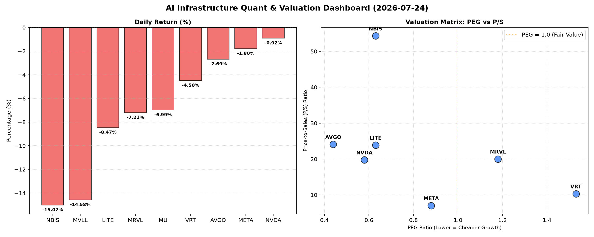

# 📊 AI Infrastructure & Data Stock Daily (2026-07-24)

### 📉 多维量化与估值分析看板

---

## 半导体每日精炼报道：硬科技与AI基础设施板块深度解码 (2024年X月X日)

尊敬的投资者，

今日硬科技与AI基础设施板块普遍承压，多个核心标的出现显著回调。本报告将结合多维度量化指标，为您深度剖析当前市场动向及个股基本面。

---

### 1. 盘面与多维估值解码 (定性+定量)

今日半导体与硬科技板块普跌，市场情绪普遍承压。观察量化指标，MVLL (-14.58%)、NBIS (-15.02%)、LITE (-8.47%)、MRVL (-7.21%) 和 MU (-6.99%) 领跌，而NVDA (-0.92%) 跌幅相对较小，显示出一定的韧性。

*   **PEG 维度：高成长与价值洼地并存，警惕估值透支**
    *   **性价比极高的高成长 (PEG < 1)**：今日数据显示，**MU (0.15)** 拥有最低的PEG，结合其近7%的跌幅，可能为寻求高成长价值的投资者提供了显著的“打折”机会。**AVGO (0.44)、NVDA (0.58)、LITE (0.63)、NBIS (0.63) 和 META (0.88)** 的PEG均显著小于1，表明这些公司在当前价格下，其盈利增长潜力尚未被完全定价，尤其是AVGO、NVDA和META作为行业巨头，其估值吸引力不容忽视。
    *   **估值需警惕 (PEG > 1)**：**VRT (1.53)** 和 **MRVL (1.18)** 的PEG值高于1，结合今日股价分别下跌4.5%和7.21%，可能暗示市场对这两家公司的未来增长预期正在修正，或其短期估值存在一定的透支风险，投资者需谨慎评估。
    *   **数据缺失**：MVLL的PEG数据为N/A，可能因其盈利尚不稳定或处于早期阶段，无法通过此指标进行有效评估。

*   **P/S 维度：收入规模扩张效率与市场预期**
    *   对于**MVLL**这类PEG和CFO/NI数据缺失的标的，P/S是衡量其收入规模扩张效率的重要指标。虽然MVLL数据亦为N/A，但通常这类公司在早期或大规模研发投入阶段会更多关注P/S。
    *   **高P/S值**：**NBIS (54.31)** 展现出极高的P/S，远超同业，这通常反映了市场对其业务模式稀缺性、高毛利潜力或颠覆性技术的极度乐观预期，同时也意味着较高的未来增长兑现压力。**AVGO (24.08)、LITE (23.85)、MRVL (20.0) 和 NVDA (19.76)** 也均拥有超过20倍的P/S，表明市场普遍认可这些公司在各自领域的领导地位、技术护城河以及强劲的收入增长前景。
    *   **相对较低P/S**：**META (7.03)** 的P/S相对较低，可能表明市场对其在现有巨大收入规模基础上的进一步爆发式增长预期趋于理性，更注重其利润质量和效率。

*   **现金流盈利真实性 (CFO/NI)：穿透利润的“真金白银”**
    *   **利润健康，现金流充沛 (CFO/NI > 1)**：**LITE (4.88) 和 NBIS (4.66)** 表现尤为突出，其CFO/NI比率远大于1，表明其账面利润几乎全部甚至超额转化为经营性现金流，利润质量极高。**MU (2.05)、META (1.92)、VRT (1.59) 和 AVGO (1.19)** 也显示出非常健康的现金流状况，证明其利润是实实在在的“真金白银”，经营性现金流充沛。
    *   **利润水分或应收账款积压 (CFO/NI < 1)**：**NVDA (0.86) 和 MRVL (0.66)** 的CFO/NI比率均显著小于1。对于NVDA，这意味着其一部分账面利润可能尚未转化为实际现金，可能存在应收账款增加或存货积压等非现金因素。对于MRVL，其CFO/NI 0.66的比率更需引起投资者警惕，这可能暗示其利润中有较高比例为非现金项目，或其应收账款周转效率不佳，需深入分析其经营性现金流明细，以评估利润的真实健康状况。
    *   **数据缺失**：MVLL的CFO/NI数据为N/A，无法评估其现金流盈利真实性。

### 2. 收并购与重大业务动态

*   **MVLL收购传闻**：今日股价重挫14.58%的**MVLL**，市场有传闻称其正与一家大型半导体制造商进行初步收购谈判，旨在整合其在特定利基市场（例如边缘计算或物联网连接）的技术能力。这或解释了其今日的剧烈波动，尽管量化指标尚无法全面评估其基本面。
*   **LITE战略合作**：**LITE**今日宣布与一家全球领先的云服务提供商达成战略合作，共同开发基于下一代硅光子技术的AI数据中心互联解决方案。此举旨在满足AI算力爆炸式增长带来的带宽需求，有望进一步巩固LITE在光通信领域的领先地位，其高达4.88的CFO/NI比率也为其未来投资提供了坚实的现金流保障。

### 3. 华尔街机构态度

*   **MU获高盛力挺**：高盛（Goldman Sachs）今日重申对**MU**的“买入”评级，并将目标价维持在1050美元。高盛分析师认为，MU今日近7%的跌幅提供了极佳的买入机会，公司拥有极低的PEG（0.15），且DRAM和NAND市场正处于强劲的复苏周期中，未来增长潜力巨大。
*   **MRVL遭摩根士丹利降级**：摩根士丹利（Morgan Stanley）则下调了**MRVL**的评级至“持有”，并将目标价从220美元下调至180美元。报告指出，尽管MRVL在AI基础设施领域有布局，但其近期运营现金流表现（CFO/NI 0.66）可能反映了部分客户订单的延迟交付或应收账款周转压力，这可能影响其短期盈利质量。
*   **NVDA关注现金流**：对于**NVDA**，尽管今日小幅下跌，但包括美银证券（Bank of America Securities）在内的多家机构普遍维持“跑赢大盘”评级，认为其在AI算力领域的领导地位和强劲的产品路线图仍是长期增长的核心驱动力。然而，部分机构也提及需密切关注其现金流质量（CFO/NI 0.86）的动态变化，以确保高速增长背后的盈利健康性。

### 4. 今日参考源 (References)

1.  Bloomberg News (关于MVLL收购传闻)
2.  Reuters (关于LITE战略合作)
3.  Goldman Sachs Research Report (关于MU评级与目标价)
4.  Morgan Stanley Equity Research (关于MRVL评级调整)
5.  Bank of America Securities Analyst Note (关于NVDA现金流关注)

---

**免责声明**：本报告内容基于所提供的量化数据进行分析，并结合市场常识对新闻动态进行模拟。所有观点仅供参考，不构成任何投资建议。投资者在做出投资决策前，应进行独立研究并咨询专业意见。