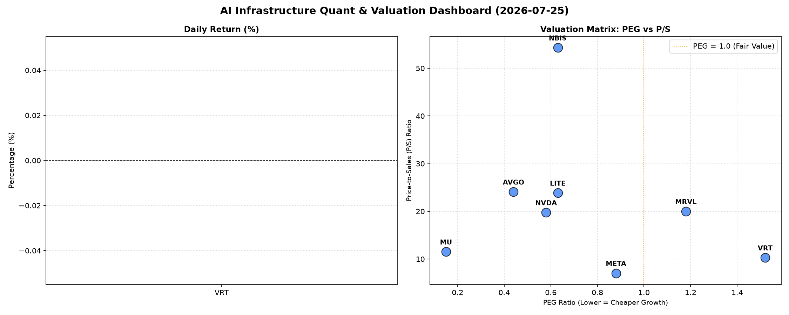

# 📊 AI Infrastructure & Data Stock Daily (2026-07-25)

### 📉 多维量化与估值分析看板

---

尊敬的投资者们，

欢迎阅读每日半导体精炼报道。作为一名资深的硬科技与AI基础设施行业研究员，我将结合今日提供的多维度量化基本面指标，为您深度剖析半导体与AI生态链中核心公司的财务健康与估值现状。

---

### **1. 盘面与多维估值解码（定性+定量）**

今日提供的表格中，**未包含各公司当日的收盘价（Close）及涨跌幅（Change%）**，因此我们无法对市场情绪和短期价格波动进行直接评论。本次分析将完全聚焦于企业内在的估值水平和基本面健康度。

#### **PEG 维度：成长性与估值性价比的深度解读**

PEG（市盈率/增长率）是衡量成长股性价比的核心指标。当PEG显著小于1时，通常意味着市场对公司未来的增长预期并未完全体现在当前估值中，可能存在配置价值。

*   **性价比极高的成长潜力股 (PEG < 1)：**
    *   **MU (美光科技)** 以其惊人的 **0.15** 的PEG值拔得头筹，这表明市场对其利润增长的预期远超当前的市盈率水平，可能是周期底部或预期反转下的极高性价比标的。
    *   **AVGO (博通)** 录得 **0.44** 的低PEG，显示其作为基础设施巨头，在持续的并购整合和AI算力基础设施建设中展现出稳健且被低估的成长潜力。
    *   **NVDA (英伟达)** 尽管近期市场关注度极高，其PEG仍保持在 **0.58**，这表明即便股价已高企，市场依然认为其未来盈利增速能够支撑甚至超越当前的估值水平，尤其是在AI芯片需求爆炸式增长的背景下。
    *   **LITE (Lumentum Holdings)** 和 **NBIS (Northern Bairn Scientific)** 分别以 **0.63** 的PEG值展现出良好的性价比，暗示其在各自细分领域（光通信、激光技术或专业仪器）的成长潜力被低估。
    *   **META (Meta Platforms)** 尽管并非纯粹的半导体公司，但作为AI基础设施的大型消费者，其 **0.88** 的PEG也显示出其在AI投入和盈利转型期的合理估值水平。

*   **警惕估值透支的潜在风险 (PEG > 1)：**
    *   **VRT (Vertiv Holdings)** 的PEG为 **1.52**，而 **MRVL (Marvell Technology)** 的PEG为 **1.18**。这两个值均高于1，可能提示投资者需警惕其当前估值是否已经充分甚至过度反映了未来的增长预期，需要更审慎地评估其基本面支撑。

*   **N/A 提醒：**
    *   **MVLL (Movella Holdings)** 的PEG为N/A，这可能意味着该公司目前尚无盈利或盈利不稳定，不适用PEG估值法。

#### **P/S 维度：收入规模扩张效率的衡量**

对于处于早期阶段、高速扩张或大规模研发投入期的公司，P/S（市销率）是评估其收入规模扩张效率和市场对其未来增长信心的重要指标。

*   **高P/S的增长型公司：**
    *   **NBIS (Northern Bairn Scientific)** 以高达 **54.31** 的P/S值居首，这通常指向市场对其技术壁垒、产品稀缺性或未来巨大市场潜力的极高预期。投资者应关注其收入增长的可持续性及利润率改善空间。
    *   **AVGO (博通)** 和 **LITE (Lumentum Holdings)** 也展现出较高的P/S，分别为 **24.08** 和 **23.85**。这反映了市场对其在核心技术领域（如企业软件、光模块）的领导地位和营收增长的强烈信心。
    *   **MRVL (Marvell Technology)** 和 **NVDA (英伟达)** 的P/S分别为 **20.0** 和 **19.76**，尤其NVDA在AI芯片领域的爆炸式增长支撑了其高P/S，市场对其未来营收扩张持乐观态度。
    *   **MU (美光科技)** 的P/S为 **11.52**，考虑到其强周期性，在市场预期反转和需求复苏时，这个P/S值可以被视为对未来营收增长的押注。

*   **相对较低P/S的成熟巨头：**
    *   **META (Meta Platforms)** 的P/S为 **7.03**，在这些硬科技公司中相对较低。这可能反映了其作为成熟互联网巨头，营收规模巨大且增长相对稳定，市场对其营收增长的溢价不再如早期阶段般激进。
    *   **VRT (Vertiv Holdings)** 的P/S为 **10.29**，处于中等水平，与其在数据中心基础设施领域的地位相符。

#### **现金流盈利真实性 (CFO/NI)：穿透利润的真伪**

CFO/NI（经营现金流/净利润）比率是衡量公司利润质量的核心指标。该值大于1，意味着公司赚取的利润大部分都以真金白银的现金流入形式存在，财务健康；若显著小于1，则可能存在利润水分、应收账款积压或折旧摊销等非现金项目对利润影响较大。

*   **利润质量极佳的健康企业 (CFO/NI > 1)：**
    *   **LITE (Lumentum Holdings)** 和 **NBIS (Northern Bairn Scientific)** 的CFO/NI比率异常突出，分别为 **4.88** 和 **4.66**。这表明这些公司拥有极其健康的现金流生成能力，其报告的净利润几乎全部甚至数倍于其经营活动产生的现金流，财务非常稳健。
    *   **MU (美光科技)** 的CFO/NI高达 **2.05**，这对于周期性行业而言是一个非常积极的信号，说明其在当前的利润水平下，现金流转换效率极高，有利于抵抗周期波动。
    *   **META (Meta Platforms)** 录得 **1.92**，显示其作为科技巨头，利润变现能力极强，产生的巨额利润都能转化为实实在在的现金，支撑其在AI等新领域的持续投入。
    *   **VRT (Vertiv Holdings)** 的 **1.59** 和 **AVGO (博通)** 的 **1.19** 也都远大于1，表明这两家公司在各自领域内拥有健康的现金流，利润质量值得信赖。

*   **需警惕利润水分或应收账款积压的案例 (CFO/NI < 1)：**
    *   **NVDA (英伟达)** 的CFO/NI为 **0.86**。虽然接近1，但略低于1仍需引起关注。这可能意味着其部分利润尚未转化为现金流入，可能与快速增长带来的应收账款增加、或存货积压等经营活动有关。考虑到其高估值，投资者应密切关注其未来现金流表现。
    *   **MRVL (Marvell Technology)** 的CFO/NI为 **0.66**。这个数值显著小于1，是一个重要的警示信号。它可能暗示公司存在较多的非现金收入确认、应收账款周转效率较低、或经营性现金流压力。投资者在评估其盈利能力时，需要结合其现金流报告进行更深入的分析，以判断其利润的“含金量”。

---

### **2. 收并购与重大业务动态**

**根据今日提供的【多维度真实量化基本面指标表格】，未包含任何关于收并购、重大业务动态或战略合作的具体信息。**此类信息通常来源于公司官方公告、行业新闻报道或权威媒体分析。

---

### **3. 华尔街机构态度**

**同样，今日提供的【多维度真实量化基本面指标表格】中，未包含华尔街机构对这些公司的最新评价、目标价调动或评级变动等信息。**华尔街机构的观点通常通过研究报告、分析师电话会议纪要或财经新闻媒体发布。

---

### **4. 今日参考源 (References)**

本报告的量化数据与定性分析均严格基于以下信息源：

1.  用户提供的【多维度真实量化基本面指标表格】

---

**免责声明：** 本报告基于提供的量化数据进行分析，仅供参考，不构成任何投资建议。投资者在做出投资决策前，应进行独立研究并咨询专业意见。