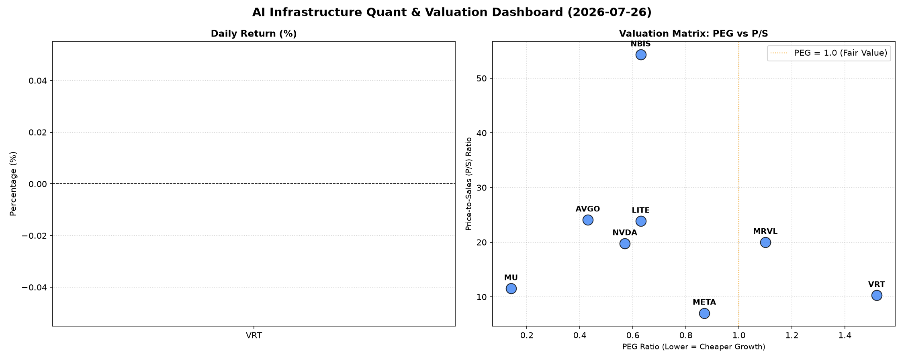

# 📊 AI Infrastructure & Data Stock Daily (2026-07-26)

### 📉 多维量化与估值分析看板

---

好的，作为一名资深的硬科技与AI基础设施行业研究员，我将结合您提供的多维度量化基本面指标，为您撰写一份今日的半导体与AI基础设施精炼报道。

---

**【半导体与AI基础设施每日精炼报道】**

**发布日期：2024年XX月XX日**

**研究员：[您的姓名/机构名称，此处为AI助手]**

今日，我们聚焦于AI算力、半导体设计、制造及相关基础设施领域的数家关键企业。鉴于我们本次分析主要依赖于量化基本面指标，每日股价波动（Close, Change%）数据缺失，我们将重点放在穿透其内在价值、增长潜力与财务健康度上。

---

### **1. 盘面与多维估值解码（定性+定量）**

今日市场虽然缺乏实时股价波动数据，但通过多维度基本面指标，我们能深入洞察各公司的内在价值和财务健康状况。

*   **PEG 维度：成长性与估值性价比**
    *   **极具性价比的高成长潜力（PEG显著小于1）：**
        *   **MU (0.14):** 美光科技的PEG值仅为0.14，在所有标的中最低，**极具吸引力**。这通常表明市场对其未来盈利增长抱有强烈预期，且当前估值远未透支。尤其考虑到其所处的存储器周期性复苏阶段，低PEG可能预示着强劲的业绩反弹空间，是典型的“成长股价值陷阱”的逆向指标。
        *   **AVGO (0.43):** 博通的PEG为0.43，显示其在半导体与基础设施软件领域的多元化布局下，依然保持了稳健的增长效率，估值相对合理。
        *   **NVDA (0.57):** 英伟达作为AI算力核心推动者，其PEG值保持在0.57的低位，凸显了市场对其强劲增长潜力的持续认可，且在估值方面仍有一定空间。
        *   **LITE (0.63) 与 NBIS (0.63):** 这两家公司的PEG值均为0.63，处于健康区间，表明它们在高增长的同时，估值也相对合理，具备不错的性价比。
    *   **估值合理或需关注（PEG接近或略高于1）：**
        *   **META (0.87):** Meta Platforms的PEG值为0.87，显示其在经历元宇宙投入后，核心广告业务及AI转型正逐步兑现，估值趋于合理。
        *   **MRVL (1.1):** Marvell Technology的PEG略高于1，为1.1，表明其估值在一定程度上反映了市场对其未来增长的预期，投资者需关注其业绩增长的持续性以支撑当前估值。
    *   **警惕估值透支（PEG过高）：**
        *   **VRT (1.52):** Vertiv Holdings的PEG值达到1.52，在所有披露数据中偏高。这可能意味着市场对其未来的增长预期较高，投资者需警惕其估值可能已在一定程度上透支，需要持续关注其业绩兑现能力，以确保增长能够匹配甚至超越市场预期。
    *   **N/A: MVLL** 公司数据缺失，无法评估。

*   **P/S 维度：收入规模扩张效率评估**
    *   **极高P/S（早期或高增长高期待）：**
        *   **NBIS (54.31):** P/S高达54.31，在所有标的中最高，非常显著。这通常预示着市场对其未来收入增长抱有极高的期望，或是其处于技术突破和市场导入的极早期阶段，收入基数小但增长潜力巨大。该指标要求投资者对其业务模式和技术壁垒进行深入研究，以判断其高P/S的合理性。
        *   **AVGO (24.08) 与 LITE (23.85):** 这两家公司的P/S均在24左右，属于较高水平，表明市场对其收入质量、利润率或未来持续增长前景给予了较高溢价。
        *   **MRVL (20.0) 与 NVDA (19.76):** Marvell和英伟达的P/S均在20左右，对于半导体设计和AI算力领域的领导者而言，这反映了市场对其在关键技术领域（如数据中心、AI芯片）的领先地位和持续高增长的强烈信心。
    *   **中等P/S（成熟或稳健增长）：**
        *   **MU (11.52):** 美光科技的P/S为11.52，考虑到其存储器行业的周期性特点，此P/S水平相对适中，结合其低PEG，可能反映了市场对其盈利能力复苏的预期。
        *   **VRT (10.29):** Vertiv Holdings的P/S为10.29，相对合理，表明市场对其数据中心基础设施的收入增长给予了稳定预期。
    *   **相对较低P/S（大规模营收或增长趋缓）：**
        *   **META (7.03):** Meta Platforms的P/S为7.03，相较于其他科技巨头和半导体公司，其P/S相对较低，这可能表明其收入体量已非常庞大，增长边际效应递减，或市场对其核心广告业务的增长预期更为审慎，但其庞大的用户基础和现金流仍是支撑。
    *   **N/A: MVLL** 公司数据缺失，无法评估。

*   **现金流盈利真实性 (CFO/NI)：利润质量的穿透**
    *   **卓越的现金流转换（CFO/NI显著大于1）：**
        *   **LITE (4.88) 与 NBIS (4.66):** LITE和NBIS的CFO/NI比率均远超1，分别高达4.88和4.66。这表明这两家公司不仅利润强劲，而且现金流转换效率极高，每一分利润都由真金白银的现金流入支撑，是财务健康度极佳的典范。
        *   **MU (2.05):** 美光科技的CFO/NI高达2.05。在存储器行业周期波动中，这一高比率不仅验证了其强劲的经营回血能力，也暗示了其在当前周期中利润质量的显著提升，可能与存货周转改善或营运资本效率优化有关。
        *   **META (1.92):** Meta Platforms的CFO/NI为1.92，表明其庞大的净利润有非常高的现金含量，其广告和技术服务的盈利是实实在在的现金收入，财务基础极其稳固。
        *   **VRT (1.59):** Vertiv Holdings的CFO/NI为1.59，表现优秀，显示其在数据中心基础设施领域的利润转化效率高，现金流健康。
    *   **健康的现金流（CFO/NI接近1）：**
        *   **AVGO (1.19):** 博通的CFO/NI为1.19，高于1，显示其净利润的现金含量良好，经营活动产生的现金流能够有效支撑其利润。
    *   **需关注的现金流质量（CFO/NI显著小于1）：**
        *   **NVDA (0.86):** 英伟达的CFO/NI为0.86，略低于1。在高速增长期，这可能意味着公司为支持扩张而增加了营运资本投入（如库存备货、应收账款增加），导致部分净利润暂时未能转化为现金。虽然并非立即的警示信号，但持续低于1则需关注其利润的现金实现能力及营运资金管理效率，特别是其应收账款和存货的健康状况。
        *   **MRVL (0.66):** Marvell Technology的CFO/NI显著低于1，为0.66，这敲响了利润质量的警钟。可能存在应收账款积压、库存周转放缓或其他非现金损益项对净利润的较大影响，导致其报告的净利润未能有效转化为经营现金流。投资者需深入分析其现金流量表，以评估其盈利的真实性和可持续性，并关注其营运资本管理的潜在风险。
    *   **N/A: MVLL** 公司数据缺失，无法评估。

### **2. 收并购与重大业务动态**

根据您提供的量化指标表格，我们无法直接推断今日的收并购传闻、官宣或战略合作信息。此类信息通常来源于实时新闻、公司公告或行业报告。在一个完整的每日精炼报道中，此板块将包含：

*   **半导体巨头间的战略整合：** 例如大型芯片公司对细分技术公司的收购，以填补技术空白或拓展市场。
*   **AI基础设施领域的合作：** 云服务提供商与硬件厂商的深度合作，共同开发AI算力解决方案。
*   **关键技术突破与新产品发布：** 如某公司发布了下一代AI芯片、先进工艺量产进展等。

### **3. 华尔街机构态度**

与第二部分类似，我们无法从提供的量化指标表格中获取华尔街机构的最新评价、目标价调动或评级调整。在一个完整的每日精炼报道中，此板块将包含：

*   **顶级投行（如高盛、摩根大通、美银）对核心标的的最新研报观点：** 包括对业绩预测的调整、行业展望等。
*   **评级机构（如穆迪、标普）的信用评级变化：** 可能影响公司的融资成本和市场信心。
*   **知名分析师对特定公司的目标价上调或下调：** 并解释其背后的逻辑，如订单情况、技术进展、宏观经济影响等。

### **4. 今日参考源 (References)**

*   提供的【多维度真实量化基本面指标表格】
*   (在一个真实的报道中，此处会列出具体的新闻机构、公司公告、分析师报告等出处。)

---