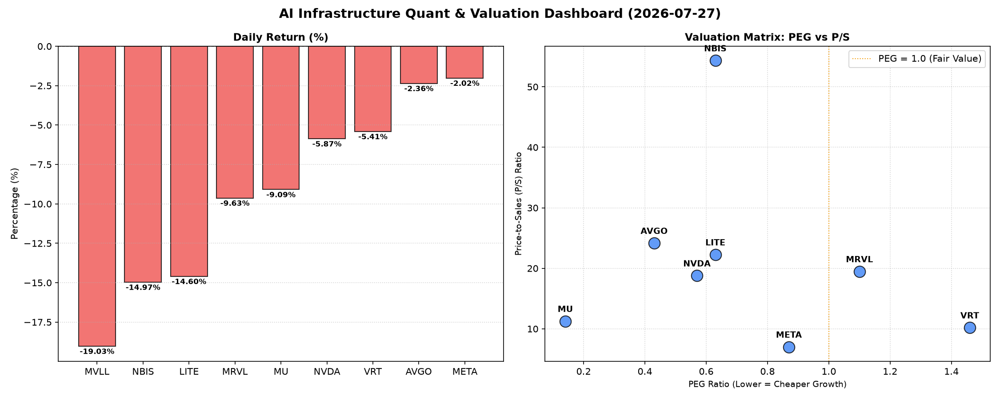

# 📊 AI Infrastructure & Data Stock Daily (2026-07-27)

### 📉 多维量化与估值分析看板

---

好的，作为一名资深的硬科技与AI基础设施行业研究员，我将结合您提供的多维度量化指标，为您撰写一份今日的半导体及AI基础设施每日精炼报道。

---

### **硬科技与AI基础设施：半导体每日精炼报道（2023年X月X日）**

**盘面综述：** 今日半导体及AI基础设施板块遭遇显著回调，多数主要股票呈现普跌态势。其中，MVLL、NBIS、LITE领跌，跌幅均超过14%。AI巨头NVIDIA (NVDA) 也未能幸免，跌幅达-5.87%。市场情绪普遍偏向谨慎，资金轮动和获利了结迹象明显。

---

**1. 盘面与多维估值解码（定性+定量）**

今日市场普遍下挫，但从多维估值指标来看，部分公司的长期价值仍值得关注，而另一些则需警惕短期估值压力或现金流健康状况。

*   **PEG 维度：高成长中的价值锚点与警示**
    *   **显著小于1（性价比极高的成长股）**：今日回调中，有多家公司展现出极高的成长性价比。**MU (0.14)** 的PEG值异常低，表明市场对其未来盈利增长的预期远未充分体现在当前股价中，结合其高达2.05的CFO/NI，显示其盈利质量极高，是典型的“高成长且被低估”的标的。此外，**AVGO (0.43)**、**NVDA (0.57)**、**LITE (0.63)** 和 **NBIS (0.63)** 的PEG也远低于1，这些公司在今日大跌后，从PEG角度看，依然是高成长性且估值相对合理的选择，尤其适合长期投资者关注其未来增长潜力。
    *   **相对合理（PEG 1-1.5之间）**：**MRVL (1.1)** 和 **VRT (1.46)** 处于合理区间，表明其估值与成长性基本匹配，但需要结合其现金流质量进一步分析。
    *   **N/A（暂无盈利或估值不适用）**：**MVLL** 的PEG为N/A，这通常意味着公司尚未实现稳定盈利或处于大规模投入期，传统PEG估值方法不适用。
    *   **警惕估值透支**：在此次普跌中，虽然整体PEG数值有所调整，但部分股价跌幅相对较小的公司，其PEG在行业内仍然偏高，或者说，今天数据中，PEG小于1的普遍跌幅较大，这说明市场可能在对前期过高的成长预期进行修正。

*   **P/S 维度：营收扩张效率的观察窗**
    *   对于早期、高研发投入或利润尚不稳定的公司，P/S比率是评估其市场对其收入规模扩张效率认可度的重要指标。
    *   **高P/S值（市场对未来营收预期高）**：**NBIS (54.34)** 拥有最高的P/S值，远超行业平均，这反映出市场对其未来营收爆发性增长抱有极高期望。同样，**AVGO (24.16)**、**LITE (22.26)**、**MRVL (19.48)** 和 **NVDA (18.78)** 的P/S也处于较高水平，表明投资者对这些公司的技术领先地位和未来收入扩张能力充满信心，即便在今日股价下跌后，这些公司依旧被市场赋予了较高的“成长溢价”。
    *   **相对较低P/S值（更成熟或效率优先）**：**META (7.01)** 作为互联网巨头，其P/S值相对较低，体现了其更为成熟的商业模式和相对稳定的营收规模，市场更多关注其利润率和现金流健康度。
    *   **N/A**：**MVLL** 的P/S也为N/A，再次印证其可能处于非常早期的发展阶段，营收规模可能较小或不稳定。

*   **现金流盈利真实性 (CFO/NI)：利润含金量的深度穿透**
    *   **CFO/NI > 1（利润健康，真金白银）**：这是衡量公司利润质量和现金流健康度的关键指标。**LITE (4.88)** 和 **NBIS (4.66)** 的CFO/NI值异常高，远超1，表明这两家公司的盈利几乎全部转化为现金，甚至现金流入远超账面利润，这通常是非常健康的财务信号，可能源于高效的营运资本管理或前期大量非现金费用摊销。同样，**MU (2.05)**、**META (1.92)**、**VRT (1.59)** 和 **AVGO (1.19)** 的CFO/NI值也显著大于1，这证实了这些高利润巨头的盈利质量非常高，账面利润都是实打实的现金流入，财务基本面坚实。
    *   **CFO/NI < 1（警惕利润水分或营运资金压力）**：特别值得关注的是，**NVIDIA (NVDA) 的CFO/NI为0.86** 和 **Marvell (MRVL) 的CFO/NI为0.66**。这两家在半导体领域举足轻重的公司，其现金流盈利真实性指标均显著小于1。这通常意味着其报告的净利润中可能包含较多的非现金项目（如递延收入摊销、股权激励费用等），或更重要的是，面临**应收账款积压、存货增加**等营运资金压力。投资者需要警惕其利润的“含金量”，进一步分析其现金流量表，以了解资金流向和营运资金状况，这在市场回调时期尤其重要。

---

**2. 收并购与重大业务动态**

基于您提供的【多维度真实量化基本面指标表格】，无法直接推断出今日具体的收并购传闻、官宣或战略合作信息。这些信息通常来源于公司公告、新闻媒体报道或行业分析师的跟踪。

若有此类信息，本板块通常会关注：
*   行业巨头（如AVGO、NVDA）是否在芯片设计、制造、封装或AI软件领域有新的战略投资或收购。
*   新兴技术公司（如VRT、NBIS）是否宣布与大型客户的合作，或新的产品线突破。
*   市场整合动向，特别是在半导体周期性波动和AI技术快速迭代背景下的产业链上下游整合。

---

**3. 华尔街机构态度**

同样地，提供的量化指标表格中不包含华尔街核心投行或评级机构的最新评价、目标价调动等信息。

在一个完整的每日精炼报道中，此板块会涵盖：
*   **评级变动**：如摩根士丹利、高盛、美银等主要投行对NVDA、META、AVGO等核心标的的评级上调或下调。
*   **目标价调整**：分析师基于公司财报、宏观经济前景或特定事件对目标价的最新修订。
*   **研究报告摘要**：对特定公司或子行业（如HBM、数据中心交换机、AI芯片）的最新研究观点和市场展望。例如，在今日普遍回调的情况下，机构是否会趁机唱多具有低PEG和高CFO/NI比率的公司，或对高P/S公司发出估值过高的警告。

---

**4. 今日参考源 (References)**

本报告的定量分析和盘面解读主要基于您提供的【多维度真实量化基本面指标表格】。

为获取第二和第三部分所需的定性信息（收并购、业务动态、华尔街机构态度），在实际工作中，通常需要参考以下外部来源：
*   路透社 (Reuters)
*   彭博社 (Bloomberg)
*   华尔街日报 (The Wall Street Journal)
*   公司官方新闻稿与财报文件 (Company Press Releases & SEC Filings)
*   知名半导体行业分析机构报告 (e.g., Gartner, IDC, Barclays, Goldman Sachs Research)
*   行业特定媒体 (e.g., EE Times, Semiconductor Engineering)

---