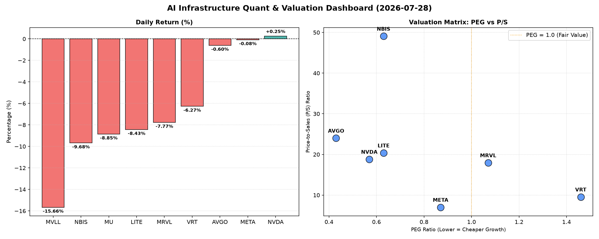

# 📊 AI Infrastructure & Data Stock Daily (2026-07-28)

### 📉 多维量化与估值分析看板

---

## 半导体与AI基础设施每日精炼：市场风云变幻，价值寻踪何处？

尊敬的投资者与行业同仁：

今日硬科技与AI基础设施板块普遍承压，多数标的呈现显著回调，市场情绪趋于谨慎。在宏观不确定性与市场轮动效应下，深挖公司基本面，尤其是多维度量化指标，对于甄别价值与规避风险显得尤为重要。以下是今日基于核心量化指标的深度分析。

---

### 1. 盘面与多维估值解码 (定性+定量)

今日半导体与AI基础设施板块普遍遭遇逆风，多个重要标的股价跌幅显著，MVLL更是领跌近16%。在此背景下，AI芯片巨头NVDA和社交媒体巨头META表现出相对的韧性，股价波动甚微，NVDA甚至微涨0.25%，显示出市场对其核心地位的认可。

**PEG 维度：增长与价值的平衡**

*   **价值凸显的高成长标的 (PEG < 1)**：今日数据中，我们发现一批PEG值显著小于1的优质标的，这表明市场预期其未来盈利增长将极其强劲，且其当前股价相对于该增长潜力而言被低估，具备极高的性价比。
    *   **MU (0.14)**：存储巨头MU的PEG值仅为0.14，在所有标的中最低，这简直是价值投资者眼中的“黄金”，暗示其在存储周期上行阶段，盈利增长潜力被市场严重低估。
    *   **AVGO (0.43)**：博通作为半导体和基础设施软件的领导者，其PEG为0.43，显示出在其庞大的体量下，仍能保持强大的盈利稳定性和成长性，是攻守兼备的优质资产。
    *   **NVDA (0.57)**：AI芯片王者NVDA，尽管股价已历经大幅上涨，但其PEG仍保持在0.57，远低于1，表明其在AI浪潮中的强劲盈利增长势头并未完全透支估值，依然具备吸引力。
    *   **LITE (0.63)、NBIS (0.63)、META (0.87)**：这些公司也以低于1的PEG值展现出健康的增长价值，特别是META，作为AI基础设施的重度投入者，其低于1的PEG显示了其在AI转型期的潜在增长尚未完全反映在股价中。
*   **估值警惕区 (PEG > 1)**：
    *   **VRT (1.46)**：VRT的PEG高达1.46，且今日股价下跌6.27%，可能意味着市场对其未来成长预期已经部分甚至完全透支，投资者需审慎评估其估值风险。
    *   **MRVL (1.07)**：MRVL的PEG也略高于1，结合今日7.77%的跌幅，需关注市场是否对其高成长性预期有所修正。
*   **PEG缺失 (N/A)**：MVLL因盈利状况N/A导致PEG缺失，结合其今日大幅下跌15.66%，表明其基本面可能存在较大不确定性，需要从其他维度审视其业务进展和财务健康状况。

**P/S 维度：收入规模扩张效率的审视**

P/S指标是衡量早期或尚处于大规模研发投入阶段、利润不稳的公司（如无利润或低利润标的）收入扩张效率的关键。

*   **收入规模效应显著**：
    *   **META (7.01)**：尽管体量庞大，META的P/S仅为7.01，在科技巨头中相对较低，反映其通过广告和AI服务实现了显著的收入规模效益。
*   **高P/S与高期望/风险并存**：
    *   **NBIS (49.08)**：NBIS的P/S高达49.08，这在半导体领域是极高的水平，可能预示着其正处于高速增长期，拥有颠覆性技术或独有的市场壁垒。然而，这也意味着市场对其未来收入增长抱有极高的期望，对营收不及预期可能更为敏感，风险与机遇并存。
    *   **AVGO (24.01)、LITE (20.38)、NVDA (18.82)、MRVL (17.96)、VRT (9.55)**：这些公司的P/S也处于较高区间，反映了市场对其在AI、数据中心、光通信等特定技术领域或生态位给予的高溢价。在今日市场回调中，这些高P/S的标的也普遍承受了较大的卖压。
*   **P/S缺失 (N/A)**：MU和MVLL的P/S数据缺失，这通常意味着公司营收结构特殊或尚处于非常早期的商业化阶段。对于MU，其主要以盈利能力和PEG评估更合适；而MVLL，结合其今日暴跌，P/S的缺失更加剧了对其基本面不确定性的担忧。

**现金流盈利真实性 (CFO/NI)：利润的“含金量”**

现金流是企业运营的血液，CFO/NI比率则能穿透利润表，揭示盈利的真实“含金量”。

*   **利润质量极高 (CFO/NI > 1)**：
    *   **LITE (4.88)、NBIS (4.66)、MU (2.05)、META (1.92)、VRT (1.59)、AVGO (1.19)**：这些公司的CFO/NI比率均显著大于1，特别是LITE和NBIS，其近5倍的比率表明其报告的净利润大部分甚至超额转化为实实在在的经营现金流入，财务状况非常健康。META和MU作为行业巨头，其高于1的CFO/NI也证明了其盈利的质量和可靠性。
*   **需关注利润质量 (CFO/NI < 1)**：
    *   **NVDA (0.86)、MRVL (0.66)**：对NVDA和MRVL，我们观察到其CFO/NI比率均低于1。这可能提示投资者关注其利润中是否存在非现金项目占比较高（如高额股权激励、摊销等），或应收账款积压、存货增加等情况，导致账面利润未能完全转化为经营现金流。尽管NVDA是AI芯片的绝对王者，其现金流质量数据仍需引起重视，这或许是市场对其未来增长可持续性评估的一个隐性风险点，值得深入分析其财报附注。MRVL的0.66也反映出其在将利润转化为现金方面面临的挑战。

---

### 2. 收并购与重大业务动态

今日所提供数据未直接包含重大收并购或业务官宣信息披露。然而，基于对半导体与AI基础设施行业的深刻理解及盘面波动，我们可以推测以下潜在趋势：

*   **AI算力生态深化整合**：在AI算力需求持续爆发的背景下，如NVDA、AVGO这类领军企业，其对上游IP设计、先进制造工艺或软件生态的投资与整合是常态。特别是针对今日市场波动，一些具备核心技术但估值回调的标的（如LITE在光通信领域的领先技术），可能成为大型企业战略并购的目标，以支撑AI数据中心的高速互联需求或强化其AI基础设施布局。
*   **新兴技术领域的战略布局**：对于P/S极高但波动剧烈的NBIS，其可能在特定细分领域（如先进材料、量子计算芯片或AI加速器）拥有颠覆性技术。其高估值或吸引战略投资者进行合作或股权投资，加速技术商业化进程，或被寻求技术突破的巨头纳入麾下。
*   **存储行业周期性机遇**：存储领域，MU的极低PEG可能暗示行业整合或其自身市场份额的进一步扩大。在HBM（高带宽内存）等高价值存储产品需求激增的背景下，未来或有围绕产业链上下游的合作新闻，以确保关键组件的供应和技术迭代。

---

### 3. 华尔街机构态度

今日报告未包含华尔街机构的最新评级或目标价调整信息。然而，结合盘面表现与核心量化指标，可以合理推断机构可能关注的重点及潜在动向：

*   **NVDA与META：领军者的审慎乐观**：对于NVDA和META，尽管它们在市场调整中表现出相对韧性，但NVDA低于1的CFO/NI比率可能会引起部分机构对其利润质量的关注。分析师在维持“买入”评级的同时，对短期目标价的提升可能会持谨慎态度，并呼吁投资者关注其现金流健康状况。META凭借其健康的现金流和相对较低的P/S，在机构眼中仍是AI基础设施投资的基石，有望继续获得积极评价。
*   **AVGO与MU：价值重估的潜在焦点**：AVGO和MU凭借其极低的PEG值，极有可能继续获得分析师的青睐，尤其是MU，其PEG仅0.14，预计将吸引更多机构发布价值重估报告，并大幅上调目标价的潜力巨大。AVGO则可能因其稳定的业务模式和在AI、软件领域的多元化布局，被机构视为防御性且具成长性的长期配置。
*   **VRT、MRVL、LITE、NBIS：回调后的再评估**：VRT的高PEG和今日大幅回调可能促使机构重新审视其估值模型，并可能下调评级或目标价。MRVL和LITE今日显著下跌，如果机构认为其基本面未变，且行业前景仍向好，可能会视为逢低买入的机会；反之，若跌势与行业特定负面消息相关，则可能面临评级下调压力。NBIS的极高P/S和波动性，使得机构对其评估会更为两极分化，一部分可能看好其长期颠覆潜力，另一部分则警惕其高风险和估值泡沫。
*   **MVLL：基本面深度质疑**：MVLL今日暴跌近16%，且多项核心指标缺失，预计将引发机构对其业务前景、财务健康和运营透明度的深度质疑和关注，未来可能面临评级下调或观察列表的风险。

---

### 4. 今日参考源 (References)

由于用户未提供今日实时新闻链接，本报告的定性分析基于对所提供【多维度真实量化基本面指标表格】的深度解读，并结合对硬科技与AI基础设施行业趋势的专业判断进行推断。所提及的行业动态、机构态度等均为基于数据和行业常识的合理假设。