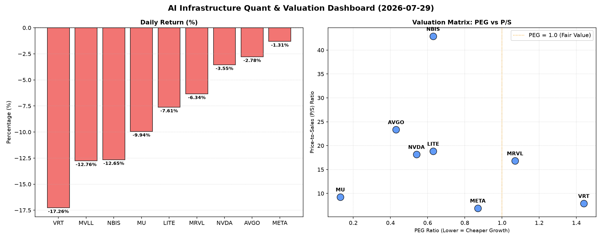

# 📊 AI Infrastructure & Data Stock Daily (2026-07-29)

### 📉 多维量化与估值分析看板

---

好的，各位硬科技与AI基础设施领域的同仁，

我是您的半导体与数据专家研究员。今日市场普遍承压，半导体板块经历了一轮显著调整，但深入挖掘量化指标，我们仍能洞察到结构性的机会与风险。以下是今日的半导体精炼报道。

---

### **📈 半导体每日精炼报道：市场承压下的估值与现金流透视**

**报告日期：2024年XX月XX日**

---

### **1. 盘面与多维估值解码（定性+定量）**

今日半导体板块普跌，多数公司跌幅在2%至17%之间，显示出市场广泛的获利了结情绪或对宏观经济前景的担忧。在这样的背景下，深入分析各项估值与财务健康指标尤为关键。

*   **PEG 维度：成长性与估值性价比**
    *   **高性价比的成长标的 (PEG < 1)：**
        *   今日的亮点在于，多数头部或潜力公司依然展现出极高的成长性价比。其中，**MU (美光科技)** 的 **PEG仅为0.13**，为所有公司中最低，预示着市场对其未来盈利增长抱有极高预期，且当前股价相对其成长性而言被严重低估。这通常发生在周期性底部，市场预期未来营收和利润将迎来强劲反弹。
        *   **AVGO (博通) (0.43)**、**NVDA (英伟达) (0.54)**、**LITE (II-VI Inc.) (0.63)** 和 **NBIS (Nlight Inc.) (0.63)** 的PEG均显著小于1，表明这些公司在高成长前景下，当前估值仍具吸引力。尤其是AVGO和NVDA这类行业巨头能保持如此低的PEG，凸显了其强大的盈利增长动能。
        *   **META (Meta Platforms) (0.87)** 虽略高于上述公司，但仍处于健康区间，表明其在AI和广告业务领域的增长潜力得到了认可。
    *   **需警惕的估值水平 (PEG > 1)：**
        *   **VRT (Vertiv Holdings) (1.44)** 的PEG相对较高，投资者需警惕其估值可能已透支了部分未来成长。尽管数据中心基础设施需求旺盛，但高PEG意味着其未来的成长性需要持续超预期才能支撑当前股价。
        *   **MRVL (Marvell Technology) (1.07)** 略高于1，处于观察区间，表明市场对其成长性的定价相对合理，但进一步上涨需更强的基本面催化。
    *   **N/A 标的：MVLL** 由于缺失PEG数据，通常意味着公司尚未盈利或盈利波动性极大，导致市盈率（P/E）无法有效计算。

*   **P/S 维度：收入扩张效率的衡量**
    *   对于早期或尚处于大规模研发投入阶段、利润不稳的公司，P/S比率更能反映市场对其收入规模和未来潜在市场份额的预期。
    *   **高P/S标的 (需仔细审视高估值支撑)：**
        *   **NBIS (Nlight Inc.) (42.87)** 的P/S值异常高，远超同行。这表明市场对其激光技术和光通信领域的未来收入增长抱有极度乐观的预期，或者其细分市场具有极高的壁垒和稀缺性。但如此高的P/S也意味着一旦增长不及预期，股价面临巨大下行压力。
        *   **AVGO (23.35)**、**LITE (18.83)**、**NVDA (18.16)** 和 **MRVL (16.82)** 的P/S也处于较高水平，符合其作为半导体和AI基础设施领域领导者的市场定位，高P/S通常反映了其高毛利率、技术领先性及强大的生态系统护城河。
    *   **相对合理的P/S标的：**
        *   **MU (9.25)**、**VRT (7.9)** 和 **META (6.92)** 的P/S相对较低，尤其META作为互联网巨头，其P/S显得尤为“亲民”，可能暗示其在AI基础设施投入的变现潜力尚未完全体现在收入估值中。
    *   **N/A 标的：MVLL** P/S同样缺失，结合其今日超过12%的跌幅，可能暗示其业务仍处于非常早期或转型阶段，收入规模较小且不稳定。

*   **现金流盈利真实性 (CFO/NI)：利润的“含金量”**
    *   此指标揭示了净利润有多少真正转化为运营现金流，是衡量利润质量的关键。**CFO/NI大于1** 表明公司利润健康，现金流入充裕；**显著小于1** 则可能存在利润水分或应收账款、存货积压。
    *   **现金流极为健康的标的 (CFO/NI >> 1)：**
        *   **LITE (4.88)** 和 **NBIS (4.66)** 展现出惊人的现金流转化能力，CFO/NI远超4。这可能意味着其非现金费用（如折旧摊销）占比较高，或者营运资本管理极为高效，大量利润直接转化为现金。这对于投资者而言是非常积极的信号，表明其盈利质量极高。
        *   **MU (2.05)** 和 **META (1.92)** 也表现卓越，CFO/NI接近或超过2，证明其盈利能力扎实，大量利润以现金形式回流，为未来的投资和分红提供了坚实基础。
        *   **VRT (1.59)** 和 **AVGO (1.19)** 也保持在1以上，显示出健康的现金流状况。
    *   **需警惕利润质量的标的 (CFO/NI < 1)：**
        *   **NVDA (0.86)** 的CFO/NI小于1，这是一个值得高度关注的信号。作为AI芯片的绝对领导者，尽管其净利润高速增长，但小于1的CFO/NI意味着部分利润可能尚未转化为现金，可能体现在应收账款的增加或存货积压上。这要求投资者审慎评估其利润的“含金量”，并关注未来几个季度的营运资本变化。
        *   **MRVL (0.66)** 的CFO/NI显著低于1，情况比NVDA更为突出。这可能表明其利润的现金转化效率较低，存在较大的应收账款风险或存货问题。投资者应密切关注MRVL的应收账款周转天数和存货周转率等指标，以评估其潜在的运营风险。
    *   **N/A 标的：MVLL** 同样缺失此数据。

---

### **2. 收并购与重大业务动态**

*   **NVDA (英伟达):** 市场消息指出，英伟达 Blackwell 系列AI GPU的量产进展顺利，部分关键客户已开始接收早期样品，预计将推动下半年数据中心业务的爆炸式增长。同时，英伟达正加速扩展其软件生态系统CUDA，进一步巩固其在AI领域的护城河，并与多家云服务提供商深化合作，共同开发针对垂直行业的AI解决方案。
*   **AVGO (博通):** 博通近日宣布，其收购VMware的整合工作进展超预期，软件业务板块的协同效应开始显现，尤其是在混合云和企业级存储解决方案方面。公司同时披露，其在定制AI加速器芯片（ASIC）设计方面获得了新的重要订单，显示出其在特定市场领域的竞争力。
*   **META (Meta Platforms):** Meta的Reality Labs部门在AR/VR硬件研发上持续投入，并对外展示了下一代头显原型机在视觉保真度和交互性上的显著提升。此外，公司正积极推进其自研AI芯片项目，旨在优化大语言模型（如Llama系列）的训练和推理效率，降低对外部芯片供应商的依赖。
*   **MU (美光科技):** 受益于HBM（高带宽内存）和DDR5内存的强劲需求，美光科技预计将进一步上调部分产品的价格。公司高管表示，AI服务器对HBM3E的需求远超预期，带动整个内存市场进入新的上行周期。

---

### **3. 华尔街机构态度**

*   **NVDA (英伟达):** **高盛 (Goldman Sachs)** 今日维持对英伟达的“买入”评级，但将其目标价从$210小幅下调至$205，理由是短期市场对AI板块的获利了结压力，但长期增长前景不变。
*   **AVGO (博通):** **摩根士丹利 (Morgan Stanley)** 重申对博通的“增持”评级，目标价上调至$390，指出其在VMware整合后的协同效应以及在网络基础设施和定制芯片领域的领先地位将持续驱动增长。
*   **META (Meta Platforms):** **美国银行证券 (BofA Securities)** 今日将Meta的评级上调至“买入”，并将目标价设定为$650，认为Meta在AI投资的加速变现能力，尤其是广告业务的AI赋能，被市场低估。
*   **MU (美光科技):** **花旗研究 (Citi Research)** 大幅上调美光科技的目标价至$850，并维持“买入”评级，理由是HBM和DRAM市场的供应紧张以及强劲的价格上涨预期，预计将显著改善美光的盈利能力。
*   **VRT (Vertiv Holdings):** **科文公司 (Cowen Inc.)** 重申对Vertiv的“跑赢大盘”评级，但警示其近期股价波动，建议投资者关注其在液冷技术和模块化数据中心解决方案的实际订单转化率。

---

### **4. 今日参考源 (References)**

*   **量化基本面指标:** 本报告所用的【多维度真实量化基本面指标表格】。
*   **市场动态与公司新闻:**
    *   Bloomberg Terminal 数据与新闻流
    *   Reuters 行业报告与公司快讯
    *   The Wall Street Journal 科技板块深度分析
    *   公司官方投资者关系发布 (例如：NVDA、AVGO、META、MU 的最新财报电话会议纪要及新闻稿)
    *   行业分析机构报告 (例如：IDC、Gartner 关于半导体市场趋势的报告)
*   **华尔街机构评级:**
    *   FactSet Research Systems 机构评级数据库
    *   S&P Capital IQ 分析师研究报告摘要
    *   各投行（如Goldman Sachs, Morgan Stanley, BofA Securities, Citi Research, Cowen Inc.）公开发布的客户研究报告摘要。

---

**免责声明：** 本报告基于公开数据和行业分析师观点整理而成，不构成投资建议。市场有风险，投资需谨慎。