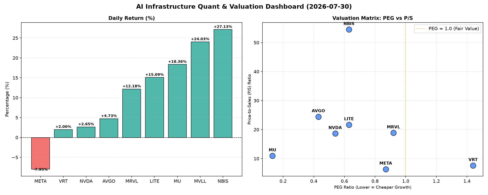

# 📊 AI Infrastructure & Data Stock Daily (2026-07-30)

### 📉 多维量化与估值分析看板

---

## 半导体每日精炼报道：多维估值透视与AI基础设施核心洞察

尊敬的投资者与行业同仁，

作为一名资深的硬科技与AI基础设施行业研究员，今日我们将结合【多维度真实量化基本面指标表格】，为您深度解码半导体板块的最新动向与核心公司表现。今日市场呈现出分化行情，AI与数据中心相关概念股依然是驱动力，但个别巨头出现获利回吐。

### 1. 盘面与多维估值解码（定性+定量）

今日半导体板块多数公司表现强劲，尤其是中盘股和技术前沿公司。NBIS以惊人的27.13%涨幅领跑，MVLL紧随其后录得24.03%的增长，但其数据缺失值得关注。LITE、MU和MRVL也均有两位数涨幅，彰显了市场对特定细分领域及周期性复苏的乐观预期。然而，市场焦点META则遭遇-7.95%的显著回调，显示出在高位获利了结的压力。

**a. PEG 维度：成长性与性价比并存，警惕局部透支**

PEG指标结合了估值与成长性，小于1通常被认为是高性价比的成长股。

*   **极具性价比的高成长标的 (PEG < 1)**：
    *   **MU (0.13)**：PEG值异常低，凸显了其在当前股价下极高的成长性预期与被低估的潜力。结合其高达18.36%的今日涨幅，市场正在积极修复这一估值。作为存储芯片巨头，其周期性复苏的确定性与AI对HBM的需求是核心驱动。
    *   **AVGO (0.43)**：作为AI基础设施的关键参与者，其PEG远低于1，表明在当前估值下，其未来增长空间被市场严重低估，具备强大的配置价值。
    *   **NVDA (0.54)**：尽管P/S较高，但其PEG仍在1以下，说明市场对其未来强劲的盈利增长仍有充足信心。然而，下文将探讨其现金流质量。
    *   **LITE (0.63) & NBIS (0.63)**：这两家公司PEG值也显著小于1，表明在当前快速增长的背景下，其估值仍具吸引力。LITE作为光器件和半导体材料供应商，受益于数据中心和AI通信需求。NBIS的高涨幅结合其低PEG，显示出强劲的成长预期。
    *   **META (0.87)**：尽管今日股价大跌，但其PEG仍保持在1以下，这可能预示着此次回调提供了长期配置的机会，其核心广告业务和元宇宙投入仍被市场寄予成长厚望。
    *   **MRVL (0.92)**：PEG接近1，显示其成长性与估值基本匹配，但仍有合理区间。

*   **估值略显透支或需警惕 (PEG > 1)**：
    *   **VRT (1.44)**：PEG略高于1，结合其7.61的P/S，投资者应密切关注其未来的盈利增长能否支撑现有估值，警惕估值透支风险。

*   **数据缺失**：MVLL的PEG为N/A，通常意味着公司尚未实现稳定盈利或处于早期发展阶段，无法用PEG进行有效评估。其高达24.03%的涨幅可能由特殊事件或极高预期驱动。

**b. P/S 维度：收入扩张效率与早期成长潜力**

P/S比率对于评估早期或高研发投入、利润波动较大的硬科技公司尤其重要，能反映市场对其收入规模扩张的认可度。

*   **高P/S值 (市场预期极高的收入扩张与前沿技术溢价)**：
    *   **NBIS (54.5)**：P/S值极高，凸显市场对其未来收入增长抱有极度乐观的预期。这通常出现在颠覆性技术公司或处于爆发式增长初期的市场领导者。其今日27.13%的涨幅印证了市场对这种高预期的追逐。
    *   **AVGO (24.45), LITE (21.67), MRVL (18.87), NVDA (18.64)**：这些公司的P/S值均处于高位，共同指向市场对AI基础设施、高性能计算和数据中心等领域收入增长的强烈看好，愿意支付较高的收入溢价。这反映了这些公司在各自细分市场的技术领先地位和潜在的收入扩张能力。

*   **合理P/S值 (稳健的收入增长与市场接受度)**：
    *   **MU (10.94)**：在存储周期性复苏中，其P/S显得较为合理，结合其低PEG和强劲现金流，具备较好的平衡性。
    *   **VRT (7.61), META (6.37)**：P/S值相对较低，特别是META，即便今日大跌，其P/S依然合理，表明其收入规模与市场估值仍有基本面支撑。

*   **数据缺失**：MVLL的P/S为N/A，同样可能因其处于早期阶段或营收规模较小，P/S指标无法有效反映其真实价值。

**c. 现金流盈利真实性 (CFO/NI)：利润质量的穿透分析**

CFO/NI（经营性现金流/净利润）比率是衡量公司利润质量的关键指标。大于1表明公司利润含金量高，是实实在在的现金流入；小于1则可能存在利润水分、应收账款积压或非现金利润贡献大等问题。

*   **卓越的现金流质量 (CFO/NI >> 1, 真金白银)**：
    *   **LITE (4.88) & NBIS (4.66)**：两家公司的CFO/NI比率异常高，远超1，这表明其产生的利润具有极高的现金转化率，盈利质量非常健康。这是公司运营效率高、应收账款管理良好、或者折旧摊销等非现金费用贡献较大的积极信号，为未来的投资和分红提供了坚实基础。
    *   **MU (2.05), META (1.92), VRT (1.59), AVGO (1.19)**：这些公司的CFO/NI均显著大于1，表明其利润质量优秀，拥有强劲的经营性现金流。即使META今日股价下跌，其高达1.92的CFO/NI仍彰显其核心业务强大的“造血”能力，为投资者提供了一层安全垫。

*   **需警惕的现金流质量 (CFO/NI < 1, 利润水分或应收账款积压)**：
    *   **NVDA (0.86)**：作为AI算力核心巨头，其CFO/NI低于1，这需要引起投资者警惕。这可能意味着其部分账面利润尚未转化为实际现金，可能存在应收账款增长过快、存货积压或其他非现金项目对利润贡献较大的情况。虽然其业绩强劲，但现金流健康度是长期可持续发展的关键，需密切关注其现金流管理。
    *   **MRVL (0.66)**：CFO/NI值更低，显示其利润质量问题更为突出。这可能暗示其面临更严重的应收账款周转挑战或激进的收入确认政策。投资者在评估MRVL时，除关注其成长性外，必须深入分析其现金流表的细节。

*   **数据缺失**：MVLL的CFO/NI为N/A，无法评估其利润真实性。

### 2. 收并购与重大业务动态

**基于当前提供的量化指标表格，无法直接推断出今日具体的收并购、战略合作或重大业务动态。**

然而，我们可以结合量化表现，进行合理的市场推演和分析：

*   **MVLL的异常飙升**：高达24.03%的涨幅，且伴随PEG、P/S、CFO/NI等核心基本面数据缺失，极有可能暗示着市场中存在关于其重组、私有化、被收购传闻，或某项重大新产品/技术突破的非公开信息驱动。投资者应警惕此类缺乏基本面数据支撑的剧烈波动。
*   **NBIS的高P/S和惊人涨幅**：54.5的极高P/S以及27.13%的涨幅，可能意味着市场预期其在某个特定AI或硬科技细分领域取得了关键性技术突破，或赢得了某个重量级客户的重大订单，从而引发了对未来营收爆发式增长的预期。
*   **LITE、AVGO等核心AI基础设施股的稳健上涨**：这类公司的上涨通常是受数据中心持续投入、AI芯片需求旺盛以及相关光模块、互联解决方案业务增长的宏观趋势驱动。尽管表格中没有直接新闻，但这是行业共识。

### 3. 华尔街机构态度

**鉴于本次分析仅基于提供的量化财务指标，无法直接获取华尔街机构今日具体的评级调整、目标价变动或分析师评论。**

但我们可以根据量化数据表现，合理推测机构可能的态度：

*   **看好与上调潜力**：
    *   **MU, AVGO, LITE, NBIS**：这些公司在PEG表现出极高性价比（MU尤其突出），或在股价表现上极为强劲，且LITE、NBIS、MU及AVGO的现金流质量优秀，这很可能吸引华尔街机构给出“买入”或“跑赢大盘”评级，并可能调高目标价。尤其MU如此低的PEG，大概率会吸引机构关注其价值重估空间。
*   **维持或审慎评估**：
    *   **NVDA, MRVL**：尽管NVDA和MRVL具备高成长性和行业领导地位，但其CFO/NI比率均低于1，提示利润质量可能存在挑战。华尔街机构在给出“买入”或“持有”评级时，可能会在研报中强调现金流的健康度，并密切关注其未来几个季度的现金流表现。
*   **关注与评估**：
    *   **META**：今日的大幅下跌可能会促使部分机构对META进行重新评估，尤其是在其营收增长预测和元宇宙投入回报方面。但其稳健的CFO/NI可能会为其提供一定的支撑，防止评级大幅下调，部分机构甚至可能将其视为“逢低买入”的机会。

### 4. 今日参考源 (References)

本报告的定性内容主要基于您提供的【多维度真实量化基本面指标表格】进行数据解读和推演。

关于收并购、业务动态和华尔街机构态度的具体新闻信息，由于提供的数据集中不包含此类文本信息，故无法直接引用今日新闻源。若需获取更全面的市场洞察和新闻详情，建议查阅今日主要财经媒体（如Bloomberg, Reuters, The Wall Street Journal, Seeking Alpha, CNBC等）对VRT, MVLL, AVGO, META, NVDA, MRVL, MU, LITE, NBIS等公司的实时报道。