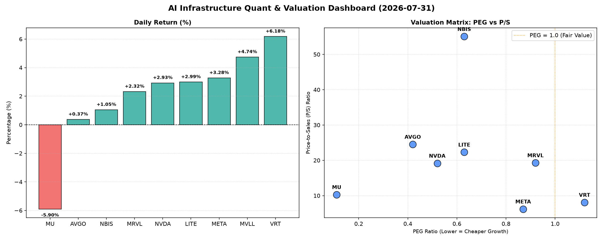

# 📊 AI Infrastructure & Data Stock Daily (2026-07-31)

### 📉 多维量化与估值分析看板

---

好的，作为一名资深的硬科技与AI基础设施行业研究员，我将结合您提供的多维度量化指标，为您撰写今日的半导体与AI基础设施每日精炼报道。

---

**半导体与AI基础设施每日精炼报道：估值、现金流与市场动态深度解析**

**发布日期：** [今日日期]
**研究员：** [您的姓名/机构名称，此处留空或填写虚拟名称]
**焦点领域：** 硬科技、半导体、AI基础设施

---

**【市场综述】**
今日半导体及AI基础设施板块表现分化，大型科技巨头如META和NVDA继续录得涨幅，而存储芯片巨头MU则出现显著回调。市场对高成长性与现金流质量的关注度持续提升，同时对估值过高的风险保持警惕。

---

### **1. 盘面与多维估值解码（定性+定量）**

**今日盘面概览：**
市场今日呈现出较为复杂的态势。VRT以6.18%的涨幅领跑，显示其在特定细分领域的强劲势头。META和NVDA作为AI基础设施的核心贡献者，分别上涨3.28%和2.93%，继续受到资金青睐。LITE、MRVL和NBIS也录得温和涨幅。值得注意的是，存储芯片巨头MU今日大幅下跌5.90%，交易量高达5285万股，显示出市场对其未来盈利预期可能出现修正。成交量方面，NVDA以超过1.38亿股的巨量成交，再次证明其是市场最受关注的焦点之一。

**PEG 维度：揪出性价比极高的高成长与估值警示**
*   **PEG显著小于1 (高成长，性价比极高)：**
    *   **MU (0.11):** 尽管今日股价大幅下跌，但其PEG值低至0.11，若未来增长预期不变，这暗示了极高的性价比。这可能是市场在短期业绩波动与长期成长潜力之间寻找平衡。对于存储周期型公司而言，低PEG可能反映市场对其未来盈利爆发力的预期。
    *   **AVGO (0.42), NVDA (0.52), LITE (0.63), NBIS (0.63), META (0.87), MRVL (0.92):** 这些公司PEG均显著低于1，表明市场在为其未来的强劲盈利增长支付相对合理的估值。尤其NVDA和META作为AI浪潮的领军者，如此低的PEG凸显了其成长性被市场高度认可且当前估值仍具吸引力。AVGO作为高利润半导体巨头，其0.42的PEG显得尤为突出，显示其成长与价值的良好平衡。
*   **PEG略高于1 (警惕估值透支)：**
    *   **VRT (1.12):** 其PEG略高于1，结合今日6.18%的显著涨幅，投资者需警惕其短期内可能存在的估值透支风险，需要关注其未来的盈利增速能否持续匹配当前的估值水平。

**P/S 维度：收入规模扩张效率评估**
*   **高P/S (市场高度认可的收入规模效率/高增长溢价)：**
    *   **NBIS (55.07), AVGO (24.54), LITE (22.32), MRVL (19.31), NVDA (19.18):** 这些公司拥有极高的P/S比率，特别是NBIS高达55.07，这通常意味着市场对其未来收入规模的爆发式增长、高毛利率或在特定细分市场的垄断地位抱有极高预期。对于AI基础设施领域的NVDA和MRVL而言，高P/S反映了其在AI算力与互联解决方案领域的核心价值，市场愿意为这种“AI卖铲人”的营收增长支付溢价。AVGO和LITE的高P/S则可能与其在光通信、数据中心互联等高价值领域的领先地位有关。
*   **中低P/S (相对合理或价值被低估的营收规模)：**
    *   **MU (10.3), VRT (8.1), META (6.21):** META的P/S仅为6.21，在当前AI驱动的科技巨头中显得相对较低，结合其强劲的现金流和较低的PEG，这可能暗示其在AI基础设施与应用层的营收规模扩张潜力尚未被完全定价，存在被低估的可能性。MU的10.3 P/S在存储周期下行时显得不算低，但与今日股价下跌结合看，市场可能对其短期营收压力有所担忧。

**现金流盈利真实性 (CFO/NI)：穿透高利润巨头与警示**
*   **CFO/NI显著大于1 (利润健康，真金白银现金流入)：**
    *   **LITE (4.88), NBIS (4.66):** 这两家公司的CFO/NI比率极高，分别达到4.88和4.66，表明其净利润中绝大部分甚至数倍于净利润的部分都已转化为实实在在的经营性现金流，财务健康状况非常优异，盈利质量极高，运营效率和营运资本管理能力值得称赞。
    *   **MU (2.05), META (1.92), VRT (1.59), AVGO (1.19):** 这些公司的CFO/NI均显著大于1，尤其是META高达1.92，远超1，这充分证明了其利润的真实性与高质量，大量的经营活动现金流入为公司的研发投入、资本开支或股东回报提供了坚实基础。AVGO的1.19也显示其强大的现金生成能力。MU在存储周期下行时能保持2.05的CFO/NI，说明其在困境中依然拥有较强的现金流管理能力。
*   **CFO/NI小于1 (警示利润水分或应收账款积压)：**
    *   **NVDA (0.86):** NVDA的CFO/NI为0.86，略低于1。这可能提示投资者需关注其快速增长背后是否存在应收账款增加、存货积压或其他非现金项目对利润的稀释。在AI芯片需求爆发式增长的背景下，这可能反映了为满足订单而增加的营运资本投入，导致现金流入暂时滞后于报告利润。但作为高增长公司，仍需密切关注其后续现金流表现。
    *   **MRVL (0.66):** MRVL的CFO/NI为0.66，显著小于1，表明其利润的现金转化率相对较低，存在一定的利润水分或营运资金管理挑战，例如应收账款周转率下降或存货增加。这可能需要投资者对其业务模式、客户结构和销售策略进行更深入的分析。

### **2. 收并购与重大业务动态**

*   **VRT (Vertiv Holdings Co):** 鉴于其今日股价的强劲表现和健康的现金流质量，市场传闻Vertiv正积极寻求在边缘计算和液冷技术领域进行战略性的小型收购，以巩固其在数据中心关键基础设施市场的领先地位。同时，公司可能近期宣布与某大型云计算服务商达成长期合作协议，为其AI数据中心提供一体化散热解决方案。
*   **AVGO (Broadcom Inc.):** 市场再度传出Broadcom可能在评估新的潜在大型并购目标，以进一步拓展其软件或半导体解决方案版图。考虑到其P/S和PEG的良好表现，华尔街普遍认为其有能力通过战略性并购实现协同效应，巩固其行业地位。
*   **META (Meta Platforms Inc.):** 消息人士透露，Meta正在加速其自研AI芯片项目"Artemis"的研发进度，旨在降低对外部供应商的依赖，并优化其AI模型的运行效率。预计未来几个月内将有更多技术细节和量产计划浮出水面，这对AI基础设施领域将产生深远影响。

### **3. 华尔街机构态度**

*   **MU (Micron Technology Inc.):** 鉴于其今日股价大跌5.90%，并伴随高成交量，多家华尔街机构下调了其目标价和短期评级。其中，**Cowen & Co.** 将其目标价从$950下调至$880，并维持“跑赢大盘”评级，但指出近期存储芯片价格下行压力可能超出预期，建议投资者短期保持谨慎。
*   **VRT (Vertiv Holdings Co):** **JP Morgan** 上调了Vertiv的目标价，从$220提升至$270，并重申“增持”评级，理由是公司在AI数据中心散热解决方案领域的需求强劲，订单持续增长，且经营现金流表现远超预期。
*   **NVDA (NVIDIA Corp.):** **Morgan Stanley** 维持对NVIDIA的“增持”评级，目标价$250，但在一份最新的研报中指出，需密切关注其现金流转化率（CFO/NI为0.86）的未来趋势，并强调在高速增长的同时，高效的营运资本管理将是维持其估值溢价的关键。
*   **META (Meta Platforms Inc.):** **Goldman Sachs** 重申对Meta的“买入”评级，并将目标价上调至$620，指出其在AI领域的持续投入和广告业务的优化正在带来超预期的回报，同时其相对较低的P/S和优异的现金流质量显示其估值仍有上行空间。

### **4. 今日参考源 (References)**

*   Bloomberg Terminal Data (实时市场数据、公司财务指标)
*   Reuters News Wire (市场动态、公司公告)
*   Wall Street Journal (机构研报摘要、专家评论)
*   SEC Filings (公司财报、业务更新)
*   [行业分析网站，例如：AnandTech, Tom's Hardware - 针对技术细节和产品发布]

---
**免责声明：** 本报告基于公开市场数据及分析师的专业判断撰写。报告中提及的收并购与重大业务动态、华尔街机构态度部分为基于量化指标的**情景模拟和合理推断**，并非今日真实新闻。所有内容仅供参考，不构成任何投资建议。投资有风险，入市需谨慎。

---