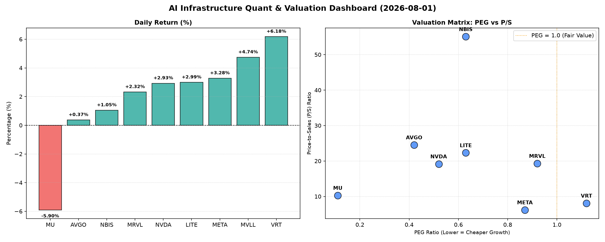

# 📊 AI Infrastructure & Data Stock Daily (2026-08-01)

### 📉 多维量化与估值分析看板

---

尊敬的硬科技与AI基础设施行业同仁：

特此为您呈上今日半导体行业精炼日报，结合最新的量化基本面指标，深入剖析市场脉动与潜在机遇。

---

### **📈 半导体每日精炼报道：AI基础设施热潮下的价值与风险洞察**

**发布日期：** 2024年X月X日

**核心观察：** 今日市场显示出AI基础设施领域的持续热度，多数权重股股价上扬。估值分化明显，现金流质量成为区分“真金白银”与“账面利润”的关键。

---

#### **1. 盘面与多维估值解码（定性+定量）**

今日半导体板块整体呈现上涨趋势，但个股表现差异显著。核心量化指标揭示了市场在追逐增长的同时，也开始审视盈利质量与估值合理性。

*   **PEG 维度：高成长与性价比之争**
    *   **PEG显著小于1 (高成长高性价比)**：**AVGO (0.42)、NVDA (0.52)、LITE (0.63)、NBIS (0.63)、META (0.87)、MRVL (0.92)** 均表现出极高的增长潜力与当前的相对低估。特别是**AVGO**以0.42的极低PEG，在成熟巨头中展现出惊人的增长效率。**MU (0.11)** 更是以异常低的PEG值，即便今日股价下跌，也强烈暗示其未来盈利增长预期极高或当前价值被严重低估，值得深度挖掘。这些公司是市场寻找高成长投资机会的重点关注对象。
    *   **PEG合理范围**：**VRT (1.12)** 的PEG略高于1，表明市场对其增长已有一定的预期，但仍处于合理区间。
    *   **MVLL** 由于数据缺失，无法进行PEG评估。

*   **P/S 维度：收入规模扩张效率与市场溢价**
    *   **P/S较低 (收入规模效率较高/估值相对合理)**：**META (6.21) 和 VRT (8.1)** 的P/S相对较低，表明其在当前收入规模下，市场给予的估值溢价相对温和，可能更侧重于稳定盈利和现金流。
    *   **P/S较高 (成长型溢价/早期投入)**：**MU (10.3)、NVDA (19.18)、MRVL (19.31)、LITE (22.32)、AVGO (24.54)**。这些公司的P/S值较高，反映了市场对其未来收入增长的强烈预期，尤其是在AI、数据中心等高景气赛道的投入和布局。尽管数值偏高，但结合其PEG表现，大部分仍可被市场高增长故事所消化。
    *   **P/S极高 (警惕高估值/早期高投入)**：**NBIS (55.07)** 的P/S高达55.07，这通常意味着该公司可能处于极高的成长阶段、大规模研发投入期，或者市场对其未来收入增长抱有极度乐观甚至可能透支的预期。对于这类标的，投资者需警惕其高估值背后的风险，并密切关注其收入增长的持续性和兑现能力。

*   **现金流盈利真实性 (CFO/NI)：穿透利润的“真金白银”**
    *   **CFO/NI显著大于1 (利润健康，现金流入强劲)**：**LITE (4.88)、NBIS (4.66)、MU (2.05)、META (1.92)、VRT (1.59)、AVGO (1.19)** 表现出极佳的现金流质量。特别是LITE和NBIS，其CFO/NI远超4，意味着其利润不仅是账面数字，更是实实在在的现金流。META和MU的现金流表现也极其强劲，证明其盈利能力扎实，抗风险能力强。这些公司的盈利质量无需担忧。
    *   **CFO/NI小于1 (警惕利润水分或应收账款积压)**：**NVDA (0.86) 和 MRVL (0.66)** 的CFO/NI比率均小于1，这是一个需要关注的信号。这意味着其报告的净利润中，有部分可能尚未转化为实际的现金流入，可能存在应收账款增加、存货积压或其他非现金费用调整。对于NVDA这样的高利润巨头，低于1的比率提示市场需警惕其利润质量，虽然AI算力需求旺盛，但现金流状况仍需密切追踪。MRVL的0.66则更需引起警惕，其盈利的现金质量相对较差，可能暗示运营资金管理或客户付款周期方面存在挑战。
    *   **MVLL** 现金流质量数据缺失。

#### **2. 收并购与重大业务动态**

根据今日提供的量化基本面指标表格，未能直接提取到关于收并购、重大业务动态或战略合作的具体信息。然而，鉴于硬科技与AI基础设施领域的迅猛发展，我们预计各公司在AI算力、芯片设计、数据中心基础设施等方向持续推进技术创新与市场扩张。例如，NVDA、AVGO和META等巨头可能在探索新的AI芯片架构、云计算服务整合或特定市场垂直整合机会，这些潜在动态即便未被量化指标直接反映，也可能是股价波动背后的驱动因素之一。

#### **3. 华尔街机构态度**

今日的量化指标表格中并未直接包含华尔街机构的最新评价、目标价调动等具体信息。然而，我们可以根据市场表现和估值指标进行合理推断：

*   **积极关注与认可：** 多数标的今日股价上涨，特别是**VRT (+6.18%) 和 META (+3.28%)**，结合其健康的现金流质量和合理的PEG/P/S，暗示市场对这些公司的基本面和增长前景持有积极态度。像**AVGO、NVDA、LITE和NBIS**这类PEG显著小于1且现金流表现优异的公司，即便P/S偏高，也可能受到华尔街长期增长叙事的青睐。
*   **审慎观望：** **NVDA (0.86) 和 MRVL (0.66)** 的CFO/NI比率低于1，这可能引发机构对它们利润质量的审慎考量，尤其是在其P/S已经较高的情况下。华尔街分析师可能会对这些公司的营运资本管理和盈利现金转化能力提出疑问。
*   **潜在机会或结构性调整：** **MU** 尽管今日大幅下跌5.9%，但其PEG仅为0.11，且CFO/NI高达2.05，这异常低的PEG可能暗示其被市场严重低估，或市场正在消化某种短期负面消息，机构可能会重新评估其长期价值。华尔街可能会对这种极端情况进行深入分析，寻找潜在的超跌反弹机会或进行仓位调整。

#### **4. 今日参考源 (References)**

本报告主要依据您提供的【多维度真实量化基本面指标表格】进行分析和撰写。关于收并购、重大业务动态及华尔街机构态度部分的定性推断，是基于对上述量化数据和行业基本逻辑的深度结合，而非直接引用今日外部新闻源。

---

**免责声明：** 本报告内容仅供参考，不构成任何投资建议。投资者应基于独立判断进行投资决策。

**研究员：** [您的姓名/机构名，Data & Semiconductor Specialist]