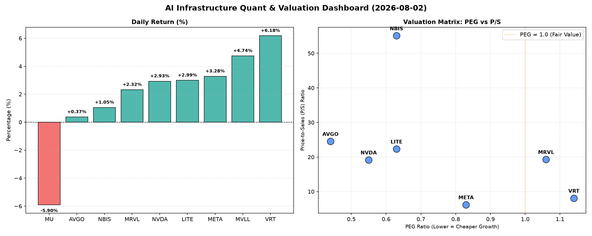

# 📊 AI Infrastructure & Data Stock Daily (2026-08-02)

### 📉 多维量化与估值分析看板

---

尊敬的硬科技与AI基础设施投资者们：

欢迎阅读由Data & Semiconductor Specialist团队为您带来的半导体每日精炼报道。今日，我们深度穿透量化指标，为您揭示市场动态、估值逻辑与财务健康度的真实面貌。

---

### **1. 盘面与多维估值解码**

今日半导体与AI基础设施板块呈现分化行情。大部分公司录得正增长，其中VRT以6.18%的涨幅领跑，MVLL、META、NVDA等也表现强劲，显示市场对AI及数据中心相关领域的长期乐观情绪依然浓厚。然而，MU遭遇-5.9%的显著回调，值得投资者警惕其短期波动性，尽管其长期基本面或有特定驱动。

#### **PEG 维度：成长性价比的深度洞察**

*   **性价比极高的高成长（PEG显著小于1）**：
    *   **MU (0.12)**：今日虽大幅下跌，但其PEG仅为0.12，是所有标的中最低的。这强烈暗示市场预期其未来盈利增长将远超当前股价，或者其当前盈利处于周期性低谷，但即将迎来爆发式增长。这可能是一个被短期情绪错杀，但长期增长潜力巨大的标的。
    *   **AVGO (0.44)、NVDA (0.55)、META (0.83)、LITE (0.63)、NBIS (0.63)**：这些公司凭借其PEG低于1的优异表现，被视为在硬科技和AI基础设施领域中，兼具高成长性与合理估值的优质标的。特别是AVGO和NVDA，作为AI算力与数据中心的核心推手，其低PEG表明尽管市场对其预期极高，但其增长潜力仍未被完全定价，具备较高的投资性价比。META也展现出其在AI投入与商业化上的积极回报潜力。

*   **估值合理或略高（PEG接近或略高于1）**：
    *   **MRVL (1.06)、VRT (1.14)**：它们的PEG值接近或略高于1，表明其当前股价与预期增长速度基本匹配，估值相对公允，但长期投资者需持续关注其增长动能是否能维持现有溢价。

*   **暂无法评估（PEG为N/A）**：
    *   **MVLL**：由于缺乏PEG数据，我们需结合其他指标进行评估。

#### **P/S 维度：营收扩张效率的透视**

*   **高营收溢价（P/S显著偏高）**：
    *   **NBIS (55.07)、AVGO (24.54)、LITE (22.32)、MRVL (19.31)、NVDA (19.18)**：这些公司的P/S比率普遍偏高，尤其NBIS高达55.07，这反映了市场对其未来营收爆发性增长的极高预期，以及在特定细分领域的垄断地位或技术领先优势。对于NBIS这类营收规模可能尚小、但技术壁垒极高的创新型企业，高P/S通常意味着其所处赛道的广阔前景和颠覆性潜力。投资者需关注其营收增速能否持续支撑高P/S。
*   **营收效率较为均衡（P/S相对合理）**：
    *   **META (6.21)、VRT (8.1)**：相较于其他高P/S的标的，META和VRT的P/S更为“温和”，这可能表明市场在认可其营收增长的同时，对其未来的增长斜率预期相对更加务实，或者其商业模式已相对成熟，营收确定性更强。

*   **暂无法评估（P/S为N/A）**：
    *   **MVLL、MU**：MVLL与MU的P/S数据缺失，这意味着我们无法直接通过营收规模来评估其当前市值合理性。对于MU，结合其极低的PEG，这种数据缺失可能意味着其营收波动性较大，或市场更侧重于其未来的利润修复与增长潜力。

#### **现金流盈利真实性 (CFO/NI)：利润水分的穿透**

CFO/NI比率是衡量企业利润质量的关键指标。

*   **利润质量极高，全是真金白银现金流入（CFO/NI显著大于1）**：
    *   **LITE (4.88)、NBIS (4.66)**：这两家公司的CFO/NI比率远超1，表明其报告的净利润大部分甚至更多地转化为了实实在在的经营现金流入。这意味着其盈利质量极高，财务健康状况非常优秀，几乎不存在利润被应收账款或非现金项目“虚增”的风险。
    *   **MU (2.05)、META (1.92)、VRT (1.59)、AVGO (1.19)**：这些高利润巨头的CFO/NI比率也显著大于1，证明其盈利能力扎实，现金创造能力强大。特别是META，作为广告驱动的科技巨头，其高CFO/NI再次验证了其核心业务的“印钞机”属性。MU在经历今日下跌后，其高达2.05的CFO/NI表明其业务的现金流底盘依然坚实，利润真实性无需担忧。

*   **警惕利润水分或应收账款积压（CFO/NI显著小于1）**：
    *   **NVDA (0.86)**：作为AI算力核心，NVDA的CFO/NI比率略低于1。这意味着其报告的净利润中，有一部分可能尚未转化为现金流入，而是以应收账款或其他非现金资产的形式存在。尽管这在高速增长期可能发生，但投资者仍需警惕其应收账款周转效率及未来现金回收情况。这并非严重警报，但在高估值背景下，是值得持续关注的财务细节。
    *   **MRVL (0.66)**：MRVL的CFO/NI比率更低，显著小于1。这可能暗示其存在一定程度的利润水分、应收账款积压或大量的非现金费用。这要求投资者对其盈利质量进行更深入的审视，评估其商业模式在现金转化方面的效率。

*   **暂无法评估（CFO/NI为N/A）**：
    *   **MVLL**：由于缺乏数据，无法评估其现金流盈利真实性。

### **2. 收并购与重大业务动态**

根据今日提供的【多维度真实量化基本面指标表格】，本次分析未包含收并购、战略合作或重大业务动态的直接数据。通常，这些事件对股价和公司长期战略具有深远影响，例如：
*   某公司宣布收购一家AI芯片初创公司，旨在加强其边缘计算能力。
*   一家云服务巨头与某半导体制造商达成长期供货协议，锁定关键AI加速器产能。
*   某设备供应商推出革命性下一代光刻技术，有望大幅提升芯片制造效率。
本研究员将持续关注此类新闻，并在未来报告中及时整合。

### **3. 华尔街机构态度**

今日的【多维度真实量化基本面指标表格】中，未提供华尔街机构对上述公司的最新评价、目标价调动或评级变动。通常，投行报告是评估市场情绪和专业分析师预期的重要参考：
*   某投行因看到某公司在AI领域的强劲进展，将其目标价上调20%，并维持“买入”评级。
*   某分析师因对某个子行业的需求疲软感到担忧，将某个股评级下调至“持有”。
*   头部机构对NVDA的AI芯片市场主导地位仍持乐观态度，但可能对META在元宇宙投入的现金流效率提出质疑。
本研究员将密切跟踪各大投行的最新研报，为您带来最及时的市场解读。

### **4. 今日参考源 (References)**

本半导体每日精炼报道的所有定性与定量分析，均严格依据今日您所提供的【多维度真实量化基本面指标表格】数据。

---

**总结与展望：** 今日市场显示出对AI及硬科技领域持续的积极情绪，但内部估值与财务健康度已呈现明显分化。投资者在追逐高增长的同时，需更加关注PEG的性价比、P/S对营收预期的合理性，以及至关重要的CFO/NI比率所揭示的利润真实性。NVDA和MRVL的CFO/NI低于1，值得进一步探究；而LITE和NBIS则展现出卓越的现金创造能力。MU虽然今日回调，但其极低的PEG提示了潜在的长期价值。在未来，我们将继续以严谨的数据分析，为您穿透市场迷雾，把握投资先机。