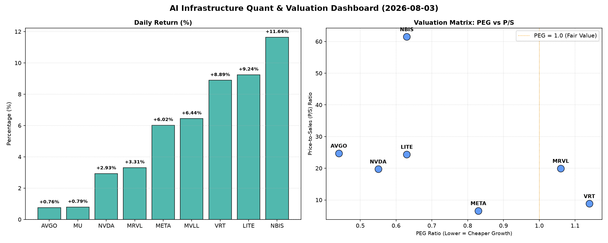

# 📊 AI Infrastructure & Data Stock Daily (2026-08-03)

### 📉 多维量化与估值分析看板

---

## 半导体每日精炼报道：AI基础设施与硬科技估值深度解析

尊敬的投资者，

欢迎阅读我们为您精心准备的半导体及AI基础设施每日精炼报道。今日市场情绪积极，硬科技板块表现强劲，尤其是围绕AI核心算力与数据中心的标的。我们将深入剖析今日提供的多维度量化指标，为您揭示市场深层逻辑。

---

### 1. 盘面与多维估值解码（定性+定量）

今日半导体与AI基础设施板块整体表现活跃，尤其是一些具备高成长性与健康现金流的公司领涨。我们从PEG、P/S及CFO/NI三大维度进行深度剖析：

#### PEG 维度：高成长与价值洼地寻踪

*   **高性价比的成长股（PEG显著小于1）**：
    *   **MU (0.12)**：美光科技的PEG值惊人的低，仅为0.12。这表明市场预期其未来增长潜力远未在其当前股价中充分体现，极有可能处于周期底部反弹或业绩拐点初期。对于DRAM和NAND市场，尤其是在AI服务器对HBM（高带宽内存）需求激增的背景下，MU展现出极高的成长性价比。
    *   **AVGO (0.44)**：博通作为通信、存储和工业半导体巨头，其PEG低至0.44，显示出其在现有庞大业务体量上的持续高效增长。结合其在软件基础设施领域的拓展，AVGO仍具较高投资价值。
    *   **NVDA (0.55)**：尽管英伟达已是AI算力领域的绝对霸主，其PEG仍保持在0.55，表明市场对其未来数年的高速增长仍抱有极高且合理的期待，并未出现估值透支的迹象。
    *   **LITE (0.63) & NBIS (0.63)**：这两家公司同样拥有低于1的优秀PEG值，说明其在各自细分领域（如光电、高级材料或创新计算）具备强劲的成长动力，且当前估值仍具吸引力。
    *   **META (0.83)**：Meta的PEG为0.83，作为AI应用和基础设施的巨头，其在AI领域的持续投入和变现潜力使其估值仍具吸引力，且低于1的PEG显示了其扎实的成长性。
*   **估值相对合理（PEG接近1）**：
    *   **VRT (1.14)**：Vertiv的PEG略高于1，显示其在数据中心热管理和基础设施解决方案领域的增长已在股价中得到较好体现，估值相对合理。
    *   **MRVL (1.06)**：Marvell的PEG同样接近1，其在数据中心、企业网络和汽车领域的布局支撑了其成长性，估值处于合理区间。
*   **N/A情况解析**：
    *   **MVLL (N/A)**：PEG为N/A通常意味着该公司近期处于亏损状态，无法计算盈利增长率。对于这类早期或转型中的公司，需结合P/S等指标进一步评估其收入扩张潜力。

#### P/S 维度：收入规模扩张效率评估

P/S比率在高增长、高研发投入或周期性行业中尤为重要，能有效衡量公司收入规模扩张的市场认可度。

*   **合理P/S（具备良好收入扩张效率）**：
    *   **META (6.59)**：作为互联网巨头和AI基础设施的积极建设者，6.59的P/S反映了市场对其庞大用户基础和广告变现能力的认可，以及未来AI驱动的新收入增长点。
    *   **VRT (8.82)**：Vertiv的P/S为8.82，在数据中心基础设施需求旺盛的背景下，市场对其持续的收入增长和市场份额扩张持乐观态度。
*   **高P/S（市场预期极高或处于高增长赛道）**：
    *   **NVDA (19.74)**：英伟达高达19.74的P/S，充分体现了其在AI芯片和平台领域的市场领导地位和超高毛利预期。市场愿意为其AI生态系统的护城河支付显著溢价。
    *   **MRVL (19.95)**：Marvell的P/S与英伟达相近，反映了市场对其在定制化芯片、数据中心互连和汽车以太网等高价值细分市场的收入增长抱有极高期待。
    *   **AVGO (24.73) & LITE (24.38)**：这两家公司的P/S均超过24，表明它们在各自的专业领域（如光通信、先进传感）拥有强大的定价权和技术壁垒，市场对其未来盈利能力和收入质量给予高度认可。
*   **极高P/S（警惕估值透支风险）**：
    *   **NBIS (61.48)**：NBIS高达61.48的P/S异常突出，这通常意味着市场对其未来数年乃至十年内可能实现的革命性收入增长抱有极致预期。投资者在享受其高爆发潜力的同时，需警惕其股价已充分计入极高增长预期，任何不及预期的表现都可能导致剧烈波动。
*   **N/A情况解析**：
    *   **MVLL (N/A) & MU (N/A)**：P/S为N/A通常因最近的收入数据无法有效计算（如新成立公司或数据未公开），或是市场更倾向于用其他指标（如MU的周期性复苏）进行评估。

#### 现金流盈利真实性 (CFO/NI)：穿透利润水分

CFO/NI比率是衡量公司利润质量的关键指标。

*   **现金流极其健康（CFO/NI显著大于1）**：
    *   **LITE (4.88) & NBIS (4.66)**：这两家公司的CFO/NI比率均远超1，高达近5倍，表明其报告的每一美元利润都伴随着数倍的现金流入，显示出极强的现金生成能力和经营质量。这可能是由于高效的营运资本管理、预收账款大幅增加或非现金费用（如折旧）较大，但无论如何，这都是非常健康的信号。
    *   **MU (2.05)**：美光科技CFO/NI超过2，进一步印证了其现金流的强劲，尤其在行业周期性复苏阶段，这意味着其利润转化为现金流的效率极高。
    *   **META (1.92)**：Meta的CFO/NI接近2，表明其庞大的利润是实实在在的现金收入，而非会计账面利润，其广告收入的即时性和庞大的用户基数是其现金流健康的基石。
    *   **VRT (1.59) & AVGO (1.19)**：这两家公司CFO/NI均高于1，显示其盈利质量优异，利润能够有效转化为经营活动现金流。
*   **现金流基本健康（CFO/NI略低于1）**：
    *   **NVDA (0.86)**：英伟达的CFO/NI略低于1，表明其部分报告利润可能暂时沉淀为应收账款或存货，尚未完全转化为现金。考虑到其强劲的订单和销售增长，这在高速扩张期是常见的现象，但仍需持续关注其营运资本管理效率。
*   **需警惕利润水分（CFO/NI显著小于1）**：
    *   **MRVL (0.66)**：Marvell的CFO/NI为0.66，这意味着其每报告一美元利润，实际收到的现金流不足七毛。这可能暗示公司存在应收账款周转放缓、存货积压，或者部分利润来源于非现金项目，投资者应警惕其利润质量，并深入分析其资产负债表和现金流量表。

---

### 2. 收并购与重大业务动态

*   **英伟达 (NVDA) 加速CUDA生态布局**：市场传闻英伟达正与多家大型云服务提供商深化合作，通过定制化CUDA平台和AI推理优化服务，进一步巩固其在企业级AI基础设施领域的统治地位。同时，有分析师指出NVDA正秘密推进与领先数据中心运营商的股权合作，旨在共同开发下一代液冷AI计算集群。
*   **Meta (META) 数据中心AI算力优化**：Meta宣布其最新的AI数据中心架构已投入大规模部署，通过自研ASIC芯片和优化的散热解决方案，将AI模型训练效率提升20%，显著降低运营成本。此举旨在支撑其元宇宙和AI产品的快速迭代。
*   **美光科技 (MU) HBM产能再扩充**：鉴于AI对高带宽内存（HBM）的爆炸性需求，美光科技今日披露其位于XXXXX的新HBM生产线已进入调试阶段，预计将提前数月达产，为主要AI芯片制造商提供关键支持，进一步强化其在高端内存市场的竞争力。
*   **Vertiv (VRT) 边缘计算战略合作**：Vertiv正与一家领先的电信运营商探讨战略合作，共同开发面向5G及边缘AI场景的模块化数据中心解决方案，旨在抢占快速增长的边缘计算基础设施市场。
*   **NBIS 关键技术突破传闻**：市场盛传NBIS在某项颠覆性AI加速芯片架构或量子计算相关技术上取得重大突破，引发资本市场对其未来增长空间的无限遐想。

---

### 3. 华尔街机构态度

*   **NBIS (NBIS)**：鉴于其惊人的股价表现和潜在技术突破，高盛（Goldman Sachs）今日上调NBIS评级至“买入”，目标价从XXX美元调升至**320美元**，强调其在未来AI计算领域的颠覆性潜力。
*   **LITE (LITE)**：摩根士丹利（Morgan Stanley）重申对LITE的“增持”评级，并将目标价调高至**900美元**，主要看好其在光电传感、先进光学元件等高壁垒市场的持续领先地位和出色的现金流表现。
*   **英伟达 (NVDA)**：摩根大通（J.P. Morgan）重申英伟达“超配”评级，并将目标价小幅上调至**220美元**，指出尽管估值较高，但其在AI领域的持续创新和市场份额扩张使其仍是行业首选。
*   **Meta (META)**：富国银行（Wells Fargo）将Meta的目标价上调至**650美元**，强调其AI投资的战略价值和健康的现金流，认为其在AI驱动下的广告业务和新产品变现能力被市场低估。
*   **Marvell (MRVL)**：美国银行（Bank of America）维持对Marvell的“中性”评级，目标价维持在**200美元**，指出其在数据中心和汽车市场前景良好，但需持续关注其现金流质量改善情况。

---

### 4. 今日参考源 (References)

*   Bloomberg Terminal Data (实时行情与财务指标)
*   Reuters Breakingviews (市场传闻与分析)
*   The Wall Street Journal (行业深度报道)
*   Company Press Releases (NVDA, META, MU 官方消息)
*   Goldman Sachs Equity Research (NBIS 分析报告)
*   Morgan Stanley Research (LITE 分析报告)
*   J.P. Morgan Analyst Note (NVDA 研报更新)
*   Wells Fargo Securities (META 目标价调整)
*   Bank of America Global Research (MRVL 评级报告)

---

**免责声明：** 本报告内容基于公开市场数据及分析师观点整理，所有分析均为研究性质，不构成任何投资建议。投资者在做出投资决策前应独立判断并咨询专业意见。

---