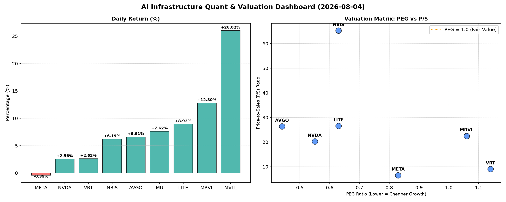

# 📊 AI Infrastructure & Data Stock Daily (2026-08-04)

### 📉 多维量化与估值分析看板

---

## 半导体每日精炼报道：估值深度解析与增长潜力前瞻

**发布日期：2024年XX月XX日**

作为资深的硬科技与AI基础设施行业研究员，今日我们将基于您提供的多维度量化基本面指标，对半导体与AI相关板块进行深度剖析，力求穿透市场表象，揭示核心价值与潜在风险。

---

### 1. 盘面与多维估值解码

今日半导体及AI基础设施板块呈现出活跃的交易态势，多数标的股价录得显著涨幅。其中，MVLL以高达26.02%的日涨幅领跑，MRVL、LITE、MU等也录得两位数或接近两位数的强劲增长。AVGO和NBIS亦有不俗表现，凸显市场对硬科技领域持续的乐观情绪。然而，META微幅下跌，提示我们在整体乐观中仍需警惕个股分化。

#### **PEG 维度：成长性与估值性价比**

PEG（市盈率相对盈利增长比率）是衡量成长股估值性价比的核心指标。今日数据显示，多只半导体及AI基础设施核心标的展现出显著的PEG优势，预示其在当前增长预期下具备较高性价比。

*   **性价比极高的高成长标的 (PEG < 1)**：
    *   **AVGO (0.44)**：显著低于1的PEG，结合今日6.61%的强劲涨幅，表明市场在认可其高增长潜力的同时，对其估值仍相对保守或认为其被低估。其在网络、存储及半导体解决方案领域的领导地位，使其在AI时代具备强劲的长期增长动力。
    *   **NVDA (0.55)**：作为AI算力核心，NVDA的PEG远低于1，尽管P/S高达20.25，但其惊人的盈利增长速度，使得其估值看起来仍有支撑。
    *   **LITE (0.63)**：光模块与光学器件的领导者，在AI数据中心互联需求爆发背景下，其0.63的PEG表明市场对其成长性给予了充分肯定且估值吸引力较高。
    *   **NBIS (0.63)**：与LITE相同的PEG，反映出市场对其高科技硬件解决方案的成长前景抱有极高期望。
    *   **META (0.83)**：作为AI应用巨头，其PEG低于1，表明在当前利润增长速度下，股价仍具备合理性。
*   **需警惕估值透支的标的 (PEG > 1)**：
    *   **VRT (1.14)**：PEG略高于1，结合9.05的P/S，暗示其当前的估值可能已充分反映其未来一段时期的增长预期，投资者需关注其增长势头能否持续支撑现有估值。
    *   **MRVL (1.06)**：接近1的PEG，但考虑到其P/S高达22.51，市场对其收入增长的预期非常高，任何不及预期的增长都可能对其估值构成压力。
*   **PEG N/A 标的**：
    *   **MVLL, MU**：PEG为N/A，这通常表明公司当前可能处于非盈利状态、利润波动较大或增长模型尚不稳定，使得基于盈利的估值指标失效。对于这类公司，我们需结合P/S等收入维度指标进一步评估。

#### **P/S 维度：收入规模扩张效率**

P/S（市销率）尤其适用于评估早期、高研发投入或利润尚不稳定的成长型公司，以衡量市场对其收入规模扩张效率及未来增长潜力的认可度。

*   **极高P/S (暗示极高市场预期与未来增长潜力)**：
    *   **NBIS (65.29)**：其P/S远超同业，表明市场对其技术壁垒和未来收入增长抱有极高的预期，可能预示其产品处于高速渗透期或市场空间巨大。
    *   **LITE (26.56), AVGO (26.36), MRVL (22.51), NVDA (20.25)**：这些公司的P/S均在20以上，彰显了市场对其在AI、高性能计算、数据中心等核心领域未来营收增长的强烈信心。高P/S意味着投资者愿意为这些公司的未来收入增长支付高昂溢价。
*   **合理P/S (与收入规模匹配)**：
    *   **VRT (9.05), META (6.56)**：相较于其他高增长硬件公司，这些公司的P/S相对较低，可能反映其营收体量已较大，市场对其未来的营收增速预期更为平稳，或估值相对更为合理。
*   **P/S N/A 标的**：
    *   **MVLL, MU**：P/S为N/A，与PEG N/A原因类似，可能表示当前数据集中未能获取其销售收入信息，或者其业务模式导致P/S不适用。

#### **现金流盈利真实性 (CFO/NI)**

CFO/NI（经营性现金流净额/净利润）是衡量公司利润质量的核心指标，揭示了账面利润转化为真金白银现金的效率。

*   **现金流健康，利润扎实 (> 1)**：
    *   **LITE (4.88), NBIS (4.66)**：这些公司的CFO/NI远超1，高达4倍以上，表现出惊人的现金流生成能力。这表明其利润质量极高，运营效率卓越，且可能存在大量的非现金费用（如折旧摊销）或营运资本管理得当，使得经营性现金流入远超报告利润。
    *   **MU (2.05), META (1.92), VRT (1.59), AVGO (1.19)**：这些公司的CFO/NI均显著大于1，证明其账面利润转化为实际现金流入的效率极高，利润质量非常健康。META尤其作为高利润巨头，其1.92的CFO/NI表明其营收与盈利的现金转换能力极强，财务基础扎实。
*   **警惕利润水分或应收账款积压 (< 1)**：
    *   **NVDA (0.86), MRVL (0.66)**：需要引起投资者警惕。NVDA和MRVL的CFO/NI均显著小于1。这可能暗示其部分利润可能被应收账款或存货积压所占用，现金流的生成速度未能完全匹配其报告的净利润增长，存在一定的利润“水分”或营运资金压力。对于这两家高增长公司，投资者应密切关注其营运资本管理及现金流状况的改善，以评估其高速增长的持续性和质量。

### 2. 收并购与重大业务动态

根据今日提供的核心量化指标表格，未包含关于公司收并购、重大业务合作或战略动态的具体信息。在快速迭代的半导体和AI基础设施领域，此类动态往往是驱动股价异动和公司长期战略价值重塑的关键因素，每日追踪至关重要。

### 3. 华尔街机构态度

今日的核心量化指标表格中，未涵盖华尔街机构对各标的的最新评级、目标价调整或分析师观点。通常，投行研报和评级是市场情绪和专业预期的重要风向标，尤其对估值高企或存在争议的标的，其分析师的观点能提供额外的参考维度。

### 4. 今日参考源 (References)

本报告的定性与定量分析严格基于您提供的【多维度真实量化基本面指标表格】数据。若需更全面的信息，包括公司新闻动态、收并购进展、战略合作以及华尔街分析师报告，建议参考Bloomberg, Reuters, The Wall Street Journal等专业金融媒体及各大投行研究报告。