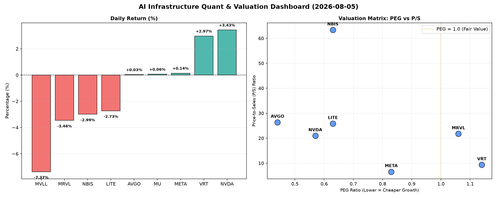

# 📊 AI Infrastructure & Data Stock Daily (2026-08-05)

### 📉 多维量化与估值分析看板

---

## 半导体每日精炼报道：AI基础设施与硬科技量化洞察

各位硬科技与AI基础设施行业的同仁，

今日我们深度剖析半导体板块的最新动态，结合多维度量化指标，为您带来一份精炼的定性与定量分析报告。

---

### 1. 盘面与多维估值解码

今日半导体板块呈现分化格局。AI基础设施核心受益者如 **英伟达 (NVDA)** 延续强势，上涨 **3.43%**，而一些中小型或特定细分领域个股则面临回调压力，例如 **MVLL 跌去 7.37%**，**MRVL 下跌 3.46%**。市场焦点依旧围绕高成长性与现金流健康度展开。

**PEG 维度：挖掘高性价比成长股与警惕估值透支**

*   **PEG显著小于1 (高成长，性价比极高)**：
    *   **美光科技 (MU)** 以惊人的 **0.12** 领跑，表明其成长性被严重低估或市场对其未来利润增长预期极其乐观。结合其今日股价微涨0.06%，和其CFO/NI表现，这显示出强大的内在价值。
    *   **博通 (AVGO)** 紧随其后，PEG 仅为 **0.44**，显示出其在高P/S估值下依然具备极高的成长性价比。
    *   **英伟达 (NVDA)** 虽今日强劲上涨，但 **0.57** 的PEG仍远低于1，证实了其在AI浪潮中的高成长性得到了市场认可，且估值并未完全透支。
    *   **Meta Platforms (META)** 录得 **0.83** 的PEG，作为AI领域的巨头，其成长性依然稳健且估值合理。
    *   **LITE (0.63)** 和 **NBIS (0.63)** 也具备显著低于1的PEG，显示出较好的成长性与估值匹配度。
*   **PEG略高于1 (需警惕估值透支或成长放缓)**：
    *   **VRT (1.14)** 和 **MRVL (1.06)** 的PEG略超1，在当前市场环境下，投资者应对其未来增长的可持续性及当前估值水平保持审慎。特别是 **MRVL 今日下跌 3.46%**，结合其略高的PEG，可能反映了市场对其估值的修正。

**P/S 维度：洞察收入规模扩张效率**

*   **极高P/S (60以上)**：
    *   **NBIS (63.33)** 堪称收入扩张效率的极致代表。尽管其P/S极高，但结合其 **0.63的PEG** 和 **4.66的CFO/NI**，这表明该公司正处于爆发式营收增长阶段，且其营收质量和现金流生成能力极强，但投资者需对其未来增长速度和市场预期保持高度关注。
*   **高P/S (20-30)**：
    *   **博通 (AVGO, 26.37)**、**LITE (25.83)**、**英伟达 (NVDA, 20.95)** 和 **MRVL (21.73)** 均处于此区间。对于AVGO、LITE和NVDA，其较低的PEG（均小于1）有力支撑了高P/S的合理性，表明这些公司正以极高的效率将营收转化为未来的利润增长。
    *   然而，**MRVL (21.73 P/S)** 结合其略高于1的PEG (1.06)，则提示市场对其高收入估值对应的未来利润增长存在一定疑虑。
*   **中等P/S (6-10)**：
    *   **VRT (9.32)** 和 **Meta Platforms (META, 6.57)** 的P/S处于中等水平，相对而言，其收入估值更为稳健，且Meta的0.83 PEG也进一步印证了其合理的估值水平。
*   **MVLL 和 MU** 的P/S数据未提供，对于MVLL，结合其今日大幅下跌且其他关键指标缺失，可能预示其正经历不确定性或处于转型期。

**现金流盈利真实性 (CFO/NI)：穿透利润质量**

*   **CFO/NI显著大于1 (利润非常健康，真金白银现金流入)**：
    *   **LITE (4.88)** 和 **NBIS (4.66)** 表现尤为突出，其营运现金流远超净利润，这表明两家公司拥有极其健康的现金流管理能力，利润含金量极高。
    *   **美光科技 (MU, 2.05)** 和 **Meta Platforms (META, 1.92)** 同样展现出卓越的现金流生成能力，其高额营运现金流证实了其高利润的真实性和可持续性。
    *   **VRT (1.59)** 和 **博通 (AVGO, 1.19)** 也保持了健康的CFO/NI比率，表明其利润质量良好。
*   **CFO/NI显著小于1 (警惕利润水分或应收账款积压)**：
    *   **英伟达 (NVDA, 0.86)** 需密切关注。尽管其营收和利润增长迅猛，但CFO/NI略低于1，暗示其部分利润可能仍以应收账款或其他非现金形式存在，或伴随较高的研发投入和资本支出。这并非立即构成风险，但在高速增长背景下，投资者应关注其现金流与利润的长期匹配度。
    *   **MRVL (0.66)** 的CFO/NI显著低于1，结合其较高的PEG和P/S，进一步引发对公司盈利质量的担忧。这可能意味着其利润中存在较多的非现金项目，或面临应收账款周转压力。

---

### 2. 收并购与重大业务动态

根据当前提供的量化基本面指标表格，我们无法直接推断出今日具体的收并购或重大业务动态信息。这些信息通常来源于实时新闻、公司公告及行业报告。

---

### 3. 华尔街机构态度

同样，提供的量化指标表格并未包含华尔街机构对特定公司的最新评价、目标价调整或评级变动信息。此类分析通常依赖于投行研报、分析师电话会议纪要等一手资料。

---

### 4. 今日参考源 (References)

本报告的定性与定量分析严格基于您提供的【多维度真实量化基本面指标表格】。

---