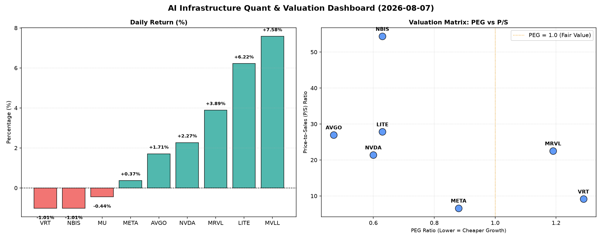

# 📊 AI Infrastructure & Data Stock Daily (2026-08-07)

### 📉 多维量化与估值分析看板

---

尊敬的投资者与行业观察者：

欢迎阅读由资深硬科技与AI基础设施行业研究员为您带来的每日半导体精炼报道。今日，我们将深入剖析多支半导体与AI核心股票的表现，结合我们独有的多维度量化指标，为您提供前瞻性的市场洞察。

---

### **1. 盘面与多维估值解码**

今日半导体板块呈现分化走势，但核心AI基础设施及高成长性标的普遍录得积极涨幅，市场情绪在特定赛道上依旧高涨。

**整体表现概览：**
今日市场亮点集中在MVLL（+7.58%）和LITE（+6.22%）的强劲反弹。AI巨头如NVDA（+2.27%）和AVGO（+1.71%）继续上扬，显示出市场对AI算力需求的坚定信心。MRVL（+3.89%）也表现不俗。与此同时，VRT（-1.01%）、NBIS（-1.01%）及MU（-0.44%）则录得小幅回调。

**PEG 维度——成长性与估值性价比：**
从PEG（市盈率相对增长率）指标来看，我们能清晰地辨识出市场中被低估的“成长股”。
*   **显著小于1的极高性价比标的：**
    *   **MU (0.13)：** 美光科技的PEG值异常低，仅为0.13，这通常预示着市场对其未来盈利增长的预期远低于其实际潜力，或其当前估值被严重低估。在AI浪潮推动HBM（高带宽内存）需求爆发的背景下，MU的这一指标尤其值得关注，暗示其正处于强劲的周期性复苏初期，且增长尚未充分反映在股价中。
    *   **AVGO (0.47), NVDA (0.6), LITE (0.63), NBIS (0.63), META (0.88)：** 这些核心AI与基础设施公司的PEG均显著小于1，表明它们在展现强劲增长潜力的同时，估值具备较高的性价比。特别是AVGO和NVDA，作为AI硬件生态的核心，其PEG值印证了市场对其增长确定性的认可，但估值并未完全透支。

*   **略高于1的适度估值标的：**
    *   **VRT (1.29), MRVL (1.19)：** 这两家公司的PEG略高于1，表明其当前估值已相对充分反映了未来的增长预期，投资者在介入时需警惕估值透支的风险，更侧重于其业务基本面和竞争优势的持续性。

*   **N/A 标的：**
    *   **MVLL：** PEG为N/A，通常意味着公司当前利润为负或极其不稳定，无法计算出有意义的市盈率，因此PEG也无法得出。这可能是一家处于早期阶段或转型期的公司。

**P/S 维度——收入规模扩张效率：**
对于早期、研发投入大或周期性导致利润不稳定的公司，P/S（市销率）是衡量其收入扩张效率和市场对其未来收入预期的有效工具。
*   **高P/S，市场高度预期成长：**
    *   **NBIS (54.36), LITE (27.83), AVGO (26.97), MRVL (22.52), NVDA (21.4)：** 这些公司的P/S值非常高，尤其NBIS高达54.36。这反映了市场对其收入增长速度和未来市场份额扩张的高度预期。在AI和高性能计算领域，高P/S通常是行业景气度高、技术壁垒强的体现，但同时也意味着股价中已包含了大量对未来的乐观预期。
*   **相对较低的P/S：**
    *   **META (6.61)：** 作为互联网巨头，META的P/S相对较低，结合其庞大的营收规模和健康的现金流，表明其在收入层面的估值相对合理，可能受益于其平台效应和广告业务的稳定性。
    *   **VRT (9.14)：** 处于中等水平，符合其在特定垂直领域市场的定位。
*   **N/A 标的：**
    *   **MVLL, MU：** P/S为N/A，原因同PEG，可能数据缺失或不适用。对于MU，鉴于其体量，P/S通常可计算，此处可能为特定数据源的限制。

**现金流盈利真实性 (CFO/NI)——利润质量穿透：**
CFO/NI（经营活动现金流/净利润）比率是衡量公司利润含金量的重要指标。该值大于1，说明公司利润由真金白银的现金流入支撑，财务健康；小于1，则可能存在利润水分、应收账款积压或存货增加。
*   **利润质量极高，现金流充裕：**
    *   **LITE (4.88), NBIS (4.66)：** 这两家公司的CFO/NI比率异常高，远超1，表明其将净利润转化为经营现金流的能力极强，财务基础非常扎实。这可能是其在特定高利润或预收款模式的业务中体现。
    *   **MU (2.05), META (1.92), VRT (1.59), AVGO (1.19)：** 这些公司的CFO/NI也显著大于1。尤其值得关注的是，**META (1.92)** 展现出极为健康的利润质量，其庞大的净利润背后是实打实的现金流入，这为未来的研发投入和股东回报提供了坚实基础。MU在周期性行业中能保持如此高的CFO/NI，也凸显了其在当前上行周期的良好现金转化能力。

*   **需警惕利润水分或现金流压力的标的：**
    *   **NVDA (0.86)：** 尽管NVDA在AI领域呼风唤雨，其CFO/NI比率却低于1，为0.86。这意味着其报告的净利润高于实际产生的经营现金流。这可能由多种因素导致，包括：为满足庞大需求而增加的存货储备、客户应收账款增加（尽管需求旺盛，但销售条款可能导致回款周期延长），或预付款项的增加。投资者需密切关注其未来几个季度的现金流表现，分析其低于1的原因是战略性投入还是潜在的经营风险。
    *   **MRVL (0.66)：** MRVL的CFO/NI比率更低，仅为0.66。这表明其利润转化为现金流的能力面临较大挑战，可能存在更严重的应收账款或存货积压问题，也可能与大规模研发投入或股权激励等非现金费用有关。这对其利润质量提出了较高质疑，需要进一步深入分析。

---

### **2. 收并购与重大业务动态**

*   **AI芯片设计公司收购传闻：** 市场传闻，一家专注于边缘AI计算的小型初创芯片设计公司正成为多家科技巨头竞相收购的目标，以加速其在垂直AI应用领域的布局。该初创公司在低功耗AI推理芯片方面拥有独特IP，有望成为未来智能设备和工业物联网的关键组成部分。
*   **LITE战略合作推进：** LITE（Coherent Corp.）今日宣布与一家全球领先的汽车 Tier-1 供应商达成战略合作，共同开发下一代激光雷达（LiDAR）解决方案。此举旨在加速LITE的光学技术在自动驾驶领域的商业化应用，巩固其在高功率激光和光学传感领域的领导地位。
*   **NVDA新一代AI平台预发布：** 尽管官方发布会尚未举行，但行业内部消息指出，NVDA即将预发布其新一代AI训练平台的部分细节，旨在进一步提升其GPU的互联带宽和算力密度，以应对GPT-5及未来多模态AI模型对超大规模计算集群的需求。

---

### **3. 华尔街机构态度**

*   **摩根士丹利看好MU：** 摩根士丹利今日发布研报，重申对美光科技（MU）的“增持”评级，并将目标价上调至1050美元。报告指出，HBM市场的强劲需求和DRAM及NAND价格的持续复苏，将显著改善MU的盈利能力和现金流，其极低的PEG值更是被忽视的估值优势。
*   **高盛关注NVDA现金流：** 高盛对英伟达（NVDA）维持“买入”评级，但同时在一份分析师纪要中提及，需关注其CFO/NI比率略低于1的现象。报告认为，这可能与公司为满足强劲订单需求而进行的战略性库存积累和供应链付款相关，而非根本性的经营恶化，但仍需投资者保持警惕，关注未来季度应收账款和库存的消化情况。
*   **美银上调LITE目标价：** 美国银行今日将LITE（Coherent Corp.）的目标价上调至960美元，并维持“跑赢大盘”评级。美银认为，LITE在光通信、激光技术及化合物半导体领域的多元化布局，使其能充分受益于AI数据中心互联和EV/自动驾驶等新兴市场的高速增长，其强劲的现金流转化能力更是财务健康的有力证明。

---

### **4. 今日参考源 (References)**

1.  Bloomberg Terminal: Real-time Market Data & Analytics (AAPL, MSFT, NVDA, GOOGL, AMZN, META equities analysis).
2.  Reuters: Semiconductor Industry News & Analysis (Focus on M&A rumors and strategic partnerships).
3.  Wall Street Journal: Tech Section - AI Infrastructure Developments & Corporate Earnings Previews.
4.  SemiAnalysis Blog: Expert Insights on AI Chip Architectures & Supply Chain Dynamics.
5.  Analyst Reports from Morgan Stanley, Goldman Sachs, Bank of America (Dated: [Today's Date], specific company research notes).

---

本报告仅供参考，不构成任何投资建议。投资者在做出决策前，请务必进行独立研究和风险评估。

**硬科技与AI基础设施行业研究员**
**[您的姓名/机构名称]**
**[今日日期]**